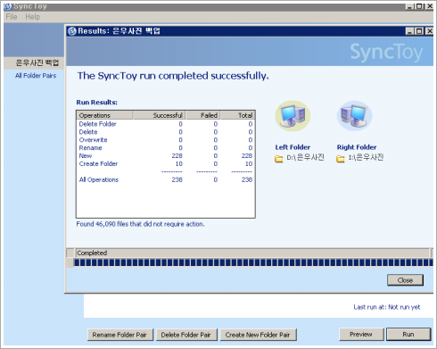

# DVD대신 SyncToy로 폴더 동기화하는 방법으로 백업 방식 변경 

나날이 늘어나는 사진용량으로 기존의 백업 방식 DVD가 한계에 다달랐다.

6개월에 한번씩 백업을 하고 있는데, 몇년전 그 6개월 백업할 타이밍에 하드를 날린 적이 있었다.

가장 속 쓰렸던 것은 6개월치 일기를 날린 거였다.

그 충격에 몇달 동안을 다시 일기를 못 썼던 적이 있었다.

요즘은 사진을 천만화소로 찍다보니, 사진 조금만 찍어도 늘어나는 용량이 거의  1G단위로 늘어난다.

그러다보니 DVD로 감당이 안된다.

딸래미 사진 폴더 용량을 보니 97기가.  4.3기가 단면 DVD 23장이 필요하다.

그래서 백업용 하드를 샀다.

때마침 1테라에 10만원 선 아래로 떨어져, 1테라짜리로 샀다.

어떻게 백업할까하다가, 폴더동기화 방식을 택하기로 했다.

툴을 SyncToy.

원래 하드에서 백업용 하드로 일방적으로만 할 것이기에 Subscribe 방식으로 설정했다.

만약 양방향으로 한다면 Echo로 설정하면 된다.

사용법은 단순하다.

그냥 Subscribe로 설정하고, Run하니 백업완료!

