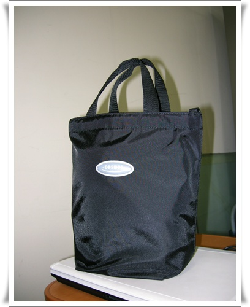
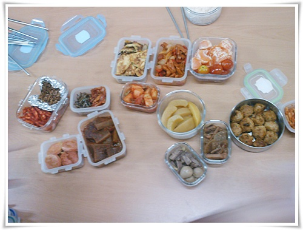

# 회사에서 먹는 점심 도시락

회사에서 도시락을 먹은지 이제 3주차.

고등학교 졸업이후 처음 도시락을 싸들고 가는 것이다.

연중행사에 찾아드는 [위염](../6166677.html) 으로 인해, 배 아프다고 했더니 아내가 보온도시락을 지르더니 그걸 들고 출근하란다.

"사회적 지위와 체면이 있지 그 커다란 도시락통을 들고 출퇴근하란 말이야"라고 버럭했지만, 아내 말 잘 듣는 착한 남편이기 잘 들고 다니고 있다.

보온도시락과 유리반찬통이 든 가방.  무지 크고 무겁다.

점심 만찬.  도시락을 싸오는 여직원들과 같이 먹으니 반찬가지는 한정식수준이다.

밖에서 사먹는 밥을 안먹고, 도시락을 먹기 시작한 이후로 위는 별 탈이 없긴 하다.

