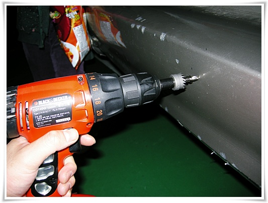
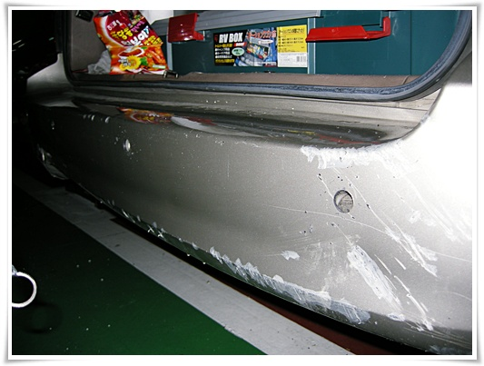
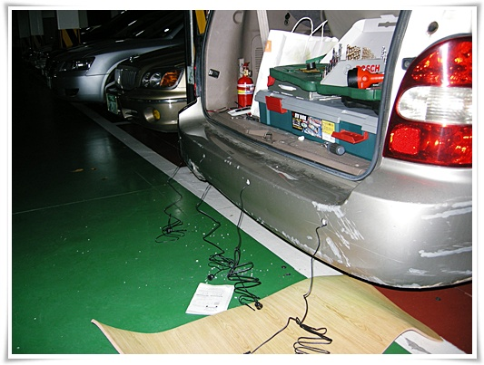
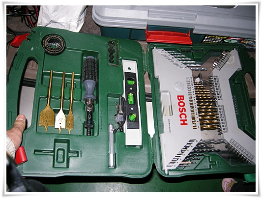
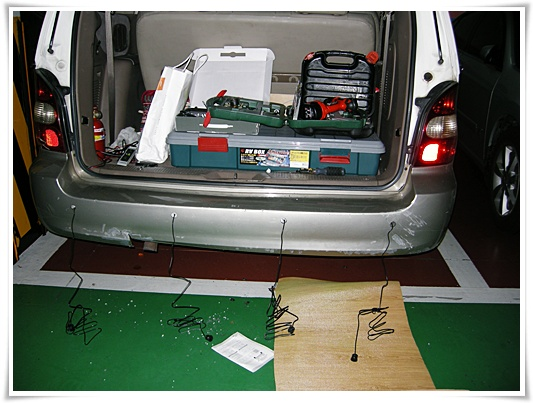
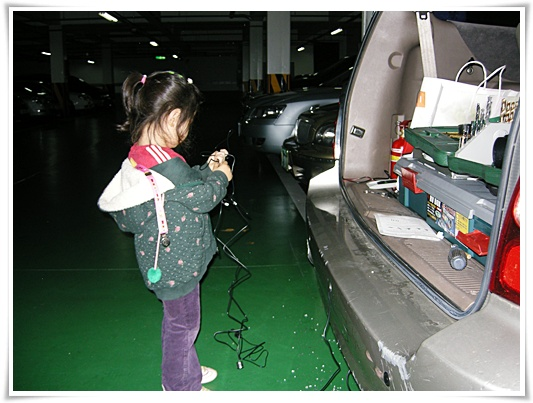
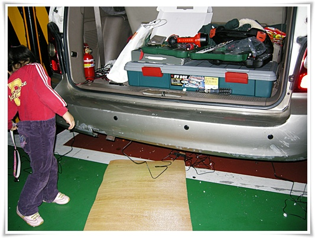
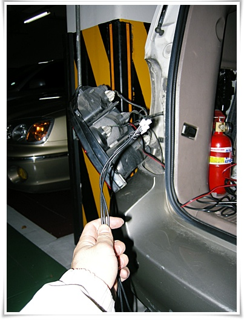
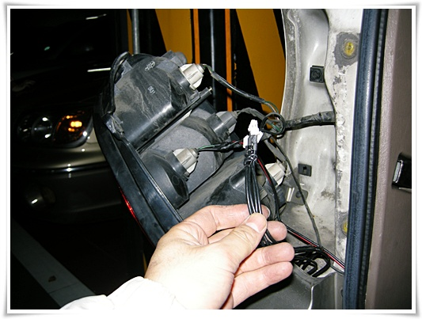
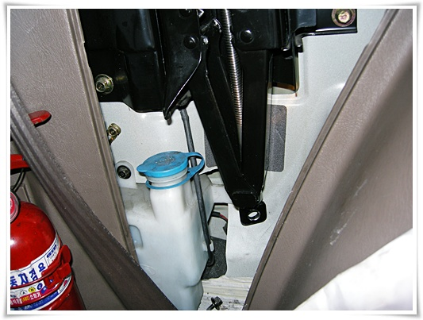

# 카니발에 후방경보기 설치작업 2탄

지난번 설치하다 중단한 [후방감지기 설치 시도](../10230558.html) 를 다시 했다.

오밤중에 하느라 지하 주차장에서 했다.

구멍을 뚫기 시작한 후부터는 돌아올 수 없는 강을 건너는 것이다.

설명서에 각 센서간 간격을 40cm로 하라고 하여, 줄자로 길이 재본 후 구멍 뚫기 시작.

저 구멍을 뚫기 위해 21mm 홀쏘도 구매했다.

구멍 4개를 이렇게 뚫었다.  사진으로 보니 범퍼가 정말 상처가 많군.

이제 범퍼에 센서를 집어넣어야 한다.

범퍼에 구멍을 내도 또 스티로폼이 있어, 이를 후벼팠다.

기껏 후벼봤는데, 선을 범퍼 안쪽으로 집어넣을 수가 없겠더군.

차 밑바닥을 작업전 들어가봤어야 하는데, 구멍부터 파고 밑으로 기어들어가서 보니 무슨 판 하나가 더 막고 있어 선을 뺄수가 없었다.

그래서 그 플라스틱 판에도 구멍을 뚫었다.

구멍을 뚫기 위해 다시 집에 올라가 드릴비트를 가져왔다.

10mm 비트로 선 집어넣을 구멍 뚦기.

여기까지 구멍을 뚫는데만도 힘이 다 빠졌다.

작업하는 내내 딸래미는 작업 도와준다고 해 놓고선 방해만 하고 있다.

어려서부터 이런 모습을 보여주면 안되는데,..

이러다 덜컥 공대라도 가겠다하고 하면 큰일인데,..

어찌저찌해서 일단 센서 4개를 범퍼에 박았다.

센서 색깔이 까만색이라 눈에 확 튀는군.

저 장판을 깔고 배선을 연결하러 차 밑으로 기어 들어갔다.

센서 4가닥을 차 안으로 집어넣어야 하는데, 잘 안되더군.

차 밑으로는 기어 들어갔는데, 당췌 선을 어떻게 위로 올려야 할지 모르겠더군.

그래서 일단 후미등부터 뜯고 봤다.

뜯고 나니, 범퍼와의 틈새가 있어 그리로 빼내면 되겠다 싶었다.

범퍼와 몸체 틈새로 빼 올렸다.

저거 빼 올리는데 온갖 삽질을 했다.  저 좁은 틈새로 선을 쉽게 올라오지 않는 거다.

나중에 줄자를 먼저 위에서 아래로 뺀 다음, 줄자에 저 선을 묶어 당겨 올렸다.

그 다음 배선을 차 안으로 집어넣어야 한다.

다른 사람이 diy 한 글들을 보면 이 ovm공구통쪽으로 선을 빼면 된다고 하는데, 30분가량을 씨름하다 포기했다.

눈에 보이지도 않고, 구불구불한 틈새로 선을 빼오는게 내게는 불가능해보였다.

그래서 그냥 선을 고무트림 사이에 뺐다.  비 오면 자칫 물 들어 올 것 같군.

이렇게 후방경보기 설치작업은 끝냈다.

선정리도 깔끔하지 못하군.

설치업체가 하는 작업을 옆에서 본 사람은 정말 간단하다고 했다.

그리고 직접 DIY 한 사람도 정말 간단하다고 한다.

그런데 나는?

간단하다는 글을 곧이곧대로 믿으면 안된다.

경험이 아주 중요한데, 난 경험이 없었다.

그러니 DIY를 즐겨한 한 사람에게는 아주 간단한 일임에도 무척이나 힘겹게 하고 있는 거였다.

공임을 너무 비싸다고 여겨서는 안된다는 것을 다시 한번 느꼈다.

전문가가 30분이면 하면 되는 것을 가지고 공임 많이 받는다고 투덜될 꺼가 아니고, 전문가이기에 30분이지 자신이 직접하면 그 몇배의 시간을 투입하고도 제대로 된 결과를 얻지 못할 것이기에 자신이 직접 했을 때 시간과 그시간에 해당하는 자신의 몸값이 전문가에게 준 공임보다 쌀 경우는 공임이 비싸다고 해도 되겠지만, 안 그럴때는 그 공임은 정당한 거라 생각한다.

시간은 곧 돈이고, 자신의 시간을 다른 사람의 시간으로 썼으니 그에 합당한 돈을 줘야겠지.

다시 해 본다면 두시간정도면 끝낼 수는 있을 것 같지만, 다시 또 하기는 싫군.

