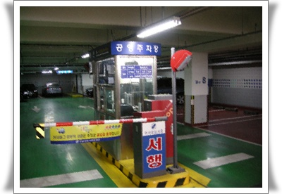

# 공영주차장 이용 팁

관련업계 종사자로서 한번 정리를 해 본다.

도로곳곳에 공영주차장이 있다. 공영주차장이니까 공공단체 즉 지자체에서 운영을 하는 주차장이다.

서울시를 기준으로 보면, 서울시에서 만든 공영주차장운영 조례를 거의 따르고 있는 편이다.(각 구마다 세부 조례가 있기는 하다)

운영주체를 보면, 서울시설관리공단에서 운영하는 것이 있고,

구청에서 직접 운영하는 것도 있고,

각 구청산하의 도시관리공단(혹은 시설관리공단)에서 운영하는 것도 있고,

아예 민간에 위탁을 주어 운영하는 주차장도 있다.

대부분은 각구청산하의 도시관리공단(혹은 시설관리공단이라고도 함)에서 운영을 한다고 보면 된다.

형태는 노상과 노외로 구분된다.

노상은 그냥 길가에 선 그어놓고 운영하는 주차장이고,

노외는 별도의 토지를 점유하여 운영하는 주차장이다.

가격은 노상이 비싸고, 노외가 싼축에 속한다고 보면 된다.

운영방식은 노상은 근무자가 PDA를 들고 다니면 차 들어올때 주차표 발급하고, 차 나갈때 요금 계산하는 방식이다.

노외주차장은 규모가 작은 경우는 노상처럼 PDA를 사용하여 운영하고, 어느정도 규모가 있으면 주차관제장비를 갖추고 운영한다.

노상주차장은 10분단위로 돈을 받으므로, 가급적 짧게 주차하고 나가는 것이 좋다.

운영시간은 대부분 평일 09:00 ~ 18:00 이므로 이 시간 이후로는 무료다.

그래서 저녁시간 시내를 주차할 일이 있으면 노상주차장을 이용하면 된다.

내가 삼성동 코엑스를 이용할 때 주로 사용하는 방법이다.

코엑스 근처에 한전옆 노상주차장과 선릉옆 노상주차장이 있어 운영시간 외라면 이곳에 주차하면 공짜로 주차할 수 있다.

노외주차장은 보통 동사무소나 문화센터에 붙어 있는 경우가 많다.

즉 수익성보다는 주민편의위주로 운영되는 주차장이서 각종 할인이 된다.

기본으로 방문주차 도장을 찍으면 보통 1시간까지는 무료로 된다.

방문주차 도장은 찍기 쉽다. 도장은 보통 민원인 스스로 찍도록 놓아두기 때문이다.

그렇다고 도장도 안찍은 상태로 할인해 달라고는 하지 말라.

주차근무요원들도 1년에 한번정도 감사를 받는데, 그 때 도장없이 할인해준 차량이 발견되면 물어내고 징계도 받게된다.

그리고 할인율은 조례로 명시되어 있기 때문에, 별도 표시사항이 없더라도 요구하면 된다.

기본적인 장애인,국가유공자가 80%, 경차 50%, 저공해차 50%, 요일제차량 10% 할인이 되겠다.

공영주차장이 일반 사설보다 낫기 때문에 인기가 많은 편이다.

특히 월정기차량같은 경우는 폭주상태다.

시내중심가 좀 급지의 공영주차장의 경우 월정기 전일이 15만원, 주간이 7만원, 야간이 5만원 정도 되는데, 보통 이용하려면 대기기간은 6개월이상은 잡아야 한다.

기존 이용자가 중지한 경우 예약순서대로 배정하기 때문에, 중도해지한 이용자가 없을 때는 그냥 무작정 대기상태다.

노외주차장 주차요원을 쉽게 무시하지 말라. 알고보면 대단한 사람이 많다.

계약직이기는 하지만, 고령의 나이를 쓰는 직종 치고는 처우가 좋은 편이다.

그래서 들어가기가 쉽지 않은 자리다. 그러다보니 꽤 빽이 있는 사람들이 많다.

한 공단을 보면 전직 육군 대령도 있고, 전직 공무원, 전직 경찰도 있고 그렇다.

땅도 제법있는데 그냥 놀기 싫어 일하는 사람도 있었다.

그렇다고 사람됨됨이 없는 사람이 없지는 않다.

분쟁이 있을 때는 가볍게 민원집어넣으면 해결된다. 민원은 차상급기관인 구청으로..

공공기관이다 보니, 위에서 감사나오는 제일 두려워한다.

그러다보니, 민원만 집어넣으면 규정상 안되는 것도 해주는 사례가 제법 된다.

