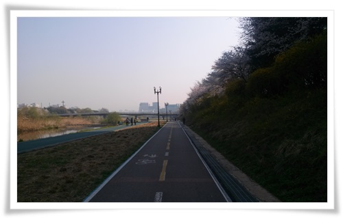
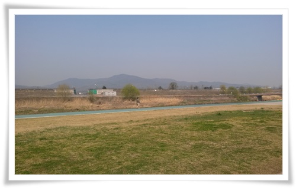
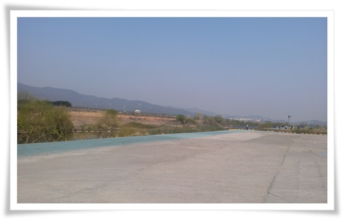
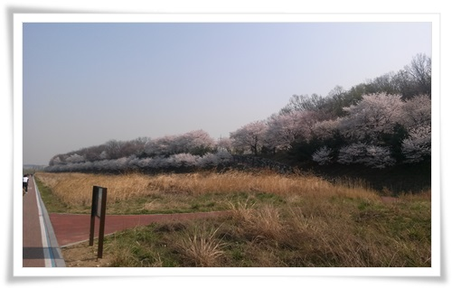
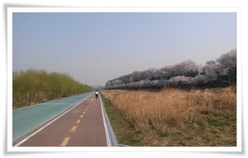
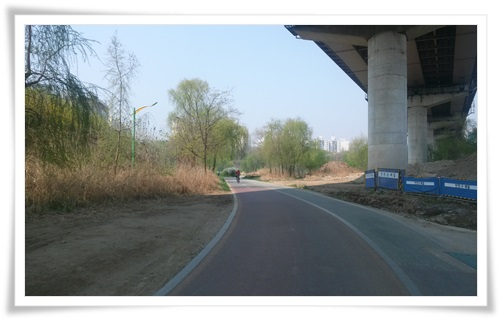
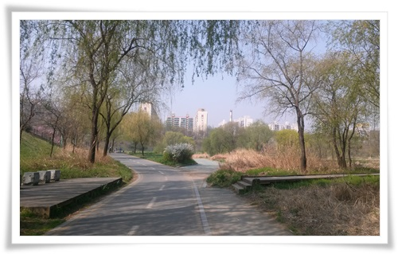

# 탄천따라 자전거로 29km 출근 

운동을 아예 안하고, 게다가 저녁은 항상 과하게 먹는 생활을 하다보니 몸은 자꾸만 불어갔다.

과거 생각을 해보면, 직장생활을 하고서 가장 몸이 좋았던 때가 장안동에서 방배동까지 매일 자전거로 출퇴근하던 시절이었다.

다시 한번 자전거 출근을 시도해보기로 했다.

집에서 회사까지 거리는 29km.  꽤나 먼 길이다.

탄천에서 양재천으로 자전거도로가 있어 위험하지는 않지만 편도 2시간이 걸리는 거라 선뜻 실천하기가 쉽지 않았다.

날도 따뜻하고, 벚꽃이 절정인 토요일, 마침 주말 출근을 해야 한 날이라 자전거로 출근을 해 봤다.

\- 정자동 근처

\- 태평동 근처.  왼쪽이 서울 공항.

\- 자전거 타고 오지 않았다면 계속 못 봤을 풍경이다.

비행장 근처 고도제한이라 하늘이 넓게 보인다.

\- 성남8경 중 한 곳인 벚꽃길.  꽃이 활짝이다.

\- 비행장 근처 자전거 도로라 한산하다.

\- 이제 양재천과 만날 때.

\- 간만에 와본 양재천 갈림길이다.

이날 자전거로 1시간41분을 달려 회사에 출근했다.

29km가 역시 멀기는 멀다.

하지만 자전거 도로가 잘 되어 있어 예상보다 할 만했다.

시간적 여유만 있다면 주기적으로 자전거 출퇴근을 해 봐야겠다.

