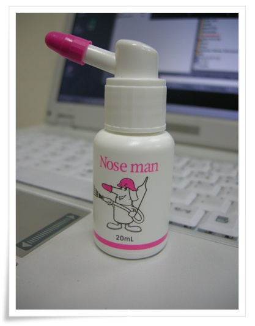

# 코세척기 사용

코감기 걸렸을 때 내가 주로 하는 요법이 소금물로 코 세척하는 거다.

컵에다 수돗물 받아, 적당량의 소금을 넣어 소금물을 만든 다음 코에다 들이부어 그 소금물이 입으로 나오게 하는 방법.

뭐 많이들 하는 방법이다.

그 준비하는 과정이 그리 편하지가 않았다.  소금물 농도도 일정치 않고, 코에다 집어 넣는 방법도 그리 편치 않고,..

검색해보니 바로 코세척기가 나오더군.  무식한게 죄다.

아래와 같은 코세척기를 샀다.

가격은 1,500원.  20mL 용량이다.

거기다 식염수 집어 넣고, 코에다 집어넣으니 안 흘리고 잘 들어가는군.

나름 이비인후과 홈페이지까지 찾아가 살펴봤는데, 소금물로 하는게 무슨 세균 죽이는 역할을 기대할 정도는 아니라는군.

효과는 코와 입사이에 있는 부비동이라는 공간에 농도 짙은 액체(노란 콧물)들이 있는데, 그걸 소금물로 희석시켜 입쪽으로 떨어뜨리는 역할을 한다는군.

즉, 코는 열심히 풀어도 뭔 시원치 않을때, 코세척을 하면 좋다는 말이더군.

이번 감기도 코세척기로 좀 편하게 지나가는 듯 싶다.

