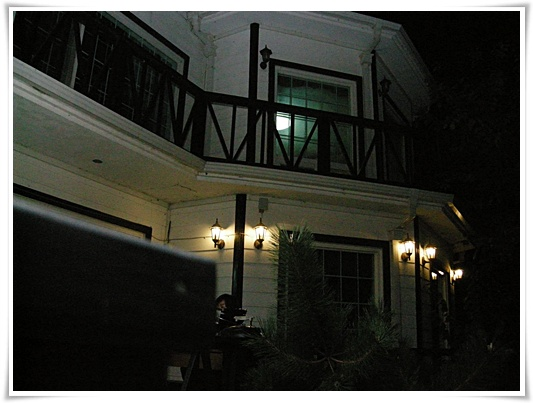
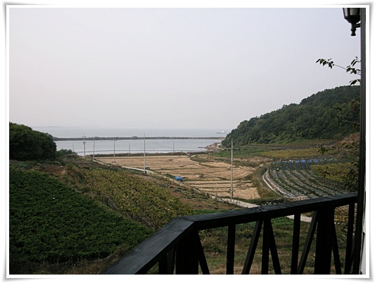

# 펜션이 과연 수익성이 있을까?

[루프캐리어없이 지붕에 짐을 싣고서](../10218872.html "")  놀러간 곳은 영종도 앞에 있는 신도라는 섬.

숙소는 해밀펜션.

펜션 모습은 이렇다.  너무 방을 잘게 쪼개놨다.

펜션에서 바라본 풍경은 이렇게 뭔가 언밸런스하고..

2000년 초중반, 우리나라에 펜션이 붐이 불었었다.

주5일제 시작과 함께 많이 사람들이 주말에 놀러가다 보니, 기존의 콘도로는 다 감당이 안되는 시기였다.

그시절 한때나마 나도 펜션을 해 볼까 생각을 했었다.

나름 전원생활도 좋아하고, 이것저것 집수리하고 텃발 가꾸고 하는 것도 내 적성에 맞을 것 같아서였다.

시기는 삼팔선이라 일컬어지는 30대후반을 목표로 잡고, 사전 공부를 시작했었다.

한 2년정도 자료 수집과 답사 끝에, 펜션 꿈은 접었다.

거의 2주에 한번씩은 주말이면 놀러를 다녔는데, 저거다 싶은 펜션은 딱히 들어오지 않았다.

이미 자연휴양림에 눈이 높아진 상태로 펜션은 도저히 경쟁상대가 되보이지 않았다.

대부분 사진은 아주 멋들어진데, 실제 가서 보면, 주변 풍경과 전혀 일치되지 않은 것이 태반이었다.

건물만 목조로 멋들어지게 지었지만, 그 건물이 그냥 논밭 한가운데 있었고,..

펜션의 경쟁상대는 기업이 운영하는 콘도, 국가및지자체가 운영하는 자연휴양림이 되겠다.

펜션의 장점으로 내세울만한 것은 그냥 예약이 쉽다는 정도.

단점으로는 편의성 떨어지고, 친절도가 펜션 주인에 따라 너무 편차가 심해 한마디로 일정한 품질이 안 나온다는 점

그리고, 주변과 전혀 연계가 되지 못하다는 점.

2005년 당시 이미, 적정 수익을 내고 있는 것은 좋은 지리적 위치를 선점한 펜션과 기업형 대단지 펜션들뿐이라는 결과가 나오더군.

암튼, 그렇다.

이번에 신도로 놀러를 갔는데, 그 꼬딱지만한 섬 전체가 펜션으로 넘쳐나더군.

새로 짓고 있는 펜션들도 많고...

휴가철 기어코 방을 잡고 놀아야겠다는 생각아니면, 그리 이용하고픈 곳은 안보이더군.

