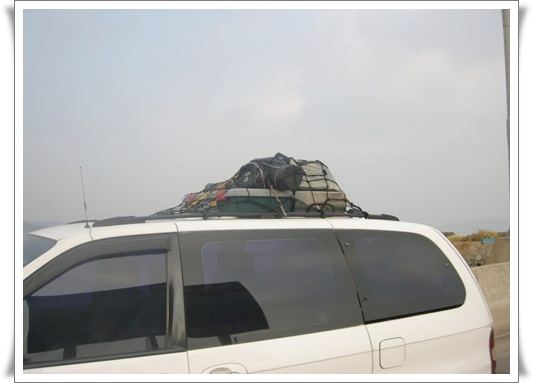

# 루프캐리어없이 지붕에 짐 싣기

동경하는 삶중의 하나가, 아프리카 초원을 캥핑차로 투어하는 것이다.

차의 모습의 national geography에 흔히 보이는 4륜구동차에 지붕에는 온갖 짐을 가득 싣고 싸돌아 다니는 것.

차 지붕에 짐을 실을려면 우선 필요한 것이 루프캐리어, 툴레박스 등이다.

그런데 이게 꽤 비싸다.  가장 간단하게 생긴 캐리어가 최저 30만원, 어지간한 것들은 5,60은 넘어간다.

이제까지의 내 차는 루프랙이 없어, 어차피 루프캐리어자체를 장착도 못했지만, 바뀐 내 차 카니발은 루프랙이 달려있다.

루프랙을 볼 때마다 저 위에 뭘 올리고 싶었다.

그렇다고 그 비싼 루프캐리어를 사기에는 배보다 배꼽이 더 상황이고,.

그래서 찾아본 것이 루프백.  요즘 1박2일 프로그램때문에 캠핑하는 사람들이 많아졌고, 그 에 따라 루프백도 조금씩 팔린다고 하더군.  싼것은 7만원, 보통 20만원선.

지붕에 지붕만한 큰 백을 얹고 다니는 거다.

고민하다가, 역시 사용횟수대비 가격에서 포기.

그냥 지붕에 얹기로 했다.

방법은 그물망과 고무줄.  옥션에서 개당 4,800원에 팔더군.

이렇게 올렸다.

차가 커져서 지붕에 올린 짐은 작아보이는데, 저 짐이 차 안으로 들어가면 사람 앉을 자리 2개를 차지한다.

저렇게 얹고서 영종도옆 시도까지 잘 갖다 왔다.

안에서 6명이 안락한 자세로 타고..

