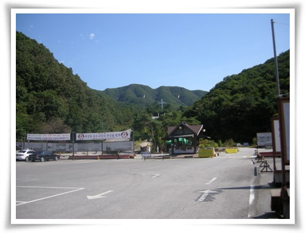
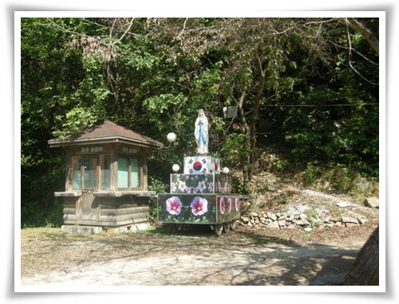
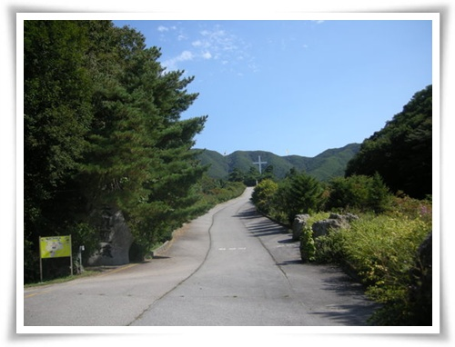
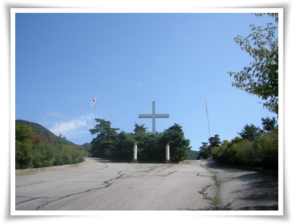
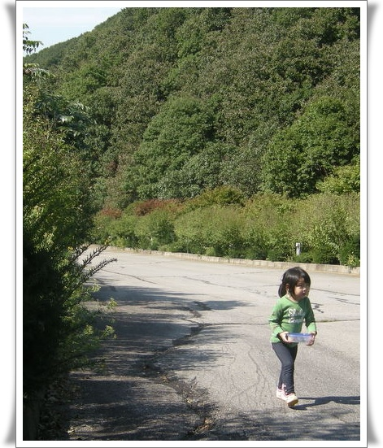
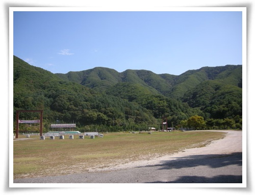

# 천진암 산책

짧디짧은 추석연휴-사실 연휴라고 불러주기로 그렇다.  무슨 추석이 토요일이어가지고, 딸랑 금요일 하루 더 쉰 것 밖에는 없다.

그 짧은 추석연휴 마지막 날, 그러니까 일요일 아침 천진암으로 갔다.

애초의 목적지는 앵자봉.  광주시에 있는 산이로, 집에서 한시간 거리다.

근래 너무 안 돌아다니고, 시간만 있으면 퍼질러 있는 생활에 나날이 들어가는 몸무게에 피로는 더해 산을 오를 참이었다.

그래서 혼자서 갔다 올 생각이었으나, 딸래미가 따라 가겠다고 하더군.

딸래미가 날 따를 날이 얼마나 되겠냐는 생각에 딸래미를 대동하고 천진암으로 향했다.

위치는 광주시 퇴촌면 우산리.

제법 골짜기에 있더군.

-천진암 주차장

입구가 요즘 보기 드물게 촌스럽다.  딱 떠오르는 이미지는, 우리나라의 기도원(부정적인 의미임)이다.

\- 입구에 있는 성모마리아 상.

헌데 제단이 태극기와 무궁화다.  이게 무슨 의미일까?  종교와 결부된 태극기는 내게 별로 좋은 이미지는 아닌데,..

-주차장에서 올라가는 길.  제법 경사가 있다.

\- 오르막길 마지막.  하늘이 참 청명하다.

\- 송편을 들고 잘 올라오고 있는 내 딸래미

\- 여기에 100년 공사기간으로 대성당을 짓는다고 한다.

탁 트인 공간에 청명한 하늘에, 사방이 병풍처럼 산으로 둘러쌓여 정말 명당이구나라는 생각이 절로 들더군.

게다가 사람도 별로 없어, 아주 호젓하고..

헌데, 저 평탄한 곳이 원래 평탄한 곳이 아니었더군.

대성당을 짓기 위해 인위적으로 골짜기를 메운 것이라고 하는군.

어지간한 단체면 환경단체의 반대에 진행을 못 했을 텐데, 종교단체라서 가능했다 보다.

천진암은 우리나라 천주교의 시발점인 곳이란다.

헌데 이름은 불교식 암자 이름이다.

이유는 원래 불교 암자였기 때문이다.

조선 정조시대 천주교 탄압이 이루어지던 시절, 천진암 스님들이 천주교 실학자들을 보호해주고 그들에게 땅을 내 주었다고 하는군.

그러고 보면, 불교가 참 관대하다.  신이 없는 종교라서 그런가?

헌데 천주교입장에서 불교를 참 고마워해야하고, 그에 대한 성의표시도 해야 할텐데, 천진암 그 어느곳에서도 원래 불교 암자였다는 표시는 없더군.  인위적으로 싹 지운 듯한 느낌이라고 할까나..

왜 숨길려고 할까?  떳떳하게 불교의 도움으로 오늘날의 한국 천주교가 더 발전했다고 안내판이라도 세워놓으면 훨씬 더 쿨해보이고, 요즘 들어 많이 시도하는 종교화합도 잘 되어, 밑지는 게 없을 듯 한데..

앵자봉을 목표로 해서 올라갔으나, 딸래미가 산에 올라가기를 거부하는 통에, 천진암을 못 벗어나고 하산했다.

