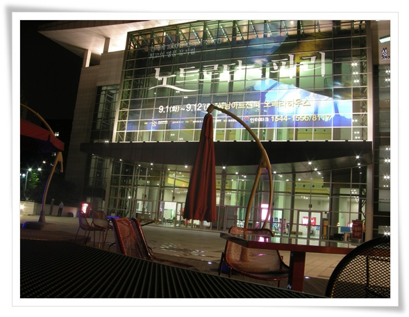

# 성남아트센터에서 본 노트르담 드 파리 

간만의 문화생활로 노트르담드 파리를 봤다.

저게 아마 5,6년전쯤 오리지널팀이 우리나라에 와서 공연했었던 것 같다.

내가 처음 본 것은 한창 중국 출장 갔을 때 산 DVD로부터다. ( [중국의 불법복제 DVD](../6166817.html ""))

중국출장의 묘미는 따오판 DVD 사는 것.    그 때 하루의 일상은 DVD 쇼핑으로 푸는 거였다.

암튼 그때 샀던 것 중의 하나가 노트르담 드 빠리였다.  곡이 너무 좋아, mp3 리핑하여 핸드폰에 넣고 다면서 들었었다.

작년에 한국판 초연이 있었고, 그 때도 보고 싶은 마음은 많았는데, 시간상 못 봤다.

그걸 올해가 되어서야 봤다.

출연진은 조금은 유명세가 떨어지는 구성이었으나, DVD로 보던 것을 실제로 보니, 그것도 좋았다.

애가 있기에, 이런 공연을 보는 방법은 이렇다.

표는 한장만 끊는다.

전반부할때 내가 공연장 들어가서 보고, 그 동안 아내가 애를 보고,

후반부할 때는 반대로 아내가 공연을 보고, 난 애를 보고..

