# 딸과 단둘이 해외여행 4/4 - 캄보디아 3일차 톤레삽호수와 선택관광

패키지여행으로 버스만 타고 돌아다니니 방향감각이 떨어져가는 것 같았다.

직접 발로 돌아다니는게 적성이 맞는다.

9년전 기억을 현재에 일치시키기 위해 예전 묵었던 숙소까지 걸어서 가보기로 했다.

예전 숙소가 Long Live Guest House.

그냥 6번 국도로 쭉 걸어가면 되는 거였다.

한 2km 정도 되는 거리다.

6시에 호텔을 나서 동네 탐험길을 떠났다.

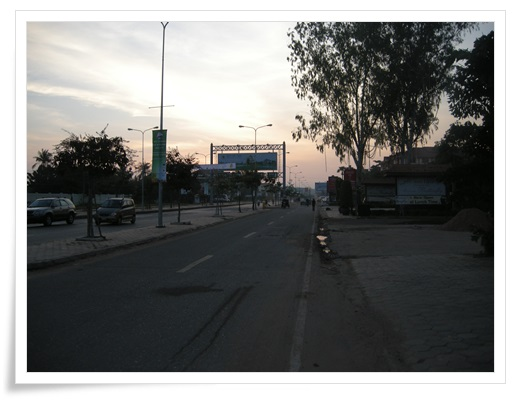

\- 일출 부근이라 아직 도로는 한산하다.

\- 이런 건물도 있다.

뭔가 종합 쇼핑센터 느낌이다.

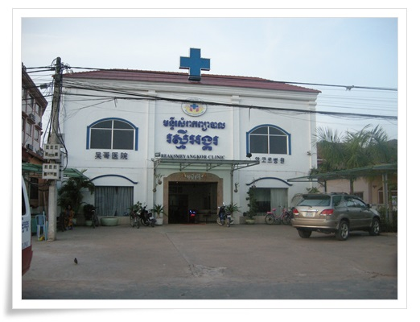

\- 병원도 있군.

한국인 손님이 제법 되는지, 한글 간판도 있군.

\- 여기도 강남스타일이 있군.

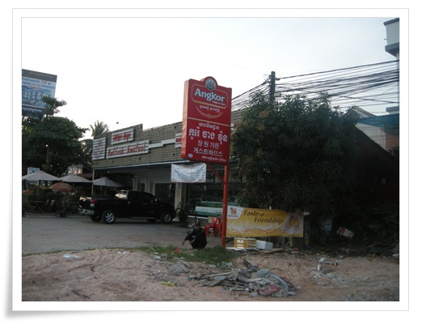

\- 장원가든게스트하우스 표지판.

\- 가판대에도 뭔가 올려져 있다.

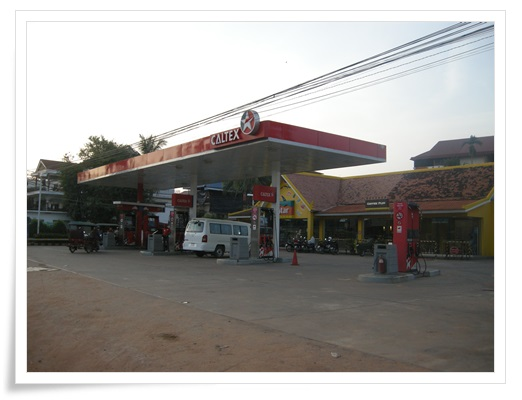

\- 앙코르의 중심인 스타마트와 주유소

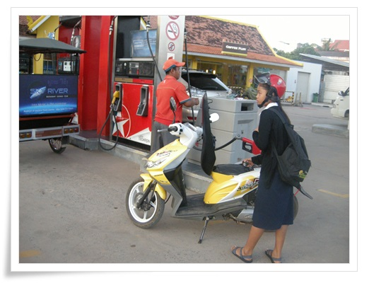

\- 주유하는 학생

\- 스타마트

9년전 이 근방을 중심으로 게스트하우스가 몰려 있어 이게 하나 이정표였는데, 지금은 어떤가 모르겠다.

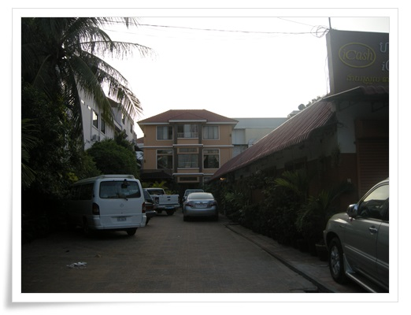

\- 스타마트 뒷편의 롱라이브게스트하우스.

9년전이랑 똑같은 모습이다.

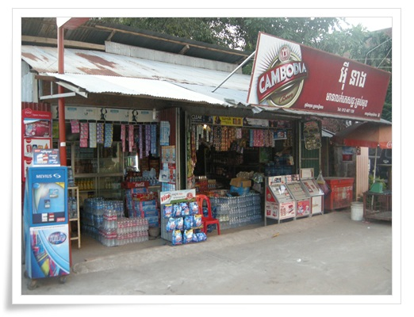

\- 9년전에도 있었던 매점.  좀 커진 것 같기도 하다.

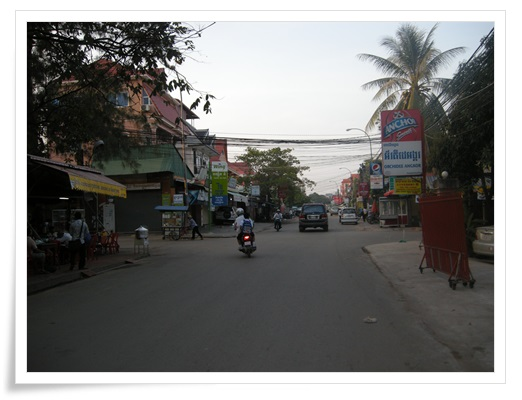

\- 뒷골목을 따라 걷는데, 제법 깨끗해졌다.

\- 세트메뉴가 6000리엘이면 1.5$이군.

역시 현지인 식사는 싸군.

\- 뒷편으로 게스트하우스들이 더 많이 들어섰다.

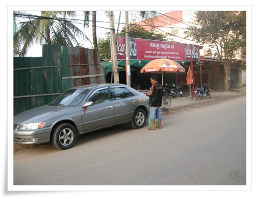

\- 병에 든 기름통으로 주유하는 운전자.

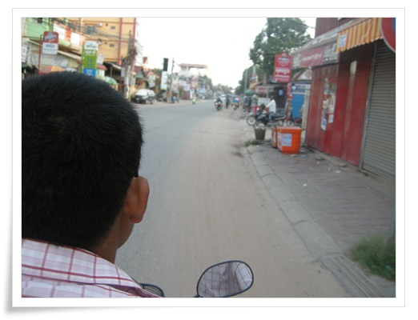

\- 다시 돌아가는길은 오토바이를 불러 세워 탔다.

호텔까지 1달러.

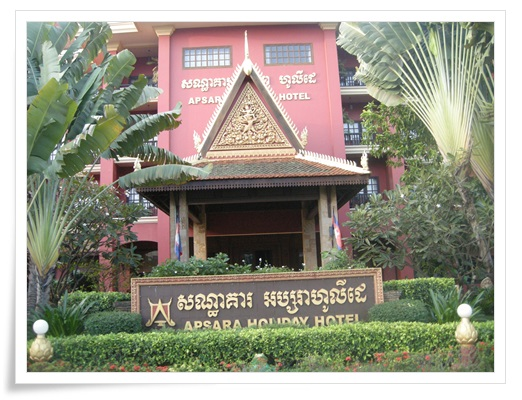

\- 호텔 도착.

\- 06:00 ~ 06:30 까지 산책한 경로.

오전 일정은 인공호수부터다.

버스로 10분을 가 인공호수에 도착했다.

인공호수도 앙코르시대에 만든 것으로 West Baray라고 한다.

호수안에 들어갈 것이 아니어서 그냥 밖에서 호수만 구경하고 돌아왔다.

\- 인공호수에서

다음 코스는 전통가옥과 물소수레 체험

\- 물수가 끄는 수레를 타고 이거 논두렁을 가는 거다.

나야 어렸을 때 소도 타보고 했기 때문에 별 신기할 게 없긴 하다.

다만 어렸을 적 생각이 나더군.

\- 하교중인 학생들

\- 전통가옥에도 들어가 본다.

\- 이게 전통 주방이라고 한다.

\- 딸내미는 길고양이를 만나 쓰다듬고 있다.

\- 고양이 안고 있는 딸내미.

이 고양이 보러 다시 한번 캄보디아 오자고 한다.

캄보디아에는 고양이도, 개도 다들 순해서 좋다면서..

\- 두리안이 이렇게 열리는 열매였군.

\- 이후 시내에 있는 중앙공원 구경.

이건 그냥 시간 떼우기식 같았다.

그 다음 행한 곳은 쇼핑.

서진잼이라는 보석가게에 들어갔다.

매니저의 보석 설명을 듣고, 보석 구경을 했다.

보석이라고 해 봤자, 좀 반짝이는 돌이라는 것 외에는 관심이 없기에 빨리 끝나기 만을 기다렸다.

아무도 사는 사람이 없었다.

같은 단체관광객중 한 분이 예전 여행사를 했다면서 해 주는 말이 패키지여행은 선택관광을 다 해야 본전이고, 실질적인 이익은 쇼핑에서 난다고 하는데, 이번 가이드는 별 수익이 없을 것 같다.

\- 점심은 김치찌게.

고기가 몇 점 없었다.

이 음식점은 좀 실망이다.

\- 고기 거의 안 들어간 김치찌게 먹은 식당 토담골.

점심 먹고, 카페에 가서 1시간가량 휴식시간을 가졌다.

좌석이 테이블당 4명이 앉는거라, 이번에 다들 멀뚱멀뚱 자기 핸드폰만 만지막거리며 언제 끝나나하는 표정이었다.

다음 행선지는 쇼핑 2탄.

상황버섯.  캄보디아가 상황버섯으로 유명하다는군.

\- 상황버섯 매장

\- 다들 자리에 앉아 상황버섯 효능에 대해 설명을 듣고 있다.

1kg에 25만원이라고 했다.

여기서는 대여섯명 샀다.

톤레삽호수는 언제 가느냐는 불만이 터질려고 할 즈음, 다음 행선지는 톤레삽호수라는 가이드 안내가 나왔다.

차로 30여분 갔다.

선착장에 내려갈 때 사진을 막 찍는데, 얼굴을 돌려 사진을 못찍게 하라고 가이드가 알려주었다.

사진 찍히면 그 사진을 강매한다고 한다.

\- 배에 탑승했다.

배에 어린애 두명이 타고 있으면서, "머리조심하세요"라고 말을 한다.

다른 곳과 달리 뭘 달라거나하지는 않았다.

그래서 더 뭐좀 주고 싶은 생각이 가지고 있던 풍선을 불어 줬다.

가만이 생각해 보니, 이곳 캄보디아에서 제대로된 장난감을 가지고 노는 아이를 본 적이 없었다.

\- 톤레삽호수.  크긴 크다.

아시아에서 제일 큰 호수라고 한다.

\- 물색깔은 황토색

\- 한배에 다 탄 우리 일행

\- 수상마을이 나타나고, 수상학교의 모습도 보인다.

\- 선택관광인 쪽배투어를 하기 위해 구명조끼를 입었다.

-이게 맹글로브나무라고 하던데, 이 숲사이를 지나간다.

\- 이렇게 배에는 사공 한명, 승객 두명이 탄다.

\- 새집들이 모여있는 곳에 잠시 모였다.

\- 호명되기를 기다리는 사공들

\- 수상가옥이라도 불은 피워야 하니 이렇게 마른 장작 쌓아 올린 게 보인다.

\- 쪽배투어를 마치고 캄보디아 한인부녀회에서 운영한다는 독도홍보관에 갔다.

뭔가 애국심 마케팅을 하는게 좋게 보이지 않는다.

괜히 쓸데없이 "독도가 어느나라 땅이죠?"하는 질문이나 하고 말이다.

\- 새마을 조끼를 입고 자원봉사하는 분들이 하는 매장이다.

수상마을 발전에 쓰인다고 하여 딸내미에게 하나 고르라고 하여 10$짜리 조각하나 샀다.

여기서 파는 물품들이 가격은 싸지는 않았다.  거의 공항 면세점 수준이다.

시장에서 봤던 가격보다 적게는 2배, 많게는 5배까지도 비쌌다.

그런데도 이 가격이 캄보디아서 제일 싼 가격이라고 버젓이 말하는 것은 듣기 거북했다.

좀 솔직하게 약간 비싸긴 하지만, 이곳 사람들을 위해 좀 사달라고 좋으려면만 굳이 저렇게 거짓말을 해야 할까 싶었다.

\- 킬링필드추모사원도 방문했다.

여기서 가이드의 캄보디아 역사에 대한 해박한 설명을 들었다.

참 불쌍한 나라다.

\- 저녁은 월남쌈밥.

뭔가 안 어울리는 조합이다.

그냥 끼니외 별 느낌 없는 식사였다.

식사후 공항으로 가기까지 마지막 남은 일정이 찜질방이다.

아이스파크라는 찜질방에 갔다.

\- 아이스파크 찜질방

우리나라의 찜질방과 비교하여 많이 떨어지긴 했다.

시설도 많이 낡았다.

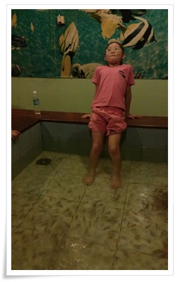

\- 찜질방에 있는 닥터피쉬.

처음으로 해 보는 것인데, 상당히 간지러웠다.

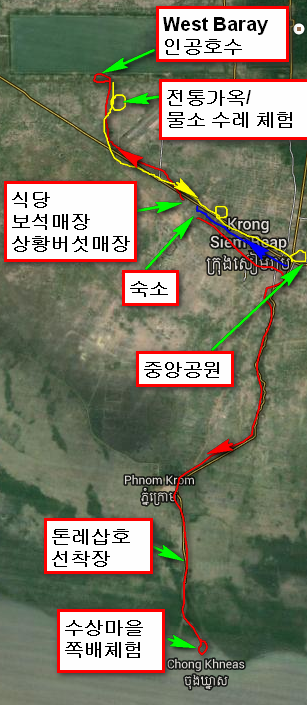

\- 셋째날 이동 경과, 주요 방문지

\- 모든 일정 마치고, 다시 귀국하는 비행기 티켓 발권중.

같이 여행다닌 일행중 딸을 마치 조카처럼 이뻐해주고 살갑게 대해준 여자분이 목욕도 시켜주고, 머리까지 땋아줘서 이쁘게 변했다.

셋째날 한 일과 쓴 돈

06:00 ~ 06:30 아침 산책 (오토바이 $1)

06:40 ~ 07:00 아침 식사

07:00 ~ 07:00 수영장에서 딸내미 물놀이

08:30 check out (방 청소 팁 $1)

08:40 ~ 08:50 West Baray(인공호수)로 이동

08:50 ~ 09:10 인공호수 구경

09:30 ~ 10:30 물소 마차 체험(선택관광)

10:30 ~ 10:40 중앙공원으로 이동

10:40 ~ 11:00 공원 구경

11:00 ~ 11:30 보석가게 의무 쇼핑

11:40 ~ 12:20 점심 - 김치찌게

12:30 ~ 13:10 북카페에서 아이스크림(선택관광)

13:20 ~ 14:00 상황버섯 매장 의무 쇼핑

14:10 ~ 14:30 톤레삽 선착장으로 이동

14:40 ~ 15:20 수상마을로 관람 & 이동

15:30 ~ 16:00 맹글로브숲 쪽배 투어(선택관광, 뱃사공 팁 $1)

16:10 ~ 16:40 한인자원봉사매장 의무 쇼핑(수정 악세라리 $10 구매)

16:40 ~ 17:10 선착장으로 복귀

17:20 ~ 17:50 식당으로 이동

18:00 ~ 18:30 저녁식사 - 월남쌈&순두부찌게

18:40 ~ 18:50 찜찔방으로 이동

19:00 ~ 21:40 아이스크파크 찜질방에서 목욕하고 시간 떼움

21:40 ~ 21:50 공항으로 이동

21:50 ~ 22:10 발권 & 출국 심사

22:10 ~ 23:40 비행기 대기

23:40 비행기 탑승

총 13$(14,900원)을 썼다.

캄보디아의 시작처럼 출국심사부스에서도 "원달러"를 요구했다.

가볍게 무시했다.

출입국사무소의 웃돈 요구만 없다면, 다시 또 와보고 싶은 나라다.  오지가 많아 오지를 돌아다녀보고 싶다.

