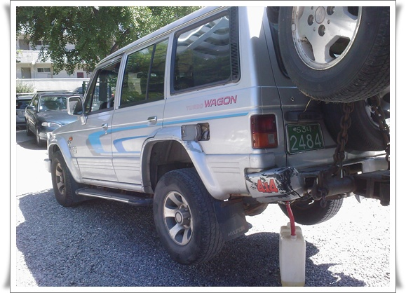

# 갤로퍼 폐차

[헤드 나간 갤로퍼 물 보충하며 다닌다](../9903633.html "") 이후 결국 차를 폐차했다.

매일매일 물보충하는데가 잦은 시동불량으로 관리가 힘들어 폐차를 결정했다.

올해까지 조기폐차 지원금이 나와 대행해주는 곳에 연락하니 바로 레카차가 와서 끌고 갔다.

고철값 42만원은 입금되었고, 조기폐차지원금은 아직 기다리고 있는 상태다.

레카차에 들린 상태로 마지막 기름을 짜내고 있는 모습.

견인기사의 눈총에도 꿋꿋하게 기름을 빼냈다.  저 통으로 거의 두통이 나왔으니, 거의 38리터정도를 빼 낸 것이다.

