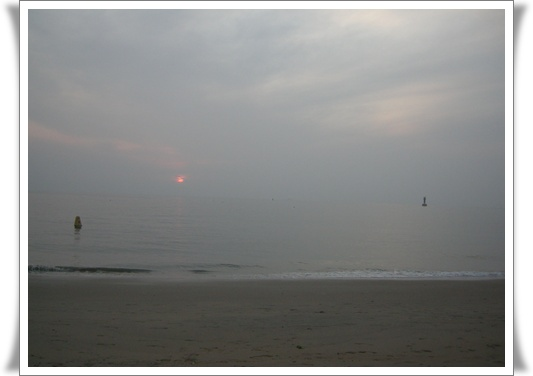
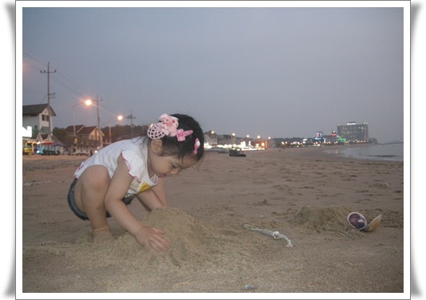
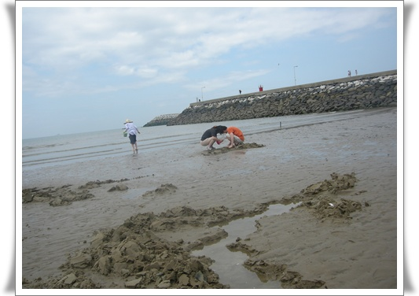
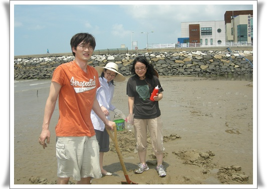
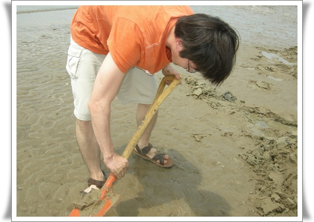
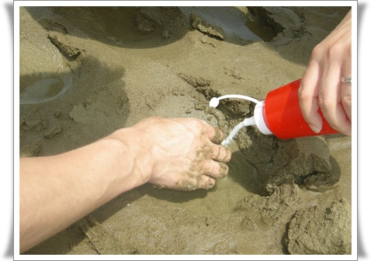
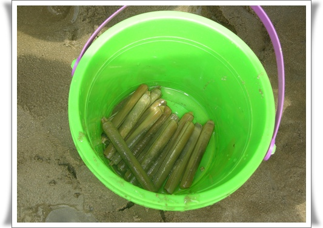

# 영흥도멤버와 같이 놀러간 무창포 해수욕장 

금요일 휴가를 내고 1박 2일 휴가를 다녀왔다.

멤버는 영흥도멤버5인방에서 한명빠진 4명에 내 딸래미.

영흥도 멤버는 뭐하는 사람들인가 하면, 1년에 한번 놀러가는 사람들이다.

시작은 3년전으로 거슬러 올라간다.

당시 팀원들간의 분위기가 더 이상 좋을 수 없는 팀이 있었다.

의기투합하여 놀러가기로 했다.  장소는 그 때 처음 개장했던 오크밸리 스키장.

11명 팀원중, 8명이 같이 갔다.

용감하게도 2박3일 일정으로 갔었는데, 첫날 무리한 보딩으로 다들 지쳐, 둘째 날은 그냥 콘도에서만 보냈었다.

그것도 남자 둘만 남아서..

그 다음해 살아남은 정예멤버 5인이 영흥도로 갔었고,

그 다음해 영문산자연휴양림으로 갔었고,

3회차인 올해 무창포 해수욕장으로 갔다.

숙소는  코레일 수련원.

김대원씨만 반차, 나머지는 휴가를 내, 금요일 점심때 출발했다.

천안까지 1시간, 천안에서 보령에 있는 무창포해수욕장까지 2시간이 걸렸다.

숙소에 짐 풀고, 보령시에 있는 마트에서 장보고, 돌아오니 어느덧 해가 떨어지는 시간.

모래놀이를 좋아하는 딸래미는 물 만났다.   차에 있는 모래놀이 도구세트 가져오라고 나에게 한참을 주문하더니, 결국은 맨손으로 모래놀이를 하고 있다.

조개캐기는 썰물때 할 수 있는 거라고 한다.

이때는 밤 10시 ~ 12시, 낮 11시 ~ 13시가 물이 빠진 시간대라고 하여, 저녁 먹고 1차 조개캐기 작업에 나갔다.

깜깜한 밤에 랜턴을 비추고, 조개 캐기에 나섰다.  조개를 캔다기 보다는, 줍는 거였다.  많이은 아니지만, 그래도 모시조개 비슷한 거 10마리 정도와 새끼소리 10마리, 그리고 고동비슷한 조개류 30여마리 잡았다.  잡은 것은 다음날 아침 조개국으로 먹었다.  소금하고 파 밖에 안 넣었지만, 직접 잡은 신선한 거라 그런지 맛있더군.

무창포 해수욕장이 맛조개로 유명하다고 하더군.

다음날 도전 종목은 맛조개 잡기.

맛조개를 캐는 장소.

맛조개 잡는 기본 동작.  한손에 삽, 다른 손에 소금통, 그리고 맛조개 담을 통.

먼저 모래를 약  5cm  깊이로 판다.  그 때 지름 0.5cm 정도의 구멍이 보이면 거기에 맛조개가 있는 거다.

그 구멍에 소금 투하.  소금은 구멍을 메울 정도로 아낌없이 뿌린다.

그러면 맛조개가 툭 튀어나온다.  처음 맛조개 튀어나오는 모습을 봤을 때 감격이었다.

소금을 넣으면 맛조개가 튀어나오는 이유는 잘 모르겠다.

현지인 가이드인 임선임 설명에 의하면, 소금을 뿌리면, 숨구멍의 염분 농도가 강해져, 맛조개가 밀물이 든 것으로 착각하여 둥지를 이동하기 위해 나온다고 하는데, 정확하지는 않다고 한다.

이렇게 해서 1시간 동안 잡은 맛조개.

내가 이걸 다 가져가서, 집에서 조개탕으로 해 먹었다.  맛있더군. ㅎㅎ

역시 개펄체험은 재미있다.

