# 캄보디아 여행 3/4 - 현지 2일차 타프롬과 앙코르왓

집결시각이 아침 7시라고 해서 알람을 5시50분으로 맞춰놓고 잤는데, 4시반에 모닝콜이 울렸다.

사람들이 늦을까 봐 가이드가 미리 모닝콜을 일찍 신청해놨나 보다.

6시에 아침식사를 하고, 7시에 버스에 탑승했다.

어제 마찬가지로 먼저 매표소에 들러 입장권을 끊었다.

그리고 툭툭을 탔다.

툭툭을 타고 한 20여분 달려 타프롬부터 갔다.

타프롬이 예전 툼레이더라는 영화 찍은 곳으로 나무가 사원을 압도한 모습으로 유명한 곳이다.

\- 툭툭에 타자마자 앵벌이 소녀가 달라 붙는다.

이번에 펜을 많이 가져왔기 때문에, 펜을 하나씩 나눠주었다.

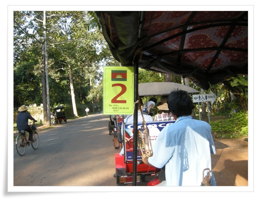

\- 툭툭이를 타고 타프롬으로 간다.

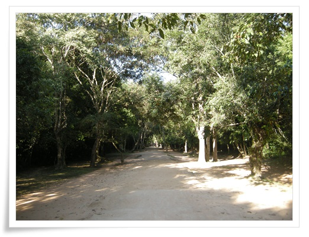

\- 타프롬 들어가는 길.

9년전보다 밀림이 많이 정리된 듯하다.  예전엔 정말 빽빽했었는데,..

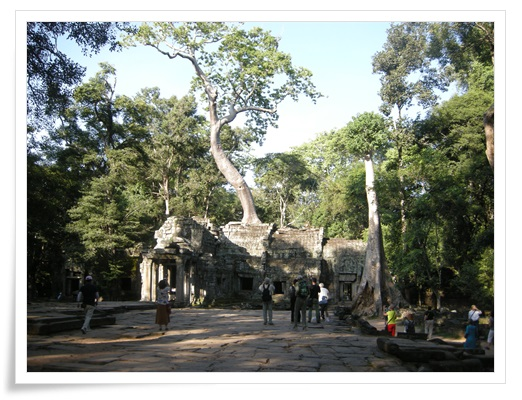

\- 사원을 내리 누르고 있는 나무

\- 타프롬에서 사진

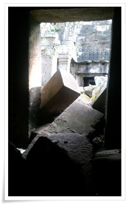

\- 나무에 의해 무너진 돌들

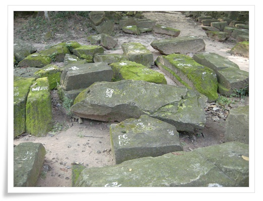

\- 복원을 기다리는 조각들

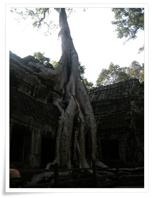

\- 가장 많이 사진에 찍히는 나무

\- 이곳도 복원중이다.

2006년에 한번 무너졌다고 하더군.

이유가 나무를 제거했더니 뿌리가 썪어면서 그 공간이 침하되어 무너졌다는 것.

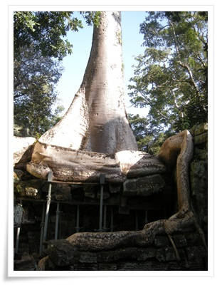

\- 나무도 이렇게 지지대에 의존하고 있다.

더 이상 성장하지고, 죽지도 않게끔 약물 주입을 받고 있다고 한다.

\- 이렇게 관람용 스탠드까지 만들고 나니, 예전의 위압감이 줄어든 것 같다.

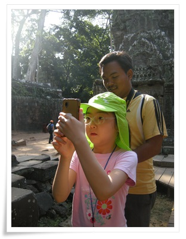

\- 뒤에는 사진을 촬영하는 현지 사진사.

사진을 찍고 나서 저녁에 찍은 사진 인화하여 한장에 1달러에 판다.

\- 이제 앙코르톰으로 들어간다

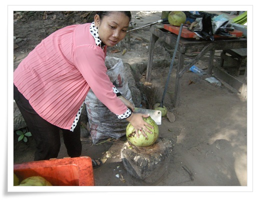

\- 열대지방에 왔으니 코코넛 주스도 한번 먹어야봐야겠지..

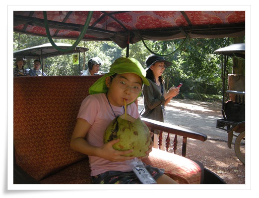

\- 코코넛 한통에 1달러.  저걸 딸내미와 둘이서 나눠 먹었더니 소변 마려워 좀 힘들었다.

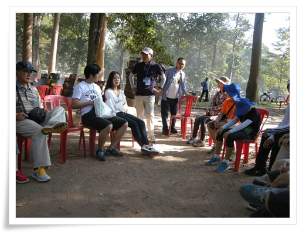

\- 앙코르톰에 들어간 후 잠시 휴식 및 앙코르 역사에 대해 듣는 시간

가이드가 역사에 많은 관심이 있었고, 꽤 깊이 설명을 해 줬다.

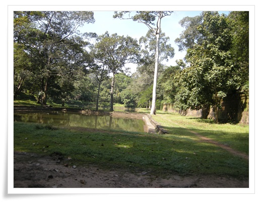

\- 왕 전용 노천탕.

앙코르왕국에 대해 기록한 원나라 주달관도 왕의 목욕장면은 병사들이 둘러 쌓고 있어 직접 보지는 못했다고 하더군.

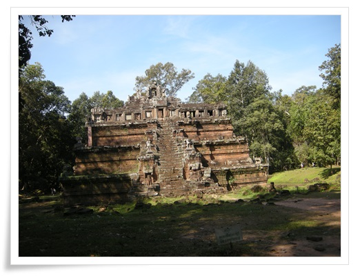

\- 왕이 뱀의 여신과 동침하는 장소라는 피미아나까스

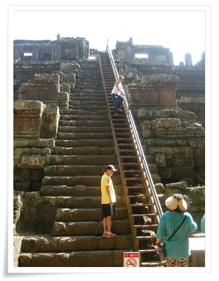

\- 가파른 계단이 특징인데, 이제 나무 계단이 설치되어 있다.

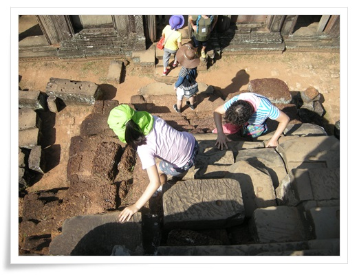

\- 높은 곳 잘도 오르내리는 딸내미

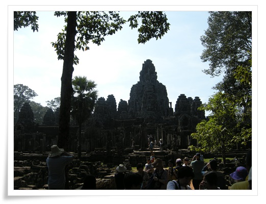

\- 다음으로 간 곳 바이욘사원.

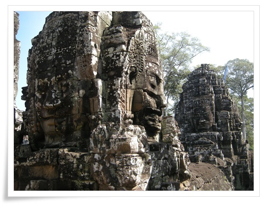

\- 바이욘의 상징.  네면이 웃는 얼굴.

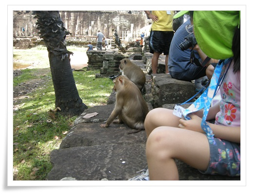

\- 사람들 곁에까지 경계심없이 돌아다니는 원숭이.

캄보디아의 동물들은 다 순한 것 같다.

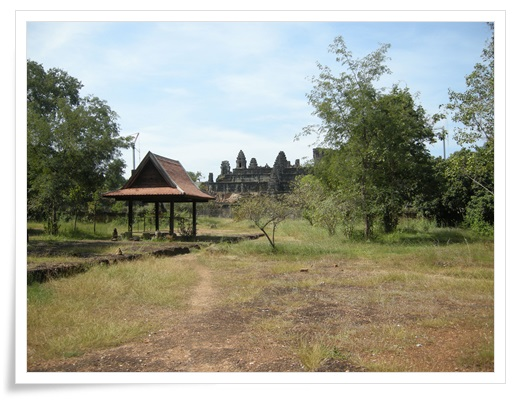

\- 다음으로 간 곳 따프롬

석양을 보는 곳으로 유명한 곳이라, 대낮에는 사람이 없다.

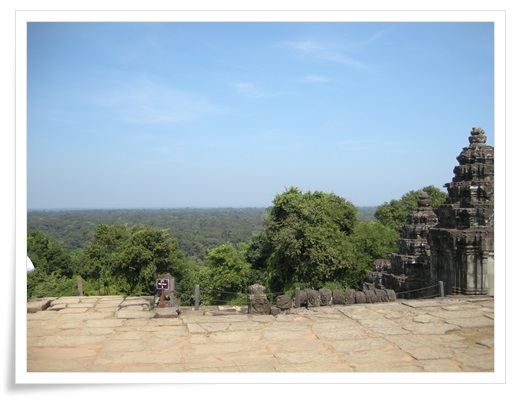

\- 앙코르에서 가장 높은 곳은 따프롬.

산이 안 보인다.

저런 정글에서 길을 잃으면 어떻게 빠져나올 수 있을까?

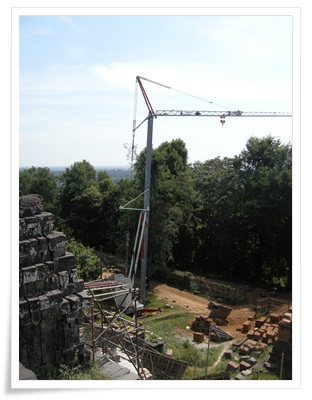

\- 따프롬도 복원작업중

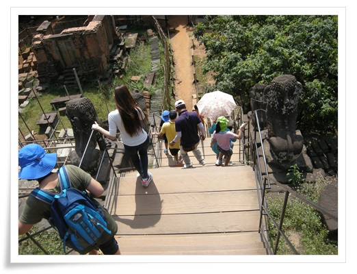

\- 이곳의 가파른 계단도 이제는 직접 밟지 못하고, 나무 계단만을 사용해야 한다.

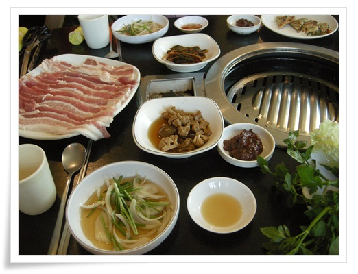

\- 점심은 삼겹살.

대낮에 삼겹살이 어울리지는 않는데, 긴 오전을 계속 걸어다녀 엄청 맛있었다.

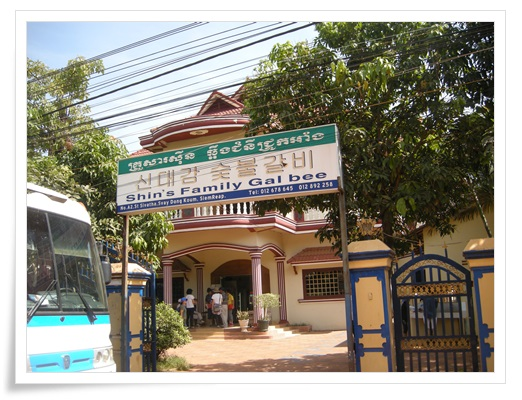

\- 삼겹살을 먹은 식당.  신대감숯불갈비.

점심 먹은 후 호텔에서 두시간의 자유시간이 주어졌다.

이 때를 놓일 수 없기에 바로 수영복으로 갈아 입고 수영장으로 향했다.

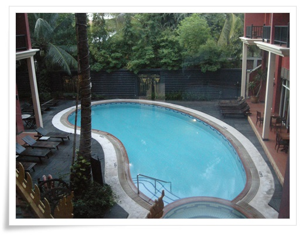

\- 호텔수영장

\- 같이 간 일행 한분에게 배영을 배우고 있는 딸내미

\- 물놀이하는 도중 망고도 먹고..

망고로 배 채우는 것은 참으로 행복한 일이다.

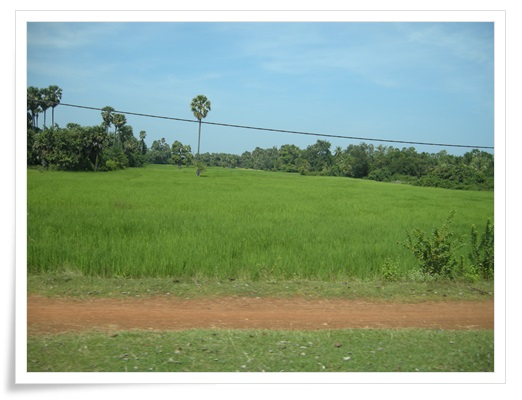

\- 오후 일정인 앙코르왓으로 가는 길.

벼가 쑥쑥 잘 자라고 있다.

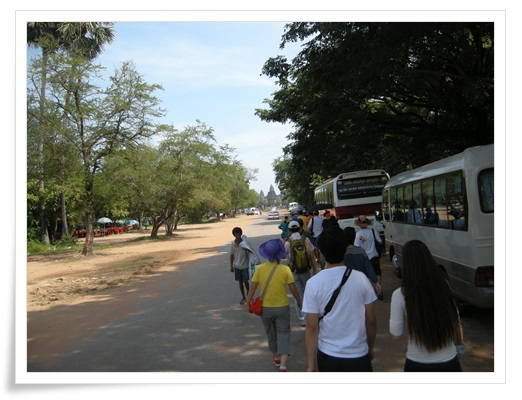

\- 버스에서 내려 앙코르왓으로 걸어간다.

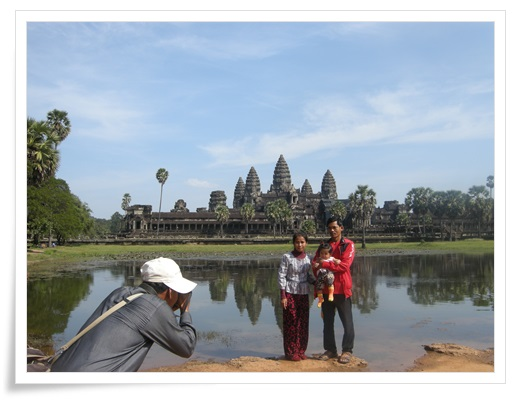

\- 간만에 보는 현지관람객이다.

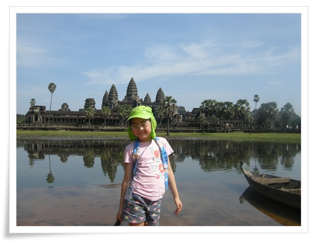

\- 앙코르왓이 수면에 반사되는 사진 포인트.

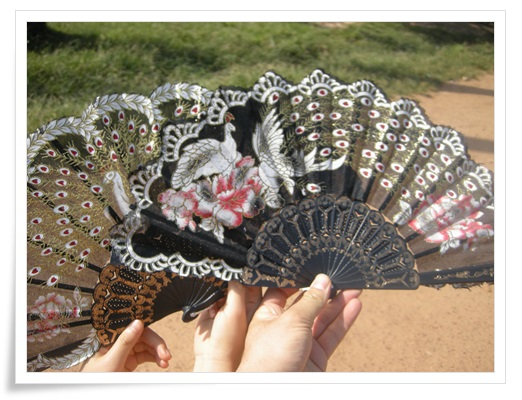

\- 이곳에서 앵벌이 소녀에게 1$에 부채 2개 샀다.

조악하기 그지없다.

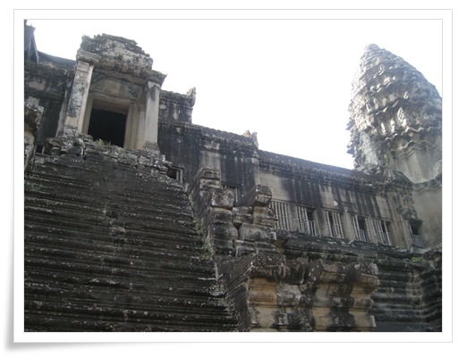

\- 앙코르왓의 계단은 많이 상했다.

그래서 올라가는 것이 제한되었다.

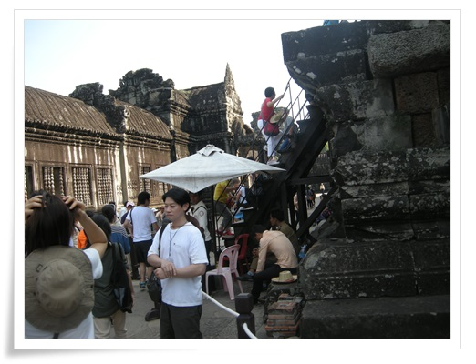

\- 마지막 신전은 이렇게 따로 만들어진 나무 계단을 통해 들어가게끔 되었다.

입장할 때도 복장의 규제를 받는다.

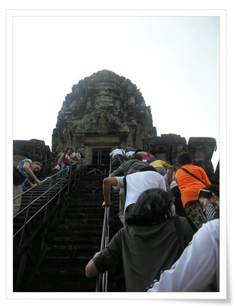

\- 줄서서 마지막 신전으로 올라가는 사람들

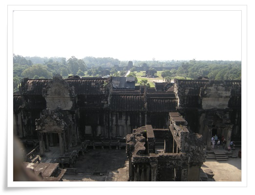

\- 신전에서 바라본 서쪽문

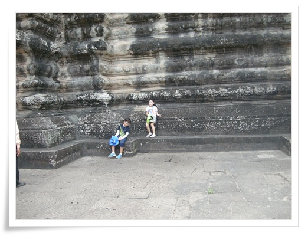

\- 14세 미만 어린이는 신전 입장이 안되어 이렇게 밑에서 기다린다

\- 저녁은 우렁쌈밥.

여기도 맛있었다.

아침 7시부터 저녁 먹을 때까지 많이 걸어 그냥 호텔에서 쉬었으면 좋으련면 패키지여행이라 저녁일정을 따라가야 했다.

저녁은 야시장과 맥주거리에서 단합회식.

\- Pub Street.

앙코르에서 보였던 서양인들이 여기 다 모여있더군.

30분간 자유 쇼핑을 한 후 맥주집에서 맥주 한잔씩 하는데, 다들 멀뚱멀뚱하니 이거 언제 끝나나 하는 표정이었다.

\- 이 날 사진사가 찍은 총 7장의 사진중 4장을 사겠다고 했다.

내가 일부러 사진에 안 찍히려 노력하여 7장이고, 다른 사람들은 열몇장씩 찍였더군.

사진은 잘 찍은 것 같은데, 조악한 품질의 인화지를 써서 그런가 뭔가 60년대풍 느낌이 난다.

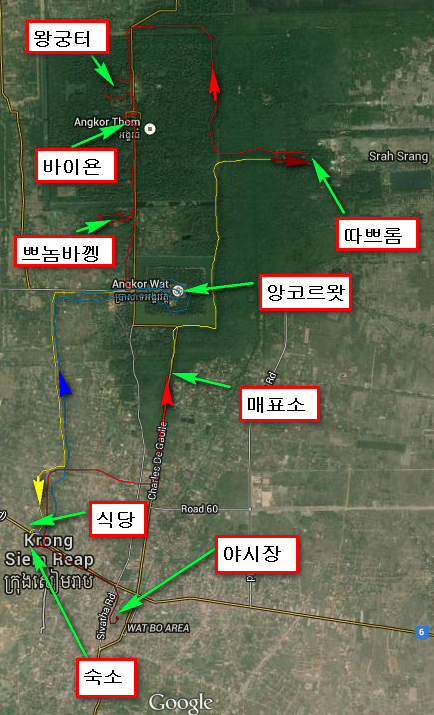

\- 둘째날 이동 경로와 주요 지점

둘째날 한 일과 쓴 돈

04:30 모닝콜에 깸

06:00 ~ 06:30 아침식사 (방 청소 팁 $1)

06:50 ~ 07:10 앙코르왓 발권센터로 이동

07:10 ~ 07:20 사진촬영 & 입장권 발권

07:20 ~ 07:40 툭툭이 타고 타프롬으로 이동

07:40 ~ 09:00 타프롬 관람

09:00 ~ 09:10 앙코르톰으로 이동 (이동중 코코넛주스 사먹음 $1)

09:20 ~ 09:40 코코넛주스 먹으며 앙코르문명에 대한 설명 들음

09:40 ~ 10:30 왕궁터, 피미야나카스, 코끼리테라스 관람

10:30 ~ 10:50 바이욘사원으로 이동

10:50 ~ 12:00 바이욘사원 관람

12:00 ~ 12:10 프놈바껭으로 이동

12:10 ~ 13:00 프놈바껭 관람

13:00 ~ 13:20 시내 음식점으로 이동

13:20 ~ 14:00 점심 - 삼겹살 (사진 4장 구입 $4)

14:00 ~ 14:10 앙코르왓으로 이동

14:10 ~ 15:30 앙코르왓 관람 (부채 2개 $1 구입, 툭툭이 기사 팁 $1)

15:40 ~ 15:50 숙소로 복귀

16:00 ~ 18:00 딸내미와 수영장에서 물놀이

18:30 ~ 19:30 식당으로 이동하여 저녁식사 - 우렁쌈밥

19:30 ~ 21:00 야시장으로 이동하여 야시장 구경 & 호프집 맥주 (선택관광, 바나나칩 $1, 건망고 $3)

21:00 ~ 21:20 숙소 복귀

총 $12(13,700원) 썼다.

