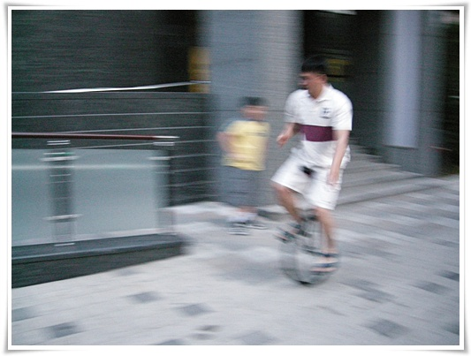

# 곰돌이 외발자전거 

외발자전거를 내가 언제 샀냐고 하면, 딸래미 태어났을 때 샀다.

그러고 보니, 벌써 3년이 지났군.

사고서, 서너달 타고서 계속 쳐박아 놓기만 했었다.

밖에서 탈라치면 온 사람들의 시선을 한 몸에 받는게, 영 부담스러웠다.

체중 80kg 을 넘으면서, 다시 타기로 했으나, 집에 들어가는 시간이 거의 밤 12시라, 평일엔 못 타고, 그렇다고 주말에 뻗어 있는라고 못타고 있다.

그래도 마음을 다시 가다듬고 탔다.

아직 녹슬지 않았다.   찍어놓은 사진을 보니 정말 재주부리는 곰 같군..

