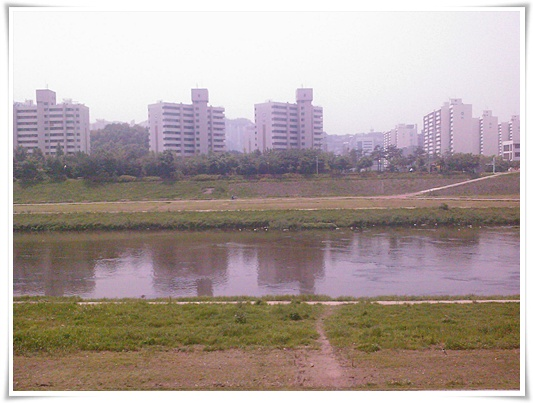
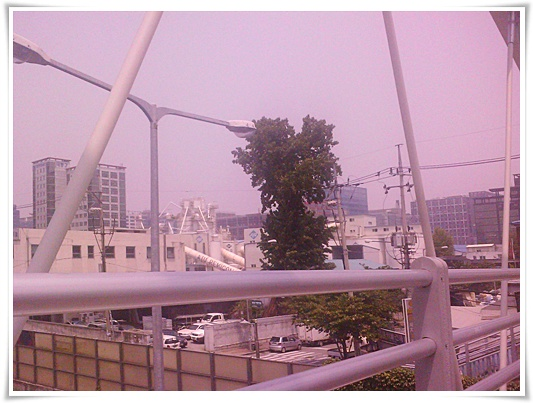
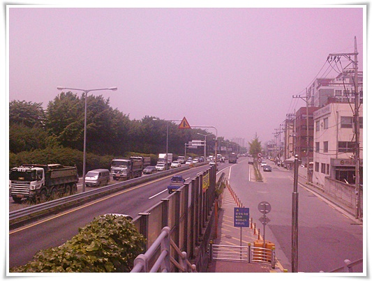
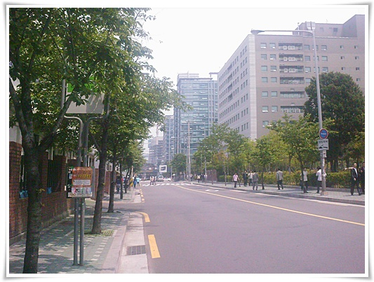

# 동네 한바퀴

가산동으로 출근한지 이제 1년.

1년을 있었는데, 동네 탐사를 안했었다.  그래서 동네에 뭐가 있는지 잘 몰랐다.

이것 나 답지 않은데 말이다.  탐사안한 이유는 아마도 별로 걷기 싶은 거리가 아니기 때문이라고 핑계를 대본다.

여름도 다가오고 하여 점심시간 한번 산책을 해 봤다.

회사에서 20분거리에 있는 안양천.

인라인타기 괜찮은 도로인데, 같은 인라인 탈 사람이 없군.

그런데 나무가 너무 없다.

여름에 산책하기 힘든 도로로군..

안양천에서 다시 회사로 들어가는 길.

구로공단에서 디지털단지로 언제 이름이 바뀌었더라?

암튼, 아직 공단의 이미지가 다 바뀌지는 않았다.  기존 공장건물과 새 아파트형 공장이 공존하는 무질서한 모습이다.

항상 정체구간인 서부간선도로.  점심시간에도 저렇게 막혀 있으면, 대체 언제가 안 막히는 시간일까?

이제 아파트형공장들과 점심때 나온 직장인들이 거리에 있다.  거리에 사람들이 있는 시간은 이 때빼고는 별로 없다.

이곳은 죄다 아파트형공장들인데, 아파트형공장의 안 좋은 점이, 녹지공간은 안 만든다는 점이다.

일반 건물든은 외부로 녹지공간은 만들어 놓는데, 아파트형공장은 건물 내부에 인공녹지를 만들어 외부에서 보기 삭막하다.

그냥 사각형의 큰 건물은 대지를 그대로 다 차지하고 있는 모습이 영...

