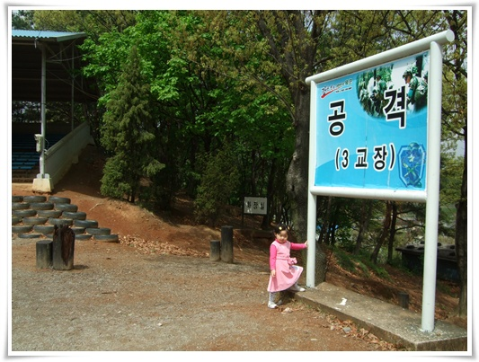
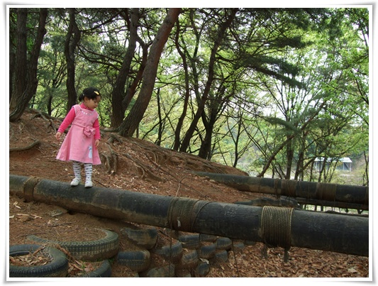

# 군대 조기교육

일요일 아침인데, 딸래미는 6시부터 일어나 날 깨웠다.

아내는 몸살로 완전 뻗어있어, 네시간 동안을 거실에서 에너자이저 딸래미 시중을 들었다.

힘이 다 빠져, 도서관으로 갈 생각으로 차에 태웠다.

차에 타고 얼마 안 있어, 차에 잠이 들길래, 무작정 드라이브를 했다.

성남에 이사온지 1년이 넘었는데, 나의 첫 군사교육받던 곳을 안 가봤다.

송파신도시니, 위례신도시니하면서 재개발한다고 하여 조만간 없어질꺼란 생각에 가봤다.

그때가 95년 여름이었으니, 14년만이군.  그러고보면 나도 어느새 나이를 많이 먹었군.

군사지역으로 묶여서 그런가, 14년이 지났음에도 그다지 바뀌지는 않았다.

공격교장.  분대전투, 소대전투 교육의 주 교육장소였었다.

교육 마지막쯤에 주간공격, 야간공격을 하루에 다 했었는데, 꽤나 힘들었던 기억이 난다.  이 자리에서 시작하여 남한산성 8부능선지점까지 줄기차게 미션클리어를 하면서 전진했었던 것 같다.

딸래미에게 외나무다리 건너기 조기 교육중.

