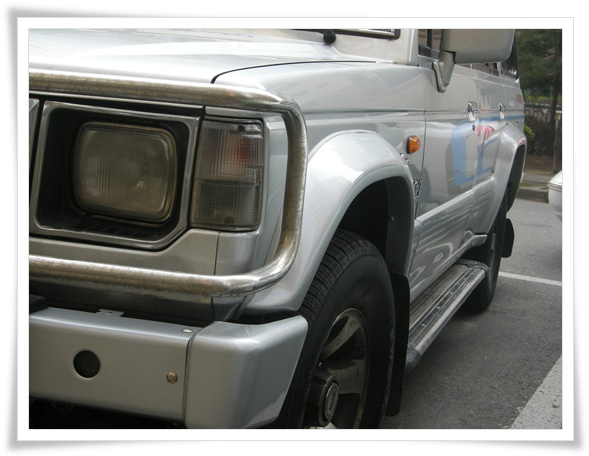

# 처음해 본 보험 사고 처리

자동차사고로 대여받은 그랜저는 4일타고 반납했다.

보험회사에서 4일치까지만 처리해주겠다고 하더군.

과실비율 가지고 몇일 분쟁이 있었다.

보험회사에서 과실비율을 3:7 로 하자는 것이었다.

멀쩡히 가다가 들이받힌 것도 억울하기는 했지만, 100% 과실 판정은 없다는게 자동차 사고라, 2:8 정도까지 예상했는데, 3:7로 하자는게 참으로 괘씸하더군.   상대방보험회사에서 그러는것은 이해가 가는데, 내가 든 보험회사에서 3:7 로 하라고 종용하는 것이 못마땅했다.

협상의 법칙이란 책에 보면, 협상에서는 시간을 쥔 자가 협상을 결정한다고 되어 있던 것 같아, 곰곰히 생각을 해 봤다.

나 : 자차보험을 안 들었다.  과실비율만큼 수리비는 나가야 한다.  하지만 출퇴근에 차를 이용하지 않으므로 시간의 제약은 없다.

내 보험사 : 자차보험을 안 든 고객이므로, 과실비율이 어떻게 결정되는지 상관이 없다.  하지만 합의가 늦춰지면 자신의 성과에 마이너스로 작동하므로, 빨리 합의가 이루어지도록 할 필요가 있을 것이다.

상대방 보험사 : 가해자 보험이므로, 내 차의 수리비의 대부분은 부담해야 한다.  고로 과실비율을 내게 최대한 불리하게 만들어야 한다.  하지만, 그렇다고 무작정 시간을 끌기는 어려울 것이다.

보험사는 내게 합의가 안되면, 경찰서에 사고신고를 하고, 법정에 소송도 해야 하므로, 내가 훨씬 불리할 것이라고 겁을 주었지만, 그건 다 걔네들 술수이고, 굳이 차를 안 몰아도 되는 내가 가장 유리한 고지에 서 있었다.

3:7 로 합의하자는 것을 거부했다.  끝까지 가겠다고 했다.

그리고 나니 한 이틀동안 보험사에서 전화가 안오더군.  아마도 날 떠보는 것이었겠지..

그러다 전화 안온지 3일째 전화가 와, 2:8 로 하겠다고 하여, 합의는 마무리되었다.

차 수리는 일주일 걸렸다.

워낙에 차가 구형이라, 부품 수급이 어려웠다고 하더군.

\- 범퍼와 휀더만 새 거로 바뀐 내 차.

차량수리비는 953,800원 나왔고, 20% 과실비율인 209,853원을 내고 차를 찾았다.

그리고 상대방 보험사로부터 받은 교통비가 84,000원.

고로, 난 125,853 원을 내고 그랜저 4일 렌트한 셈이 되었다.   뭐 선방했다.

한가지 아쉬운 점은, 고물차를 대충 수리해서 그런가, 차 문틈 사이로 바람이 들어온다.

비오면 비가 샐 것 같다.

정비소에 따지기가 귀찮군.  걍 타야겠다.

