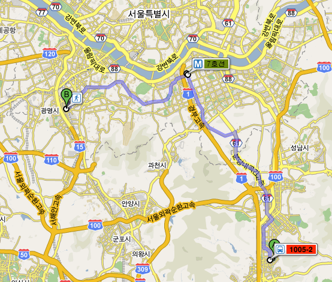

# 분당에서 가산디지털단지, 하루 4시간을 출퇴근에 소모하기

집 : 분당구 구미동 (분당의 남쪽 끝)

회사 : 금천구 가산동 (서울의 서쪽 끄트머리)

출근1안: 15분 걷기 -> 분당선(오리역->선릉역) -> 2호선(선릉역->대림역) -> 7호선(대림역->가산디지털단지역) -> 5분 걷기

장점 : 1시간 40분이라는 가장 빠른 출근 시간

단점 : 6시 50분이후에 전철을 타면, 이후 쭉 서서 가야 함.

이짓을 첫 석달간을 했다.  분당선에서라도 45분을 앉아서 가기 위해 6시반에 집에서 나왔다.

조금이라도 늦으면 얄짤없이 이후 쭉 서서가는 고통.

출근2안: 집앞에서 광역버스 -> 논현역 -\> 7호선(논현역->가산디지털단지역)

장점 : 1시간가량의 버스안에서 만큼은 앉아갈 수 있음

단점 : 1시간50분 ~ 2시간 20분 걸친 기나긴 출근 시간

요즘 이렇게 출근하고 있다.  버스에 앉아도 잠은 안 온다.  머리는 몽롱한 상태지만, 안 온다.  젊었을 때는 자리만 앉으면 잤었는데, 요즘은 내내 각성되어 있다.

이게 요즘 내 출근 경로 : 대략 45km 정도 되더군.

출근3안: 자동차로..

장점: 1시간 10분이라 놀라울 만큼의 빠른 출근 시간

단점: 45km를 자동차로 달린다.  하루 왕복 기름값만 2만원.

이짓은 몇번하고 말았다.  도저히 기름값을 충당못하겠었다.

이제껏 이리 먼길을 출퇴근을 해 본 적이 없었다.

특히나 바로 직전, 걸어서 5분거리로 출퇴근을 했었던 터라, 더더욱이나 적응안되고 있다.

혹시나, 집과 직장이 두시간 거리가 되려는 사람이 있다면,..

아서라..  몸 버린다.

매일매일이 월요일아침x10  일 것이다.

06:00 기상

06:40 출근길

08:50 회사도착

22:00 퇴근길

24:00 집 도착

01:00 취침

간혹 6시 칼퇴근을 했도, 집에 도착하여 9시 근방.

하루 수면시간이 5시간이군.

고3 적정 수면이로군..

