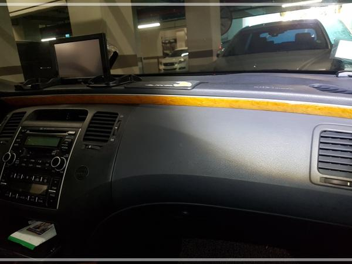
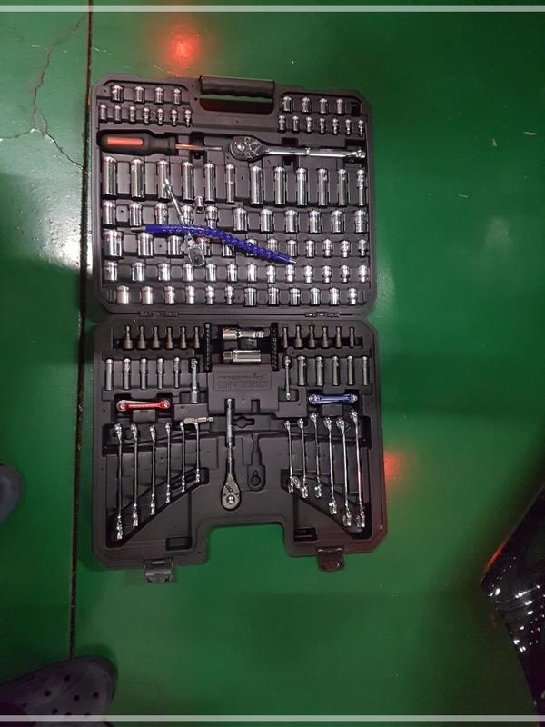
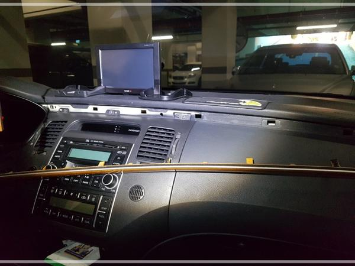
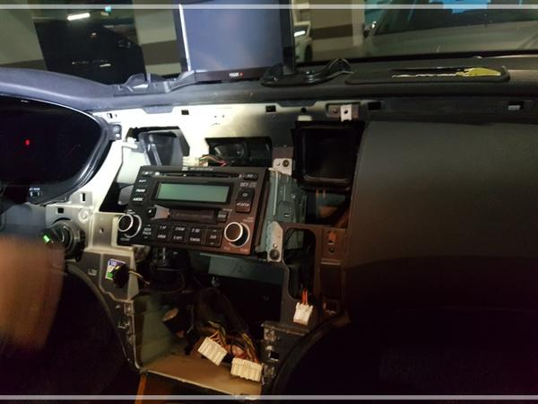
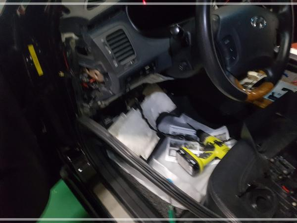
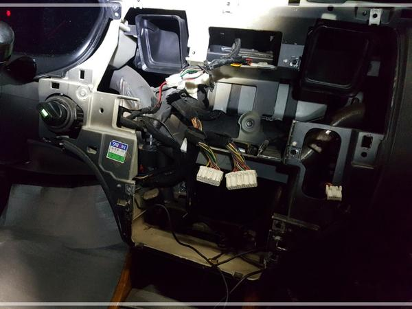
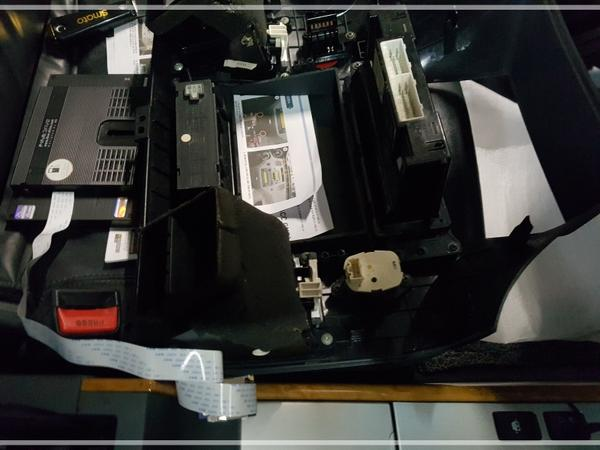

# 그랜저 TG 네비 매립 DIY

매형의 차, 그랜저 TG.

네비 매립하는 것을 도와주기로 했다.

작업 전 모습.

남자는 공구빨이지.

이 날을 위해 그 동안 베란다에서 기다긴 세월을 기다려온 렌치셋.

분해는 쉽다.

먼저 나무문양 몰딩부터 분해.

그 다음 산타페이사 분해.

카오디오자리에 네비를 집어넣고, 카오디오는 맨밑 수납함 자리로 옮겨야 한다.

왕년에 인포테인먼트 시스템 개발하면서 여러번 분해 조립을 해본 경험을 되살려 본다.

배선도 안 보이게 끌어오기 위해, 퓨즈박스 열어, 전원선과 후방카메라선을 산타페시아로 끌어온다.

카오디오자리에 네비를 넣는 거라, 걸리는 좌우로 걸리는 부분을 잘라낸다.

톱을 가져올 껄 그랬다.

톱이 없어, 니퍼만 절단하려니 제법 힘 들었다.

매립용 산타페시아 판넬에 공조판넬, 네비, 카오디오, 각종 버튼을 이식했다.

그리고, 산테페시아 조립.

안 맞는다.

카오디오가 안 맞는다.

인터넷 검색을 해 본다.

매형의 TG 이 모델이 다른 TG모델의 카오디오랑 생김새가 좀 다르다.

그래서 배송온 브라켓이 안 맞는다.

이미 엎지러진 물.

이때부터 장장 4시간에 걸친 삽질을 시작했다.

맞지 않는 브라켓을 눈 대중으로 구멍 뚫고, 조립해보고, 간격 보고, 대시 분해 후, 구멍 다시 뚫고, 조립, 반복...

암튼, 결국 성공했다.

일반 네비매립전문점보다 완벽한 선정리와 마감으로..

