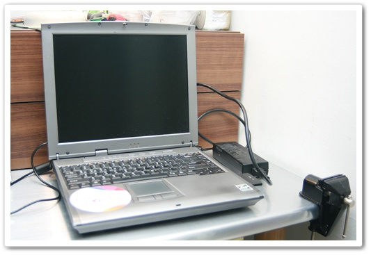

# 노트북 고치기 포기

2004년에 같은 회사 동료 조영민씨에게 45만원주고 산 노트북.

노트북이라 하기에는 꽤 무거운 거였다.  3kg이 넘었고, cpu도 p4 1.6G desktop CPU.

그래서 노트북 이름도 DeskNote.

암튼, 이게 고장났다.

증상은 켜고서 5분쯤 지나면 리셋하는거다.  이렇게 된지는 어언 4개월도 넘었다.

windows가 이상있나 싶어, 다시 깔았다.  똑같았다.

원인을 찾아보려했다.

첫 가정이, 오래된 노트북이라 쿨러에 먼지가 많이 쌓혀 열 배출이 제대로 안되어, cpu가 과열되어 자동으로 리셋되는 거라 여겼다.

분해했다.  역시나 많은 먼지가 있었다.  cpu cooler와 보드 팬을 말끔히 청소하고 재조립했다.

마찬가지였다.

첫 가정 실패.

두번째 가정.  램과 pcmcia 무선랜쪽의 접촉불량으로 cpu가 잘못된 address access하려다 invalid address로 리셋되었을 것이다라는 가정.

분해서 접점 청소후 재 시도.  역시나 실패.

세번째 가정.  파워서플라이.

Desktop CPU를 사용하는터라, 고전력을 소모하는데, 파워서플라이게 제대로 전력 공급을 못해 죽었을거라는 가정.

파워서플라이를 분해했다.  접점이 냉납인 곳이 있었다.  인두기로 재납땜.

역시나 실패.

충분히 오래썼다.  버려야겠다.

