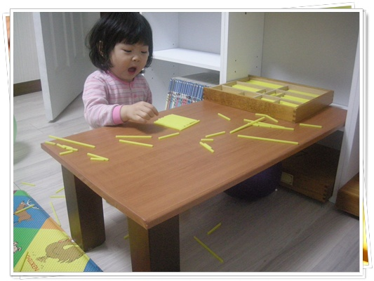

# 버려진 장롱 문짝으로 만든 탁자

아파트에 버려진 장농 문짝을 떼와서 만든 최근 작품.

딸래미 높이에 맞는 책상이 없어, 만들었다.  다리는 버려진 침대에서 떼온 기둥을 25cm로 톱질하여 만들었다.

총 들어간 재료비는 시트지 2,000원 + 나사못 6개 120원 = 총 2,120원이 들었군.

만들고 나서, 그럭저럭 괜찮다.  아무래도 어지럽히는 것도 책상 위로 한정이 되니, 치우기도 쉬워지네.

그리고, 그 전엔 방바닥에서 하다보니, 아무래도 자세가 구부정하게 되었는데, 자세도 좋아지는 것 같다.

아직, 시트지 붙이는 게 서툴다.  기포도 아직 많이 있고 그렇다.

