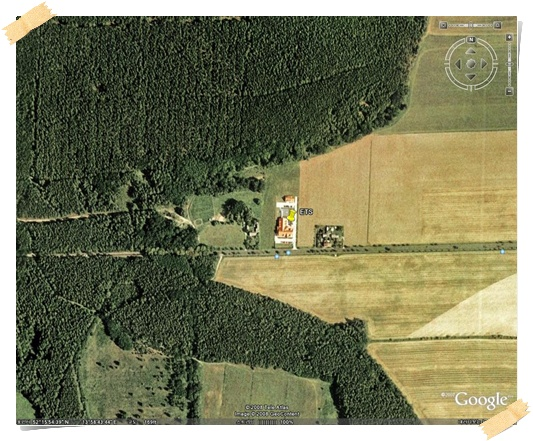
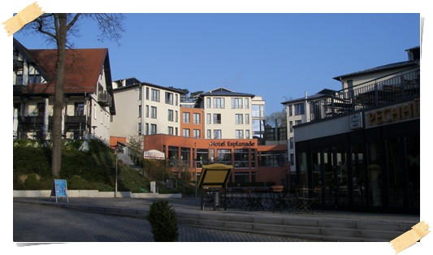
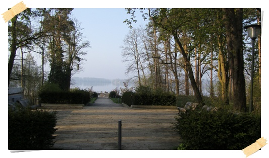
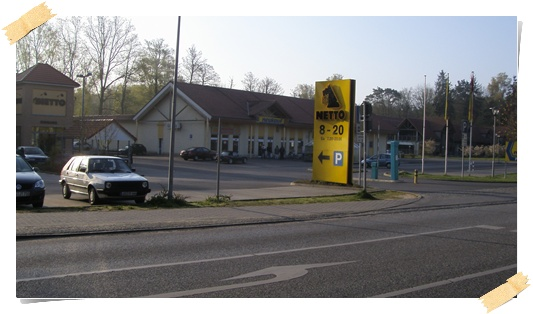
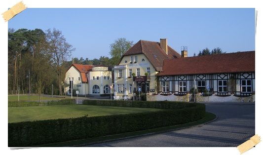
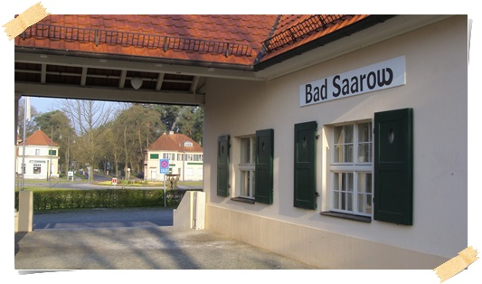

# 마지막 출장지 - 독일 Bad Saarow

작년 3월달에 독일에 갔었다.

ETS 랩에서 sim toolkit 2G 인증을 받기 위해서 갔었다.

한달반정도 있었는데, 거의 1년이 다 되어가는 지금에서야 블로그를 쓴다.

나름 꽤 많은 나라를 돌아다녔는데, 그중 가장 기억에 남는 나라가 바로 독일이다.  이건 대도시가 아닌 시골에서만 생활을 해서인지도 모르겠다.

지금도 가끔씩 생각나는 것,

호수가에 햇빛이 찰랑찰랑거리며 반짝이는 모습,

맛있던 마타도르 스테이크

평지 그대로에 있는 그대한 수목이 있는 숲

파릇파릇 새싹이 나기 시작하는 밭

저기 숲과 밭 사이에 생뚱맞게 존재하는 왼쪽 집이 ETS 랩이다.  아침이면 저 곳으로 출근하여, 저녁 9시 정도에 퇴근했다.

점심은 인근 읍내에서 주문한 중국음식을 먹었고, 점심 식사후 왼쪽의 숲길을 한 20여분 거닐었다.

내가 머물던 숙소  Esplanade 호텔.

꽤 좋았다.  내가 머무는 중, 독일 집권 여당의 Konferenza가 열였었는데, 그 덕에 경찰의 상엄한 경비를 뚫고 호텔에 들어갔었다.

호텔앞의 호숫가.  정말 이곳에 있으면 더이상 바랄나위가 없겠다는 생각이었다.

머물던 이 곳이 예전 동독 지역이었고, 이 Bad Saarow 지역이 동독시절 당 휴양지였다더군.  그래서 아직 개발이 덜 되어 자연 그대로의 상태가 간직되어 있었다.  외부에는 너무 잘 알려지다 보니, 외국인들 또한 거의 없었다.  한달 반동안 머무는 동안 호텔에서 동양인은 우리 회사 직원외에는 못 봤다.

자주 가던 마트.  무슨 놈의 마트가 8시 문 열어 8시에 문을 닫는다.  그래서 주말밖에 이용을 못 했다.

저게 Bad Saarow 기차역.  기차역이 참 이쁘다.

하루에 기차가 몇번 안 지나가는 역이다보니, 역이 평온하다.

스킨헤드족 or 네오나치즘 사람을 못 만나봐서나서인지는 몰라도, 독일이라는 나라가 정말 마음에 들었다.

여유있는 사람들, 드넓은 평원, 웅장한 건축물

단 음식은 별로 맛은 없었다.  거기서도 주말이면 읍내에 나가 주로 태국음식을 주로 먹었으니..

bmw도 처음 몰아봤다.  처음 운전할 때만해도 '내 갤로퍼랑 별 차이없네'라고 생각했었는데, 귀국하고서 내 차를 운전하니 영 허접하더군.  차도 오디오와 마찬가지로 업그레이드는 별 체감을 못하는데, 다운그레이드는 크게 체감한다는 것을 알았다.  아우토반j에서 시속 230km 주행은 나름 재미있었다.  스피드를 즐긴 것은 결코 아니다.  내가 속도광은 아니라서, 체코가느라 밟은 것 빼고는 안전운행했었다.

이제 언제 또 독일에 가 볼 수 있을까?  고작 한달반 머물렀는데, 독일이 고향인양 향수병이 걸린 듯 하다.

