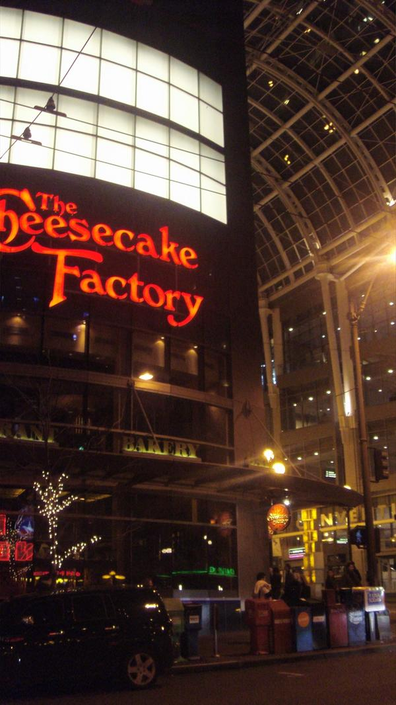
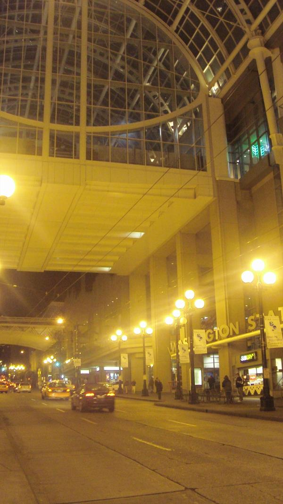

# 치즈케익 팩토리 in 시애틀

\- 여기가 시애틀 시내에 있는 치즈케익 팩토리

레드먼드보다는 시애틀이 유명하다. '시애틀의 잠못 이루는 밤'이라는 영화제목이 내가 아는 유일한 시애틀에 관한 것인데, 스타벅스로다 유명한가 보다. 레드먼드만 봐도 골목골목마다 다 스타벅스다. 김밥천국보다도 더 많은 스타벅스. 인터넷으로 물론 시애틀 관광정보를 살펴보았지만, 내게 가용한 시간인 밤에 구경할 만한 없었다.

레드먼드에서의 마지막밤은 시애틀 시내에 있은 치즈케익팩토리.

한산한 레드먼드에만 있다가 시애틀에 들어가니 그 복잡함에 정신이 혼미해졌다. 서울 명동 한복판과 같이 복잡했다. 거리는 휘향찬란하여 그 동안의 우울이 사라지는 듯한 착각마저 들었다.

저녁을 먹기로 한 장소 치즈케익팩토리는 엄청 사람이 많았다.

물도 좋더군.

강남역에 온 것 같은 분위기.

하지만 대기표를 받았는데, 대기시간 1시간이었다.

그 한시간동안 기다렸다.

하염없이.. 마냥 하염없이..

한시간 후 주문하여 먹은 것은 파스타. 맛은... 글쎄. 양은.. 무지 많았다. 반을 남겼다.

나중에 캔사스에 있는 치츠케익팩토리에서 치크케익을 먹어본적이 있는 이전임으로 부터 왜 거기서 치즈케익 안먹고 딴 걸 먹었냐는 핀잔을 들었다. 마치 회로 유명한 일직집에서 삼겹살 구워먹은 것과 같은 짓을 하였다는 것이다.

\- 1시간 남짓 기다리는 동안.. 나 말고도 기다리는 사람들..

\- 시애틀의 명동. 처음 도착한 7시쯤에는 정말 복잡했는데, 밥먹고 나니 한산해졌다. 역시 미국의 밤거리는 한산해.

