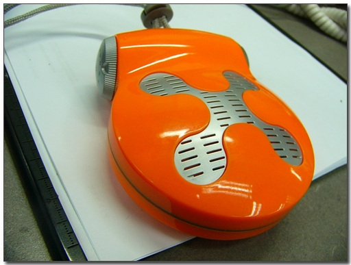
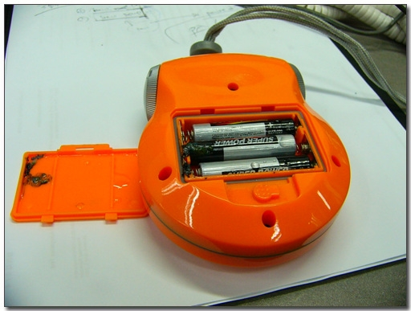
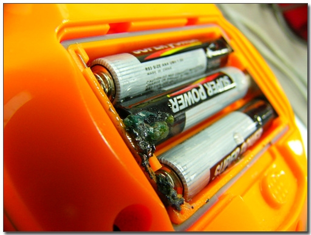

# 중국산 건전지에 또 당하다

내가 들고다니는 라디오.

물론 마데중국이다.

목걸이형이긴하데, 크기가 PDA보다 크기 때문에, 목에 걸고 다니면 큰일 난다.

그래도 큼지막한 스피커가 달려있다.

그래서 이어폰끼기를 그리 좋아하지 않는 내게는 딱이다.

자전거로 출퇴근할 때 저걸 듣는다.

간혹가다보면, 구수한 뽕짝을 카스테레오인양 자전거에 틀고 다니는 할아버지들이 있는데, 내가 딱 그 모양이 된 셈이다.

그런데, 오늘 전원을 켰는데, 아무 소리가 없다.

건절지 갈아낀지 얼마 안되었기때문에, 벌써 방전되었을리는 없을텐데 말이다..

회사에 와서 열어봤다.

또 건전지 누액이다.

건전지에 들어가는 액체가 무슨 성분인데, 철을 저렇게 빨리 부식시키지?

일단, 누액이 라디오 회로까지는 안 들어간 듯해 일단 안심이다.

예전에도, 마데중국 건전지로 인해 MP3를 망가뜨린 적이 있어, 좀 조심은 하고 있으나, 10개에 천원이라는 놀라운 가격에 대한 유혹을 쉽게 뿌리치지 못하고 있다.

[null](../6166676.html#6166676_1)

