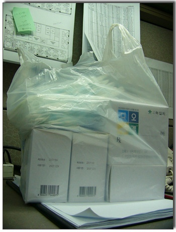

# 내시경 검사와 약봉다리

간만에 내시경 검사를 받았다.

예전 비싼 헬리코박터파이로 제균제까지 먹어 위염에서 완치됐다고 여겼는데,

요 근래, 자주 속이 쓰리더니, 지난주터는 새벽에 위통으로 잠을 다 깨어,

이거 다시 위염이 도졌구나라는 것을 감지했다.

회사가 있는 건물4층에 녹십자 검진센터가 있다.

가서 예약을 하고, 전날 저녁 8시부터 금식하여, 아침 8시 30분에 내시경 검사를 받았다.

검진복으로 갈아입으로, 혈압재고, 심전도검사 먼저 하더군.

그 다음, 주사를 놓더군. 무슨 주사인지를 모르겠다.

그리고, 걸쭉하게 하얀 액체 마시고, 마취제를 5분만 머금고 있다 마시고 나시 내시경 검사 완료.

옆으로 누워 재갈을 물고 만반의 준비를 하니, 흰가운입은 사람 등장.

매트릭스에 등장하는 센티널의 촉수와 같은 긴 관을 들고 오더군.

저 기다란 촉수가 몸속을 들어간다는 생각에 약간의 스릴과 긴장.

촉수를 입에 문 재갈을 통과시키니, 일단 목구멍앞에서 대기.

꿀꺽 삼키라는 구령에 촉수를 꿀~~꺽 하니, 식도를 타고 쭉 들어간다.

이때 눈물 찔끔.

물뿌리는 기능도 있더군.

위벽에 물뿌린다는 안내와 함께 위벽에 시원한 물이 닿는 느낌이 들더군.

위 탐사를 마치고, 이제 십이지장 차례.

고등학교 생물시간에 배운바에 의하면, 위장과 십이지장사이에 문이 있다고 한 것 같은데..

암튼 그 닫힌 문을 촉수가 삐집고 들어가는데, 뜨끔함과 함께 또 다시 눈물 찔끔.

한 5분정도로 내시경검사는 끝.

위염으로 인해, 위벽이 좀 부었다는 진단.

검사비 25,500원

처방전을 들고 약국가서 한달치 약을 받으니 한바구니다. 약값 24,800원.

세번째 내시경 검사는 이로서 끝.

간만에 느껴본 스릴이다.

[null](../6166677.html#6166677_1)

