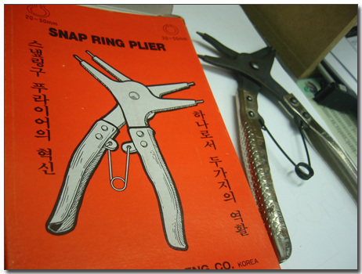

# 대체 어느 시대에 만든 걸까?

공구하나를 샀다.

이름하여 **'스냅링 플라이어'**

어디나 쓰는 것인고 하니, 틈새를 오므리거나 벌릴때 쓰는 공구다.

그다지 쓰임새가 많지는 않지만, 정작 필요할때 되면 아쉬운 공구다. 없어도 롱노우즈나 일자드라이버로 대충 작업할 수 있긴 하지만, 불편하긴 하다.

지마켓에서 제일 싼 걸로 주문했는데, 도착한 모양이 좀 요상하다.

이게 과연 어느시대에 만든 제품일까?

약간의 녹도 슬어있고, 제목도 ' **스냎링구 푸라이어의 혁신**'이라는 일본식 영어발음에,

'하나로서 두가지의 **역활**'이라며 철자마저 틀린 삼보 Eng의 제품.

어느시대 제품일까? 60년대? 70년대? 설마 이게 90년대 이후 제품은 아니겠지..

그래도 마데인차이나일지 알았는데, 메이드인코리아다.

[null](../6166681.html#6166681_1)

