# 목선반을 이용한 우드펜 만들기 교육 

톱으로는 할 수 없는 것이 바로 원형으로 깎는 것.

금속에서 주로 쓰는 것이 선반이고, 나무를 깎는 깎는 것을 목선반.

목선반으로 우드펜 만드는 교육 배우로 갔다.

집에서 가까운 고기리에 있어 별 부담이 없었다.

교육비는 3만원.

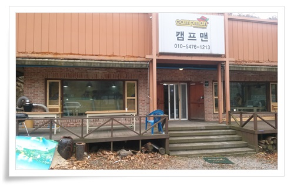

\- 도착한 교육장 JPW.  간판은 예전 상점 간판이라는데 아직 안 떼어냈다고 한다.

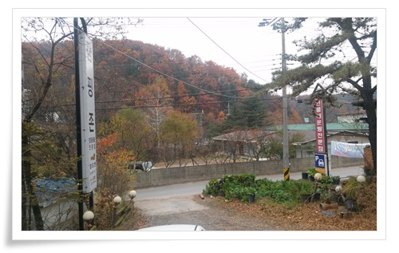

\- 전방 풍경.  고기리가 원래 유원지라서 시골 분위기가 난다.

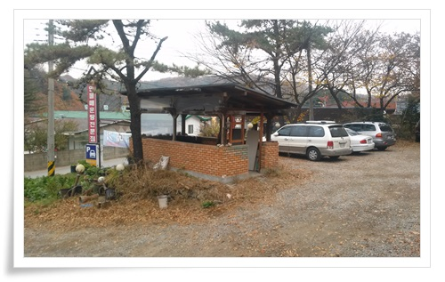

\- 마당도 차 10대는 주차할 만 한 정도 크기더군.

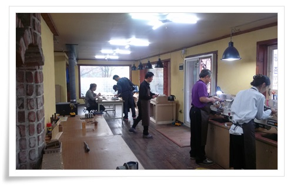

\- 공방 내부

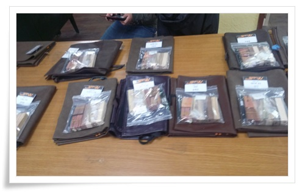

\- 교육생들을 기다리고 있는 교보재.

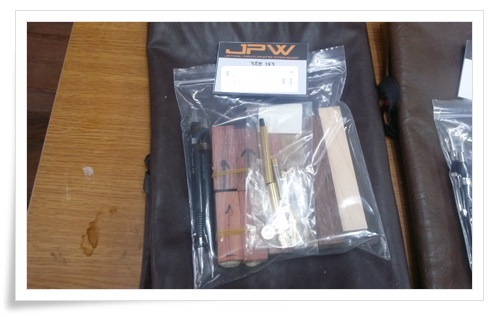

\- 내 교보재.

작업용 앞치마와, 샤프제작용 2개 재료, 볼펜 제작용 재료 1개.

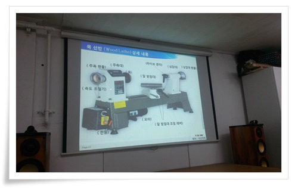

\- 강의실에서 먼저 목선반에 대한 이론 교육을 들었다.

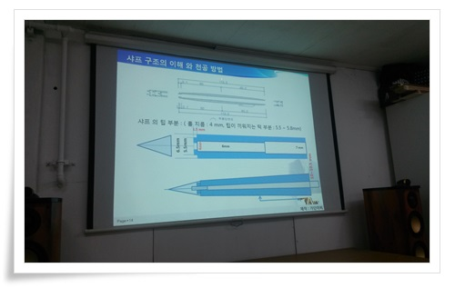

\- 그리고 샤프의 구조.

저 샤프의 몸통을 나무로 제작하는게 이번 교육이다.

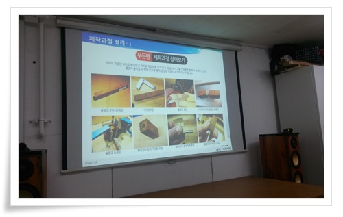

\- 제작과정.

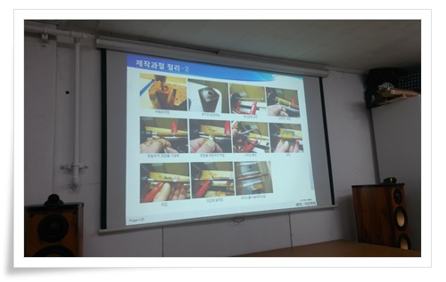

- 먼저 블링크라고 하는 나무에 홈을 파고, 황동관을 심은후,

목선반으로 깎고, 사포로 다듬고, 오일과 왁스로 마감 후 조립.

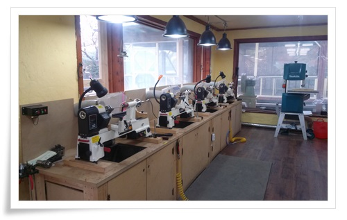

\- 이론 교육후 드디어 목선반 기계 앞으로.

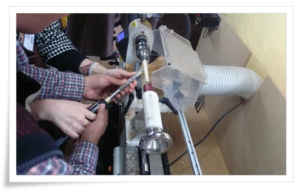

\- 먼저 강사의 시범.

4,000 rpm으로 도는 블링크에 칼로 깎아 낸다.

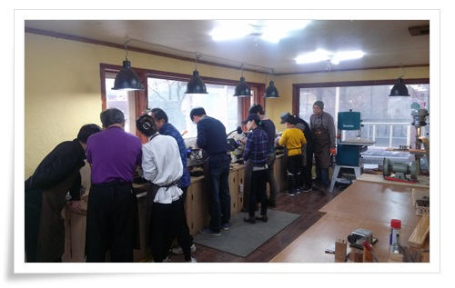

\- 이렇게 교육생들 깎는 중.

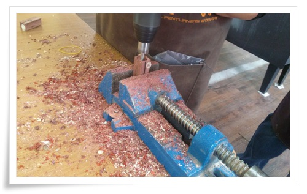

\- 볼펜용 몸통 제작하기 위해 동관을 삽입할 구멍도 냈다.

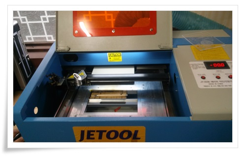

\- 다 완성한 펜에는 이렇게 레이저 각인기로 이름도 새긴다.

레이저로 나무 태우는 것 보니까 엄청 신기했다.

저 기계가 대략 백만원정도 한다는군.

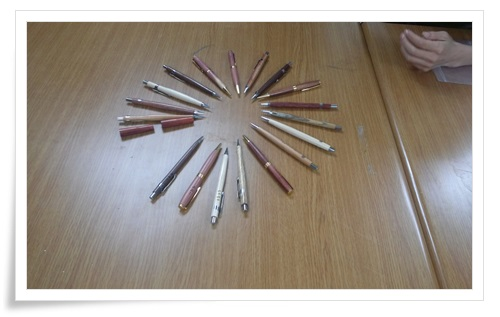

\- 이번 교육생들이 만든 펜들.

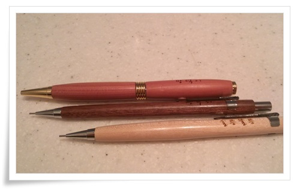

\- 이건 내가 만든 펜.  샤프 2개, 볼펜 1개.

