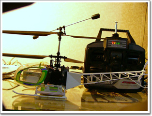

# 나의 새 장난감 무선조종 헬리콥터

어렸을때 부터 가지고 싶었던 장난감.

바로 헬리콥터다.

몇년전까지만 해도 엄청난 가격으로 감히 엄두조차 못내던 장난감이었지만, 마데전자의 활약과 리튬이온전지의 발전으로 지를만한 가격수준으로 떨어진 것이다.

무선조종중에서도 가장 어렵다는 헬리콥터.

지르기 전에 먼저 동호회를 통해 사전 공부를 했다.

남자의 로망 헬리콥터.

하지만 그 도도함으로 감히 그 뜻을 끝까지 이루기가 쉽지 않다고 한다.

헬기를 시작하는 사람의 80%가 6개월이내에 포기를 한다고 한다.

이유는 조작의 난이성. 공중에 가만히 있게 하는 것(호버링)에 손재주 아주 좋은 사람이 한달이상 걸린다고 한다.

게다가 공중에 떠는 것이기에 추락은 곧 돈을 부르게 된다. 추락하면 기본적으로 날개며, 꼬리며 기타 여러가지 부품이 망가지며, 이는 부품 교체 곧 돈을 부르게 된다.

즉 난이성으로 헬기를 추락시키고, 부품을 사는데 돈이 들며, 부품오는 동안 멍하니 손 놓고 있어야 하고, 다시 부품조립하여 공중에 띄우면 미숙으로 인해 다시 추락시키고, 이러한 악순환을 두세번만에 손을 들게 된다고 하더군.

마음가짐을 바로 하고 질렀다(실은 내가 지른게 아니고, 아내가 사줬다). 기종은 마데전자의 신기종 라마2\. 동축반전헬기다. 즉 같은 축에 반대로 날개가 도는 것이다. 그래서 꼬리에는 별다른게 없다. 잇점으로 기체가 무지 안정적이어서 초급자가 날리기 좋은 제품이라는 점.

좁은 집에서 날리다 보며 여러번의 추락과 파손이 있었지만, 열흘이 지난 지금 이제 어느정도 거실에서 가지고 놀만큼이 되었다.

7.4V 800mA 리튬전지 2개. 각각 15분의 비행시간. 그래서 30분 날리면 끝이다. 두시간가량을 충전해야지만 하는 것이지만, 근래에 이렇게 재미있는 장난감이 없는 듯 하다.

요즘 이 헬기때문에 일찍 퇴근을 한다.

[null](../6166682.html#6166682_1)

