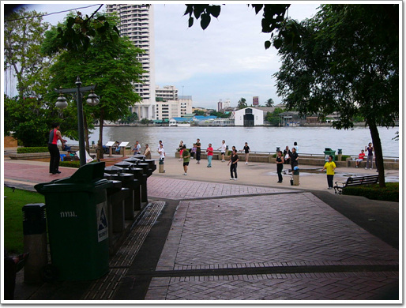

# 태국에서의 하루

태국에서 하루 머문이유.

첫번째. 태국->한국 비행기가 밤 11시 반으로 그래도 여유있는 편이지만, 육로여행이라는 어찔될지 장담할 수없어 좀 여유있게 하려고.

두번째, 이와 내 돈들여 여행온것 태국에서도 좀 쉬다가려고.

한데, 숙소 선택의 잘못으로 아침에 일어나니, 머리가 띵하고, 온몸이 쑤시더군. 습한 공기와 소음등으로 잠을 제대로 못 잔 탓이다. 나에게 에어콘없는 방은 무리였다.

원래 계획은 태국의 에어콘있는 편한 방에서 늦잠을 자다면서, 먹을 거나 먹고 즐기는 것이었는데, 실내가 더무 더워 도저히 방에 있을 수가 없었다.

\- 내가 있는 PS 게시트하우스의 복도.

\- 그리고 층마다 하나씩이있는 공동 화장실및 세면장.

일단 밖으로 나갔다. 아침 산책이나 하려고..

\- 숙소가 차프라 강 근처에 있더군. 아침이라 에어로빅 연습하는 아줌마들이 있다.

\- 아침을 어디서 먹을까 뒤져보는데, 적당한 곳을 못 찾았다.

\- 태국의 묘미는 군것질에 있다. 시원한 파이애플. 10바트. 우리돈 300원. 맛있다.

유학생 고헌과 차투착 시장에 갔다. 아무래도 차투착이 볼것도 먹을 것도 많기 때문.

\- 시장 가서 처음 한 것이 아침 식사. 제목은 모르지만 암튼 맛있는 누들.

\- 과자도 한봉지 사서 먹으면서 다니고..

\- 수박도 보이길래 수박도 먹고..

\- 코코넛도 있네? 12바트면 400원. 싸군. 코코넛도 하나 사먹고..

차투착 시장에서는 구경보다는 먹느라 시간을 다 보냈다.

11시 50분. 체크아웃을 하기 위해 숙소로 돌아왔다. 비행기가 밤이라 그 동안 짐을 어떻게 할 것인가 고민했는데, 다행이 이 숙소는 짐 보관을 해 주더군. 하루보관료 10바트.

체크아웃후, 짐을 맡기고서 다시 방콕 시내 정찰.

\- 맛있는 오렌지 쥬스. 이거는 큰거라 15바트.

\- 점심도 길거리에서.. 다시 봐도 먹고 싶군.. 쩝쩝.

\- 계란빵도 사먹고..

그리고, 찌뿌둥한 몸을 풀려고, 타이마사지도 받았다.

이번엔 제법 등치있는 아줌마가 들어와서 뼈를 아작아작 내니, 뼈 마디마다가 우두둑소리를 내는게 무지 시원하더군.

\- 마분크롱센터 갈려고, 버스를 탔다. 버스를 아는게 아니고, 그냥 아무 버스나 탔다. 대충 방향만 보고..

버스는 이상한곳으로 가더군. 버스를 세번을 타다가 포기하고, 배를 탔다.

\- 차오프라 배 선착장

\- 배가 자주 있어 좋다.

\- 더위 먹어서 그런가 경치가 눈에 잘 안들어온다.

\- 그리 많은 사람은 아니지만, 그래도 빈 자리없이 꽉 찼다.

\- 저게 새벽사원 와트룬이었던가?

\- 수상가옥도 보이고..

\- 택시 배도 정박해 있군. 저 엔진은 어디서 뗀 걸까? 크기로 봐서 봉고차정도의 엔진 같은데..

\- 짓다 만 건물. 2년전 왔었을 때도 저모양이었는데, 여태 지어지지 못하고 있군..

\- 슬슬 철골도 녹슬어가는군.

목적지 사톤에 도착했다.

선착장 바닥에 개가 누워 자리를 차지고 있더군.

\- 이개도 더위 먹었나? 태국의 개들은 사람이 바로 옆에 지나가도 콧방귀하나 안뀐다.

\- 전철역에서 구아바쥬스 하나 사먹고.. 역시 먹는 것에 행복이 있다.

\- MK센터에 왔다. 뭐가 사람이 모여있는 것으로 보아 뭔가 재미있는 것을 하나본데..

\- 태국의 가수인가 보다.

MK센터에서 시원한 에어콘 바람을 쐬면서 구경을 하다, 다시 카오산 로드로 향했다.

중요한 일정, Facial Treatment와 발마사지를 하기 위해서다..

다시 사톤으로 가서 배를 탔다.

내린 곳은 원래 내려야할 곳에서 한정거장 더 갔다. 이런 어처구니 없는 짓을 저지르다니.. 방랑푸 다음역이었는데, 이름을 잘 모르겠군..

\- 이 선착장의 특이한 점은 물고기가 무지 많다는것. 저 밑에 있는 것들이 다 고기다. 사람들이 고기밥을 주니까, 그것 받아 먹으려 더 모여드는 것 같다.

\- 나도 빵 부스러기 한 봉지를 샀다.

\- 빵부스러기를 던지니, 한 무너기 달려드는 고기떼들. 저것들 다 잡아 먹으면 몇달은 배불리 먹을 수 있을텐데..

\- 다시 온 카오산로드. 역시 방콕의 참멋은 밤이다. 이 활기찬 밤거리를 보라.. 절로 흥이 나지 않는가?

\- 저녁겸 간식으로 먹은 것은 팟타이. 무지 맛있다. 그런데 이것은 현지인들보다는 여행객들이 더 많이 먹는 음식인 것 같다. 다른곳에서는 찾기 힘든데, 여기 카오산로드 밤에는 무지 많다.

Facial Treatment를 받으로 들어갔다. 다른 사람 여행기에서 본 것인데, 캄보디아 갔다와서, 태국에서 이것 받으면 얼굴이 무지 깨끗하게 된다고 하더군.

가격은 기본요금 250바트. 추가요금 400바트.

누우니, 얼굴을 클렌징 크림갈은 것으로 닦아내더니, 피지를 하나씩 쭉쭉 파낸다. 시원하면서도 무지 아프더군.

특히, 코와 코 주위에 있는 피지를 뽑아 낼때는, 어찌나 시원하던니, 눈물은 찔끔나오더군.

추가서비스인 석고팩까지 하였다. 석고팩하는 동안은, 마시지도 해주더군. 뭐 그다지 시원한 맛은 없었지만 그래도, 만족스러웠다. 암튼 다하고 지불한 금액은 600바트. 우리돈 18,000원이군. 태국물가로 따지면 그리 싸게 했다고는 볼 수만은 없겠지만, 우리나라에는 감히 엄두조차 못 내는 거라, 대만족이다. 다음 기회에 또 피지 짜내고 싶다.

발마사지도 받으려 했는데, 시간이 여유가 별로 없더군. 그래서 짐 찾으러 숙소로 향했다.

\- 숙소가는 길에 들린 야외 바. 양주들도 팔더군. 내가 술을 좋아하면 여기서 술 먹는 것도 좋을 듯 한데, 그냥 수박쥬스 사 먹었다.

\- 그리고, 바나나 로띠. 이것도 아주 별미다.

짐을 챙겨들고, 공항버스를 탔다. 요금 100바트.

\- 역시 세계 제일1의 교통제증 도시답게 차가 꽉 막혔다.

\- 귀국 비행기에 메뉴.

이렇게 6박 7일의 캄보디아 여행이 끝났다.

이정도 놀면 노는 것의 끝을 보았겠지라 짐작했었는데, 놀다보니, 더 놀고 싶더군.

다시 일상으로 복귀하는게 두려워진다.

#### 6/24(토) - 118,539

- 06:30 기상
- 07:00 ~ 08:10 아침산책, 계란빵 10B, 파인애플 10B
- 08:10 ~ 09:00 고헌의 늑장으로 숙소에서 대기
- 09:00 ~ 09:40 숙소->짜투착
- 09:40 ~ 11:20 짜투착에서 쇼핑(국수 30B, 코코넛 12B, 기타 한 3만원정도어치)
- 11:20 ~ 11:50 짜투착->숙소
- 11:50 ~ 12:00 샤워 후 체크아웃, 짐 맡김
- 12:00 ~ 13:00 카오산 방황 ( 마른과자 10B, 젖은 과자 10B, 국수 25B, 오렌지쥬스 15B )
- 13:00 ~ 14:00 타이마사지 180B
- 14:00 ~ 15:00 버스 두번 타고(9B), 배타고 사톤으로 이동 ( 9B )
- 15:00 ~ 15:20 BTS타고 national stadium으로 이동 ( 역에서 내려 25B짜리 구아바쥬스 )
- 15:20 ~ 17:30 MK에서 노니닥거림 ( MK에서 460B주고 못난이 자매용 천사복장 구매 )
- 17:30 ~ 18:00 사판탁신으로 BTS타고 이동
- 18:00 ~ 19:00 배타고 카오산으로(도중에 잘못 내려 두번 탐 - 11B+7B, 도중에서 10B로 물고기 밥)
- 19:00 방랑푸역에서 10B짜리 파인애플
- 19:00 ~ 21:30 카오산에서 팟타이 20B, 수박 두번 20B
- 19:30 ~ 20:30 Facial treatment 600B ( 250B+400B )
- 20:30 ~ 21:00 바나나 로티 10B(원래는 15B인데 잔돈이 없어서), 돼지고기 꼬치 5B, 수박쥬스 20B, 오렌지 쥬스 25B
- 21:00 ~ 21:10 숙소에서 짐 찾음 ( 보관료 10B )
- 21:25 ~ 22:20 카오산->공항 ( 공항버스 100B)
- 22:20 ~ 23:00 티케팅 및 출국
- 23:00 ~ 23:20 면세점에서 시바스 리갈 구매 (1,040B)
- 23:30 비행기 탑승
- 23:50 태국->한국

#### 6/25(일) - 7,000

- 07:00 비행기 도착
- 07:30 입국
- 07:30 ~ 08:30 공항->청량리 ( 공항버스 - 7,000 )
- 08:30 ~ 09:00 청량리->집

6박 7일간의 총 지출 : 689,000원.

이중 교통비가 40만원, 숙박비가 5만원정도, 선물사는데 10만원정도 들었으니, 군것질하는데 20만원가냥 쓴 거군...

[null](../6166683.html#6166683_1)

