# 앙코르와트 2일차

첫날 상당히 느긋한 일정으로 잡았었는데도, 젊은 대학생커플이 뻗어, 오늘은 아주 여유있는 일정으로 꾸렸다.

그래서 아침도 06:30에 같이 먹고, 7시에 숙소에서 나가기로 했었다.

그런데, 아무리 기다려도 안 나오는게 아닌가?

그래서 커플 방문을 한참을 두드리니, 그제서야 부시시한 눈으로 문을 열었다.

암튼, 요즘 젊은이는 너무 허약하고 시간관념이 없어..

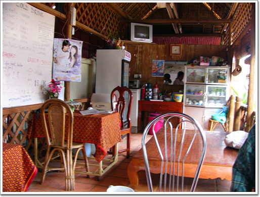

\- 숙소에 있는 식당.

\- 인기 메뉴는 이렇게 칠판에도 적혀있다.

\- 아침 메뉴, 빵과 커피하여 1$

7:30 아침식사를 마치고, 첫장소를 반띠쓰레이로 향했다.

반띠쓰레이는 외곽이라서, 돈을 5$ 더 줘야했다.

캄보디아의 물가에 비해서 기름값이 싼편은 아니었다.

휘발유가격을 보니 우리돈 800원 정도.

그네들 물가로 치면 꽤 비싼거다.

\- 툭툭을 타고, 시엠립시내를 빠져가는중.

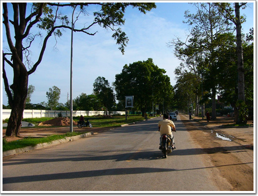

\- 이제 시내의 끝.

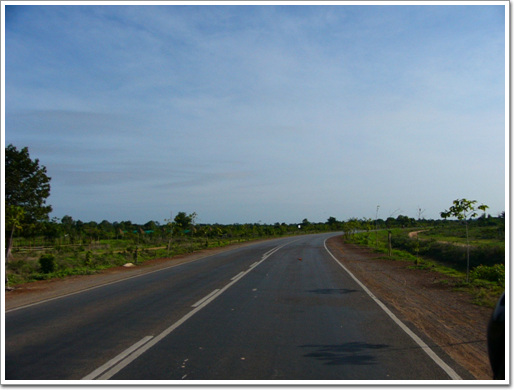

\- 시엠립이 얼마나 작은지, 조금가니 이런 광할한 평원이다.

외곽으로 가는 코스의 좋은 점은 캄보디아 사람들이 어떻게 사는지 피상적으로나마 볼 수 있다는 점이다.

앙코르와트 자체는 관광객과 그들을 상대하는 상인들뿐인지라, 실제 캄보디아 사람들이 어떻게 사는지도 보고 싶었다.

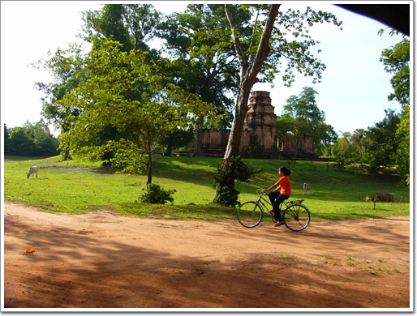

\- 자전거를 타고 다니는 여자

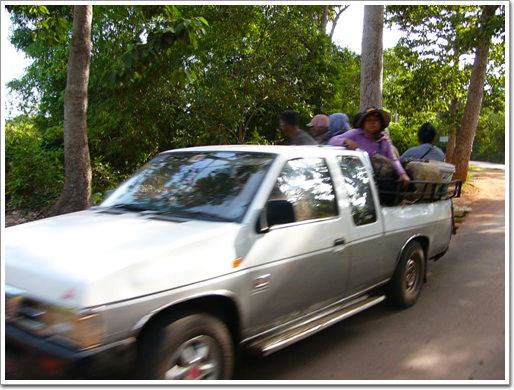

\- 국경넘어오면서 많이 보았던 장면. 이차에는 별로 많이 타지 않았군.

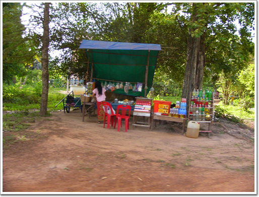

\- 군데군데 그늘에는 이처럼, 기름과 음료수, 과자등을 파는 노점들이 있다.

\- 이것이 아마 학교같은데, 담장이 없는 열린학교로군.

\- 앙코르와트 서쪽 근처의 제법 큰 마을인가 보다.

\- 지나가는 경운기.

우리나라 경운기와 달리 경운기 손잡이가 무척이나 길다.

꼭 할리데이비슨의 기다란 손잡이같군.

저렇게 긴게 어떤 잇점이 있는걸까?

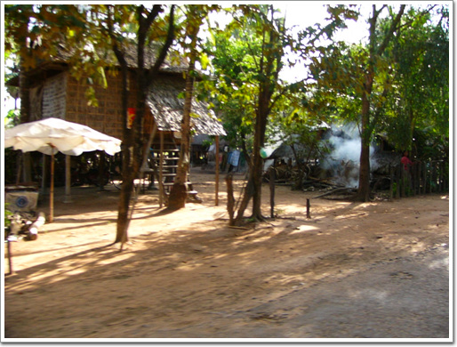

\- 캄보디아 민가. 보다시피 1층공간을 비워놓고, 2층이 거주공간인듯하다.

\- 어딜가나 애들은 이렇게 끌어주며 놀아주는 것을 좋아하지..

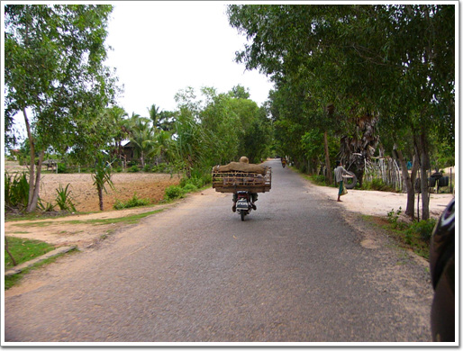

\- 앞서가는 오토바이는 옆으로 가디라는 망태를 싣고 가는데,

\- 자세히 보니, 돼지다. 어디가는껄까? 도살장?

\- 이렇게 편안한 자세로 소달구지를 타고 가기고 하는군.

08:40 반띠쓰레이 도착.

\- 1시간 가량을 달려, 목적지 반뜨쓰레이에 왔다. 우선 앞에 있는 화장실에서 볼 일부터..

\- 모든 화장실은 이런 요금안내 표지가 붙어있다. 관광객이 들어갈 때는 티켓을 보여주면 된다.

\- 여기가 반띠쓰레이 입구.

반띠쓰레이의 뜻은, '여인들의 성채'라는군.

분홍빛 사암과 붉은 라테라이트석을 사용하여 사원 전체가 분홍빛 연꽃처럼 대단한 전굥하고 아름다운 여성적 분위기의 부조로 장식되어 있다고 하여 붙여진 이름이라고 한다.

\- 사원문을 나서자, 중앙 성소로 이어진 길이 이어진다.

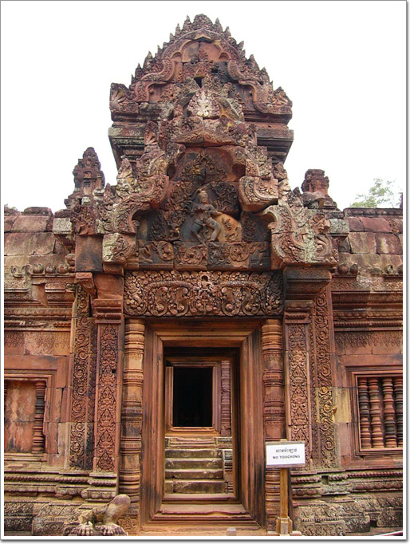

\- 대단히 정교한 중앙 성소. 크기가 별로 크지 않아 정교함이 더 해 보인다.

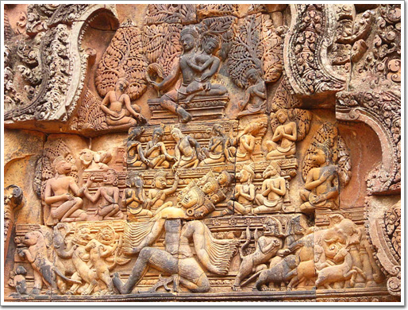

\- 각기 다른 색으로 바랜 조각들.

이 조각자체도 경이롭지만, 각기 조각조각 붕괴해버린 조각들을 어떻게 이렇게 완벽하게 복원할 수 있었는지도 놀라웠다.

해답이 없는 상황에서 맞추었다면 평소에도 퍼즐같은 것을 아주 잘 할 것 같다.

\- 이 문틀 부조가 1914년 프랑스인에게 도굴되었다가 되찾은 거라 한다.

돌이 조각한게 장난이 아니다.

\- 아직 떨어져나간 얼굴 조각을 못찾아서인지, 덜 복원된 모습이 기괴해보기도 한다.

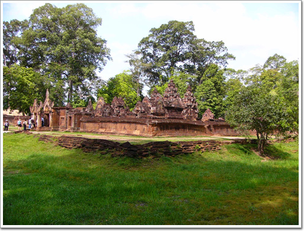

\- 반띠쓰레이의 전체 모습. 다른 사원들에 비해 크기는 상당히 작은 편이다.

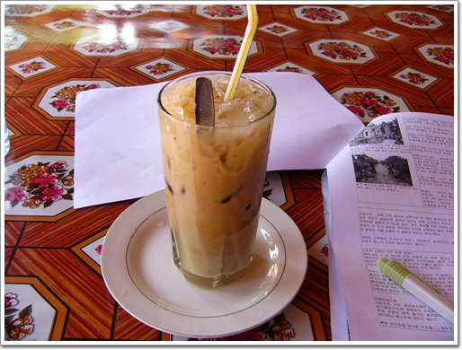

\- 09:40 반띠쓰레이 구경을 마치고, 잠시 식당에서 아이스커피 1$짜리를 마시는중.

너무 달다.

\- 10:00 이번에 반띠쌈레로 향한다.

\- 10:30 반띠쌈레 도착. 외곽이고 그다지 유명하지는 않은 곳이라 그런가, 입구로 가는 길이 한가하다.

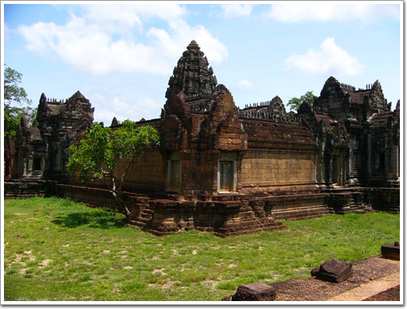

\- 이 사원이 반띠쌈레.

뜻은 '쌈레족의 성채'라고 한다.

반띠쓰레이와 같은 복원기술로 복원하였는데,

20여년의 독재체제로 거치면서 제대로 관리가 안되어 많이 망가졌다고 한다.

\- 출입구쪽의 해자를 향해 위엄있게 서 있었을 사자상.

지금은 밀림이 되어버린 곳을 바라보는 모습이 불쌍해 보이기까지 한다.

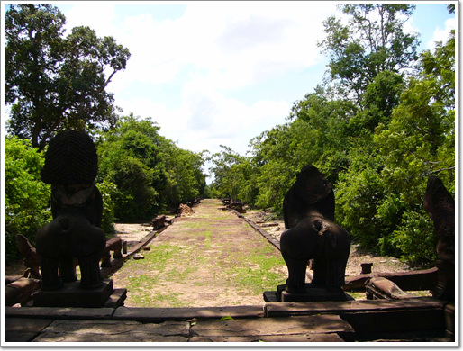

\- 원래의 출입입구였던 곳은 지금은 출입구로 사용을 안하여, 끝은 밀림으로 막혀있다.

\- 앙코르와트 유적의 창틀 양식인가 보다. 창틀 사이로 보이는 중앙성소의 모습이 고적해보인다.

\- 완벽한 보호색. 비슷한 색깔이라 처음엔 잘 안보였던 도마뱀.

\- 안에는 가이드를 대동한 관광객이 보인다.

우리나라 관광객들은 가이드 한명에서 스무명정도의 관광객이 붙는데 반해,

다른 나라 사람들은 서너명에 가이드 한명씩 따라다니더군.

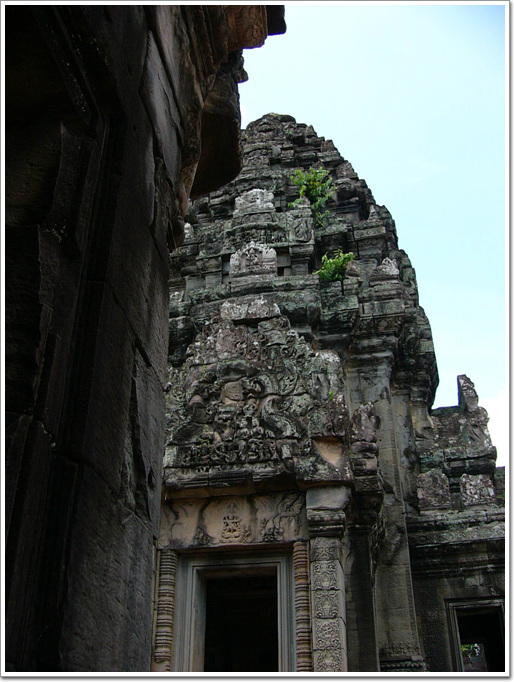

\- 중앙성소탑.

탑 중간중간 이 유적을 파괴하였던 밀림이 다시 자라고 있다.

\- 줌으로 땅겨봤다.

역시 놀라운 힘이다.

돌조각을 옆으로 조금씩 밀고 있다.

11:30 반띠쌈레 구경을 마치고, 다음목적지 타께오 향하기 위해 툭툭에 탔다.

외곽으로 갈수록, 관광객에 들러붙는 어린 잡상인들이 많다.

\- 툭툭옆에 붙여, 실크로 된 테이블 보자기를 사라고 하는 캄보디아 소녀.

캄보디아 소녀의 상술에 넘어가지 않고, 타께오로 향했다.

12:00 타께오 도착.

건축이 다 이루어지지 않고, 중도에 그만둔 건축물이라 다른 유적과 같은 부조는 없지만, 남성적인 이미지가 강한 유적이다.

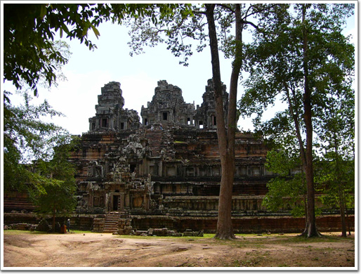

\- 이게 타께오다.

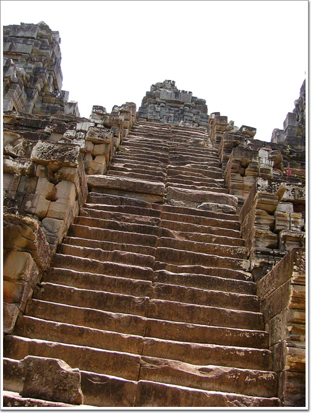

\- 여느 유적이 다 가파랐지만, 이것은 특히나 더 가파랐다.

\- 다 오르니, 북쪽으로 밀림이 끝없이 펼쳐져 있다.

앙코르와트 유적지가 천년가까이 잊어야있다가 19세기가 되어서야 발견된게 조금은 이해가 될 듯 싶다.

저 끝없는 밀림속을 무엇이 있을 줄 알고, 뒤졌을까?

아기자기한 멋이 없는 사원이지만, 거칠은 외형과 밀림이 가장 잘 보이는 건축물이라 그런가, 그늘에 앉아 바람소리를 듣고 있으니, 내려가기가 싫어지더군.

타께오 구경을 마치니 13시. 점심을 먹을 때다.

점심은 타께오에서 1분 거리에 있는 타프롬앞의 식당에서 먹었다.

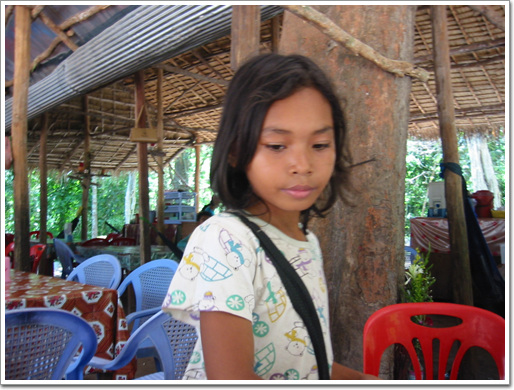

\- 물건 파는 잡상인줄 알았는데, 이 여자애가 주문을 받더군.

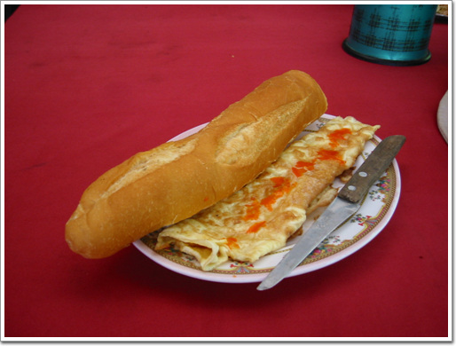

\- 내가 먹은 것은 빵과 오믈렛. 2달러다.

무지 맛없다.

성의가 없다.

최악의 메뉴였다.

밥을 먹는 도중에도 이곳의 앙코르의 아이들이 귀찮게 군다.

조잡한 팔찌와 목걸이등을 가지고 "열개 일달러", "다섯개 일달러"라고 한국어로 귀찮게 군다.

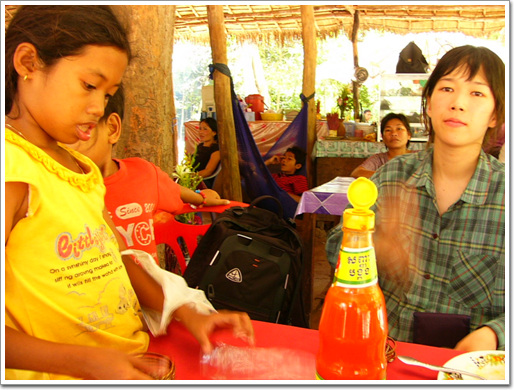

\- 바로 옆에서 1시간 내내 사달라고 졸라댄다. 그냥 무시.

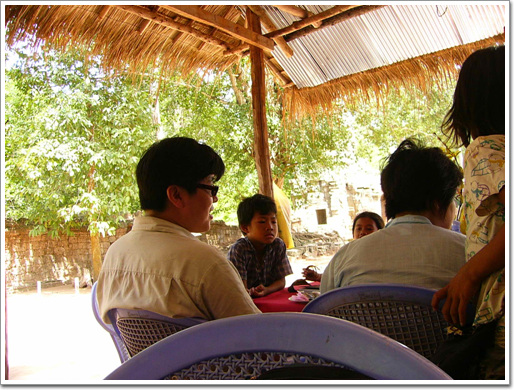

\- 옆에는 중국에서 온 관광객이다.

팔찌하나를 샀더니, 다른 애들까지 다 모였다.

애들 중국어도 무지 잘하더군.

중국인이 이미 팔찌 샀다고 하니, 다른 아이가 "buy one more"라고도 하고, 사서 선물로 주라고라고 하고 엄청 시끄럽게 해댄다.

\- 서양인들에게도 이렇게 들러붙는데, 서양인들은 보통 애들한테 눈길도 안주더군.

점심을 다 먹은 14:00.

오늘의 하일라이트 타프롬으로 들어갔다.

타프롬은 툼레이더를 찍은 장소로도 유명하다.

다른 사원들도 다 열대 밀림에 의해 폐허가 되었지만, 이 타프롬만큼이 처참하게 폐허가 되지는 않았다.

그리고 타프롬의 매력이 열대 밀림이 장악한 폐허라는 점이기에, 다른 사원들과 같이 복원을 하지 않고, 나무와 유적이 어느정도 조화를 정도로만 유지관리하는 수준이다.

\- 타프롬의 입구.

여느 사원들처럼 4면체의 앙코르 미소가 맞이하고 있다.

\- 문을 지나, 밀림속에 내놓은 길을 걷는다. 이 길도 없었을 때는 과연 어떻게 저 유적을 찾아 갔었을까?

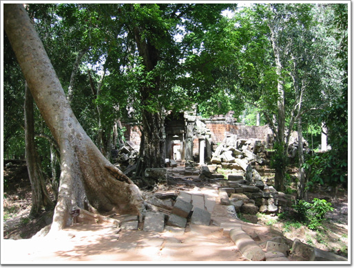

\- 이제 사원 본당의 입구다. 입구서부터 심심치가 않다.

\- 안에 들어서니 본격적인 열대 밀림의 위력이 나온다.

\- 사원위에 처음 뿌리를 내린 나무가 돌을 허물고 바닥을 향하는 모습이 징그럽기까지 하다.

\- 제일 유명한 나무. 이게 톰레이더에 나온 나무던가?

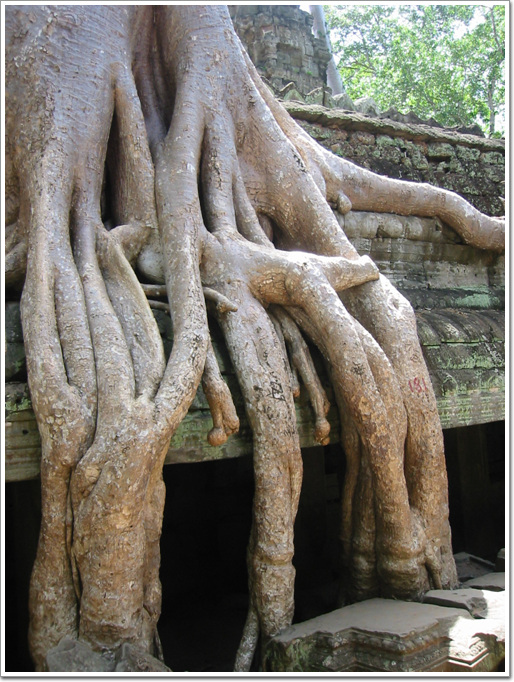

\- 거대한 뿌리. 나무가 아니라, 살아있는 아나콘다 같다.

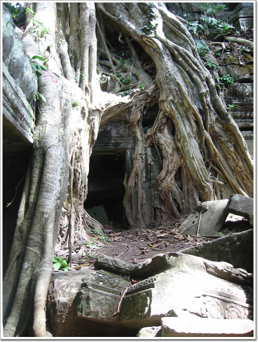

\- 갈기갈기 뻗은 뿌리가 사원도 석벽도 그냥 허물어 버리고,

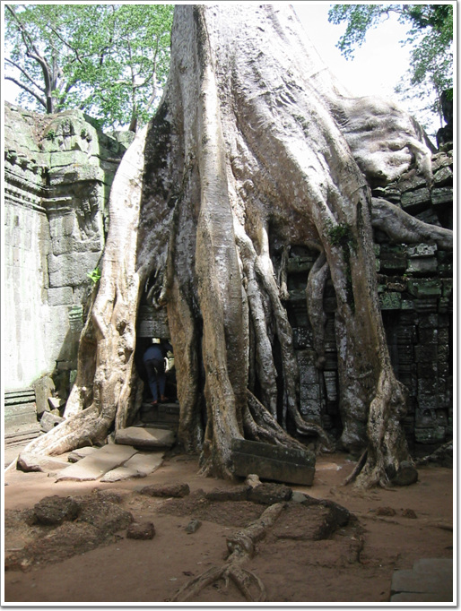

\- 아예 삼켜버리기도 한다.

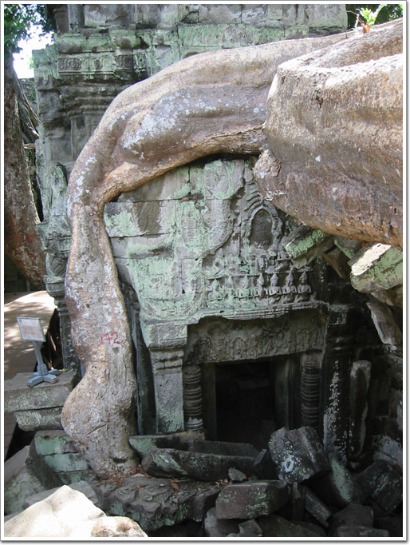

\- 나무의 뿌리밑에 깔린 사원은 원래의 위용은 간데없고 나약해보이기까지 한다.

\- 뿌리를 보고 있자면, 그 앞에 구경하고 있는 사람들을 금세라도 휘감아버릴 것 같은 착각도 든다.

\- 열대밀림이 장악하고 있는 과정을 천년동안 저 자리에서 가만히 보고 있었을 압살라.

과연 압살라는 어떤 느낌이었을까?

\- 앙코르와트에 이어 가장 인기있는 사원이기에 이곳은 찾는 사람들 발길이 끊이지 않는다.

타프롬에서 나온 시각 15:30.

같은 간 대학생 커플은, 이렇게 느슨한 일정에도 불구하고, 어제에 이어 그만 보고 숙소로 돌아가겠단다..

어제처럼 어르고 달래봐도 완강하다.

보내기로 했다.

툭툭 기사한테 커플 숙소로 보내고 다시 이 장소로 오라니까 싫단다.

이거 참,. 세계 어딜가나, 택시기사는 어쩔 수 없나 보다.

항상 고정된 단골이 아닌 뜨내기만 받는 직업이다보니, 다시 볼 사람도 아니라는 생각에 그냥 막 나가는 것 같다.

어차피는 오늘은 툭툭이 값을 대학생 커플이 낼 차례라서,

그냥 커플과 함께 가라고 내버려 두고, 난 다른 한국인 일행에 끼기로 했다.

15:30 입장한 곳은 반티끄데이.

사원의 설립목적이 승려들을 위한 것이라서 뜻 자체도 '수많은 방을 가진 성채'라고 한다.

그리고 이 사원을 1960년대 복원하려고 하였을 때 지역 주민들이 이곳을 가축의 우리로 사용하고 있었다고 하더군.

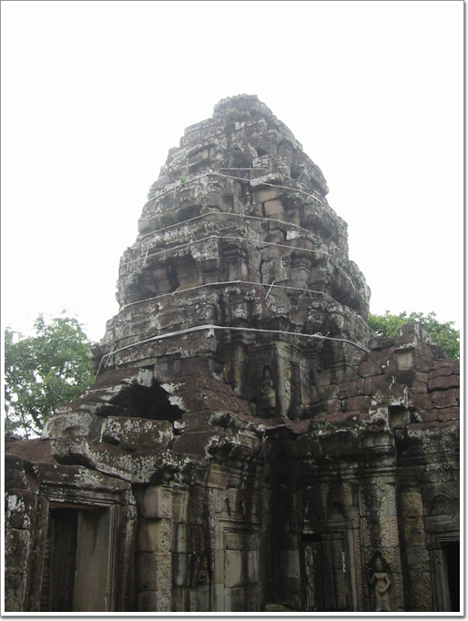

\- 복원을 이렇게 한 것인지, 아니면 복원중인것 잘 모르겠다. 반티끄데의 중앙 성소부분.

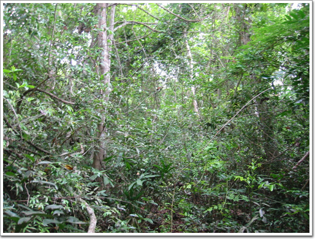

\- 사원 옆은 바로 밀림.

밀림만 보면 낫하나 들고 헤쳐들어가고픈 욕구를 느낀다.

내가 '도전지구탐험대' 프로그램을 너무 많이 봤나 보다.

16:00 왕실의 연못 스라스랭.

이 스라스랭은 반티크데이 바로 앞에 있는 연못으로, 앙코르 시대에 만든 저수지 중에서 현재까지도 자연적으로 물이 고이는 몇 안되는 저수지라고 한다.

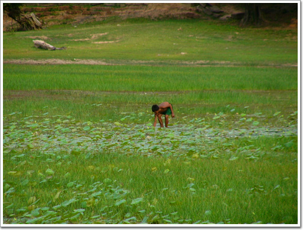

\- 호수에서 무엇인가를 잡는 사람.

\- 스라스랭 호수 너머에 오늘의 마지막 관람할 사원인 프레룹이 보이는군.

\- 연못을 바라다보는 단장.

동쪽을 향하고 있어 아침에서 이곳에서 수면위로 떠오르는 태양을 볼 수 있다고 하는데, 난 안해봤다.

16:30 다른 한국인 팀에 꼽사리 꼈다.

20대 초반으로 구성된 남자한명, 여자세명의 아주 이상적인 팀이었다.

게다가 이 팀은 툭툭이 아닌 봉고를 빌려 구경중이었다.

에어콘이 나오는 점이 아주 좋더군.

간만에 시원한 에어콘을 쐬며 유적지로 향할 수 있었다.

16:50 프레룹 도착. 이곳은 앙코르의 화장터다.

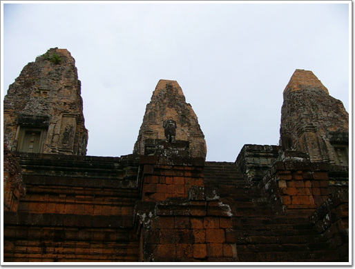

\- 화장터의 분위기가 느껴지는가?

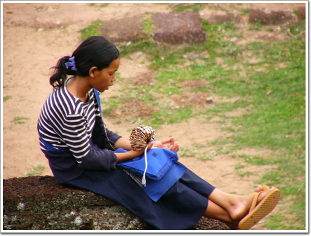

\- 멀리서 쉬고 있는 소녀. 손에 들고 있는 팔찌를 보니 오늘의 판매량은 많지 않았나 보다.

\- 관광객이면 항상 들러붙는 상인들.

캄보디아 가방을 파는 여인과, 팔찌파는 소녀, 그리고 캄보디아 소개 책자를 파는 아저씨 이렇게 세 상인이 붙었군.

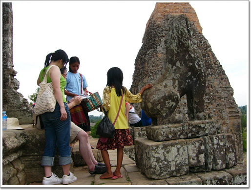

\- 내가 신세를 진 남1여3 일행에게도 물건을 팔기위해서 열심인 아이들.

\- 저 아래 사람들이 있는 직사각형이 화장하는 시설이라고 한다.

\- 석양을 보려 왔지만, 우기라 구름으로 인해 석양을 볼 수 없었다.

하긴 여기 사람들 말로, 우기에 일출과 석양을 보려면 삼대가 덕을 쌓여야하지만 가능하다고 하니..

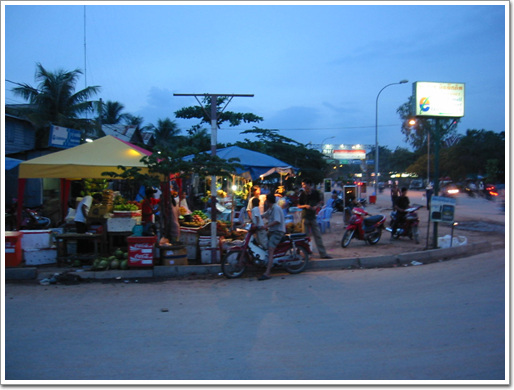

\- 어제 망고스틴 2Kg을 샀었지만, 그역시 하루만에 다 먹어치우고, 또다시 망고스틴 사러 과일가게 나왔다.

\- 오늘도 넉넉하게 2Kg.

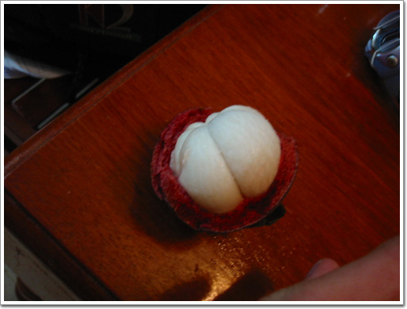

\- 아, 이 맛있는 것. 보기만 봐도 침이 나온다.

한번 먹기 시작하면 도저히 멈출 수가 없다.

오늘이 대학생 커플의 캄보디아 마지막 날.

그래서 대학생과 커플과 사진 전공 커플과 다 함께 저녁을 같이 하기로 했다.

장소는 시내 중심가의 FCC라는 레스토랑.

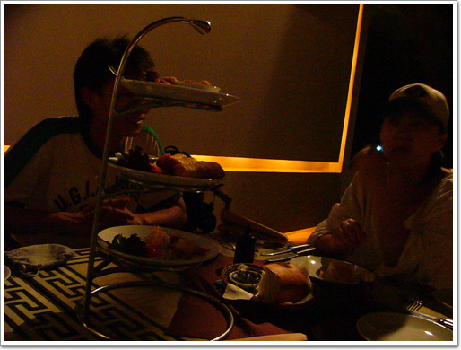

\- 캄보디아 물가로는 제법 비싼, 우리로 치면 껌값인 요리.

\- 제법 근사한 식당이다.

#### 6/22(수) - 지출액 : 21,175원

- 05:00 기상
- 06:30 ~ 07:00 커플의 늦장으로 그냥 기다림 (원래 6:30 아침먹기로 했었음)
- 07:00 ~ 07:30 아침식사 ( 커피+빵 1$ )
- 07:30 ~ 08:50 반띠쓰레이로 이동
- 08:50 ~ 09:40 반띠쓰레이 구경
- 09:40 ~ 10:00 매점에서 아이스커피 1$
- 10:00 ~ 10:30 반띠쓰레이->반띠쌈레
- 10:30 ~ 11:30 반띠쌈레 구경
- 11:30 ~ 12:00 반띠쌈레->타께오
- 12:00 ~ 13:00 타께요 구경
- 13:00 ~ 14:00 타프롬 앞에서 점심식사 (수박쥬스 1$, 빵과 오믈릿 2$ - 형편없음)
- 14:00 ~ 15:30 타프롬 구경
- 15:30 ~ 16:00 반띠크데이 구경
- 16:00 ~ 16:20 스라스랭 구경
- 16:20 ~ 16:50 커플을 숙소로 보내고 난 남1여3 단체에 끼어 봉고타고 프레룹으로 이동
- 16:50 ~ 18:00 프레룹 구경과 석양 기다림 ( 구름많이 껴 못 봄 )
- 18:00 ~ 18:30 프레룹->숙소
- 18:30 ~ 19:00 망고스틴 4Kg(4$) 구매
- 19:00 ~ 20:00 빨래, 샤워
- 20:00 ~ 22:00 다른 두커플과 FCC에서 저녁식사 10$, 이동중 툭툭비 1,000R

