# 앙코르와트로 가는 길

마추피추가 있는 페루에 가고 싶었다.

그래서 19박20일짜리 남미여행 배낭패키지로 가려고 했는데, 모집 미달로 불발되었다.

하긴 마추피추를 벌써 가면 남은 여생이 별로 재미없을 수도 있겠다.

늙기 전에 마추피추 가야겠다는 생각을 가지고 있는 터에 아직 젋은 이 나이에 벌써 거길 가고 나면, 여생이 별로 재미없을 것 같다는 생각이 들기도 한다.

방향을 바꾸어 눈은 동남아로 돌렸다.

목표는 앙코르와트가 있는 캄보디아.

1인당 국민소득이 40만원이 채 안되는 못사는 나라다.

못사는 이유야 다른 아시아국가들처럼 유럽열강들에 의한 식민지 지배로 인한 수탈과 이어진 정치경제의 불안정때문일 것이다.

같이 갈 여행파트너로 조영민씨를 꼬셨는데, 항공권 예약을 앞두고 장염으로 입원하는 통에, 혼자 가게 되었다.

솔직히 이 때 장염으로 입원한 조영민씨가 걱정되는 게 아니라, 여행중 교통비와 숙박비가 늘어나는 경비가 더 걱정이었다.

여행일정은 6월 19일 일요일 밤 9시 ~ 6월 26일 일요일 아침 7시, 6박 7일의 일정이다.

첫 1박은 태국가는 비행기 안에서, 그리고 4박은 캄보디아에서, 1박은 태국에서, 그리고 나머지 1박은 귀국하는 비행기안.

출장이 아닌 배낭여행이기에, 짐을 최소한으로 하였다.

준비물은

- 여권, 여행가이드책
- 판초우의, 우산
- 카메라 \- fz1, ixy, 예비배터리, 충전기, 메모리리더기, 삼각대
- 돈 : 태국돈, 달러
- 옷 : 속옷 2벌, 수건, 비누, 치약, 칫솔, 면도기, 반바지, 수영복, 샌달, 운동화, 빨래비누
- 약 : 감기약, 배탈약, 모기약, 물파스, 베이비파우더
- 썬크림, PDA, 모자, 필기구, 물티슈, 썬글라스

항공권은 탑항공에서 파는 밤 9시 타이항공꺼가 제일 싸길래 그걸로 샀다.

가격은 30만원인데, 공항세와 전쟁보험료 포함하여 총 337,000원이다.

짐을 다 쌌다.

6월 19일 17시 집에서 출발했다. 공항버스가 청량리에 있어, 청량리로 갔다.

17:30 승차권을 7천원에 산 후, 공항버스를 타고 공항으로 갔다.

항공권을 공항에서 받기로 하였고, 탑항공 직원이 오후 7시까지 있기 때문에, 7시까지 도착해야 했는데, 일요일이라 다행이 차가 안 막혀, 7시 전에 도착할 수 있었다.

항공권을 받고 나서, 환전을 했다. 캄보디아에서는 신용카드도 잘 안되고, ATM기는 하나도 없다고 하기때문에 넉넉히 환전을 했다. 40만원으로 300달러와 나머지 태국돈으로 환전했다.

20:00 티케팅, 출국수속

일요일 저녁이라, 태국가는 비행기는 만석이었다.

승객의 대부분은 막 결혼식을 치룬 신혼부부들이었다.

신혼부부인지 아닌지는 여자를 보니 한 눈에 알아 볼 수 있었다.

여자들의 대부분은 신부머리라고 하는 좀 이상한 머리 모양을 하고 있었다.

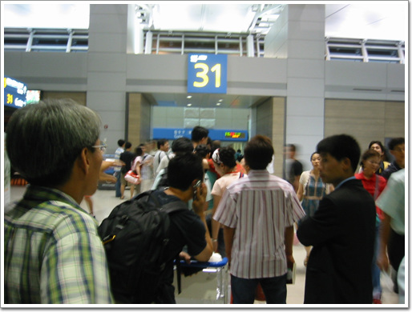

\- 20:30 비행기에 올라타려 줄 서 있는 중.

비행기는 9시에 이륙하였다.

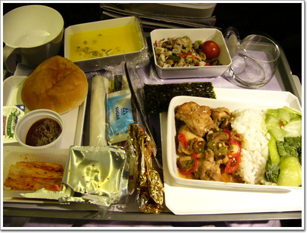

\- 타이항공의 기내식. 항공사중 기내식은 가장 잘 나오는 것 같다.

6월 20일 월요일 12시 30분. 비행기는 5시간 반을 날아가서, 다음 날 새벽 12시 반에 태국 돈무앙 공항에 도착하였다.

입국 심사는 줄을 잘 못 서 좀 어리버리한 심사관쪽에 줄을 섰더니, 1시 반에야 입국 심사를 마칠 수 있었다.

태국에서 캄보디아로 넘어가는 방법으로 내가 택한 방법은 육로. 그 중에서 카지노 버스를 이용하는 것이다.

태사랑 사이트에서 이 카지노 버스가 가장 싸고 안락하다고 하여서 이 방법을 이용하기로 하였다.

카지노 버스는 방콕의 룸비니 공원에서 4:30 혹은 5:00 에 출발을 한다고 하였다.

공항에서 룸비니 공항까지는 넉넉하게 30분 정도면 갈 수 있는 거리라, 3시 40분까지 공항에서 마냥 죽치고 앉아 있기로 했다.

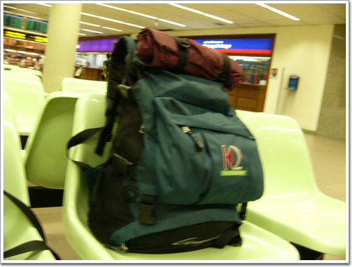

\- 나의 베낭. 가방 자체는 상민에게서 빌린 거다. 출장만 다니다 여행을 가니 짐이 상당히 줄어드는군.

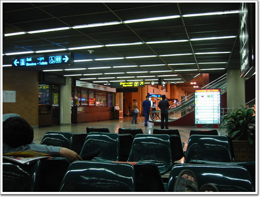

\- 1:30 ~ 3:30 까지 두시간 동안 죽치고 앉아 있던 공항의 1층.

3:30 택시를 탔다.

새벽이라 택시는 시속 120킬로로 날라다니더군.

룸비니 공원까지 20분 밖에 안 걸렸다.

택시기사에게 '룸피니 파크' 라고 말해서 제대로 갈 줄 알았는데, 룸비니 공원을 지나쳤다.

알고 보니, '룸피니 파크'라는 호텔이 새로 생긴 모양이었다.

같은 이름의 호텔로 데려다 주는 게 아닌가.

이곳이 아니라고 지도를 보여주고 설명하여 룸비니 공원으로 다시 갔다.

택시비는 공홍통행료 50바트, 고속도로 통행료 20바트, 미터요금 176바트 합하여 246바트가 나왔다.

우리돈 8천원정도 되는 셈이지.

\- 새벽 4시의 룸비니 공원. 저 동상이 라마6세 동상인데, 저 동상 왼편에 카지노 버스가 선다.

\- 처음에 이 버스가 서길래, 이게 카지노 버스인가 하여 물어봤는데, 아니랜다.

내 뒤에서 '카지노 버스는 저 쪽에서 선데요'라는 젊은 여인의 목소리가 들렸다.

큰 배낭을 짊어진 우리나라 여자와 남자다.

외모가 어려보이길래, 대학생들이 방학 시작하자마자 배낭여행 왔구나 생각했는데, 여자가 35살. 남자가 27살이랜다.

놀랬다.

그렇게 어려보일 수 있다니..

이 사람들은 태국에서 일주일을 보내고, 캄보디아로 가는 거랜다.

카지노 버스는 5시에 왔다.

사람을 기다리는 것은 아니고, 기다리던 사람을 태우자마자 출발하였다.

카지노 버스는 원래 관광객을 위한 것이 아니라, 카지노에서 손님 모집을 위해 운영하는 버스다.

그래서 원래 정상적으로 터미널에서 일반 버스로 가면 170바트 정도 나오는데, 이 버스는 100바트만 받고 가는 거였다.

\- 카지노 버스의 2층 자리에 앉으니 물부터 준다.

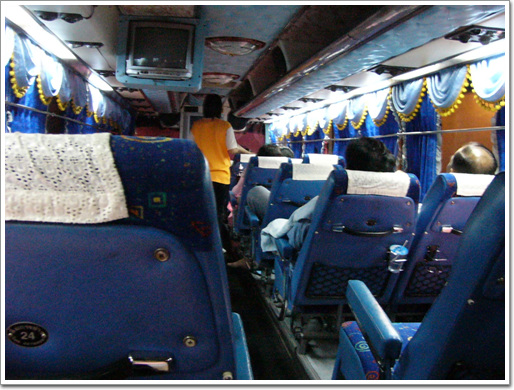

\- 2층 객실 안내양이 있다.

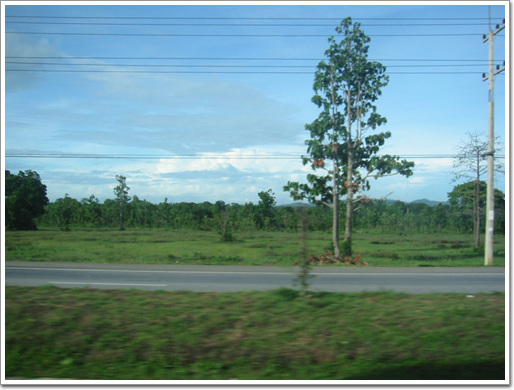

\- 6시쯤이 되니 이제 날이 밝아오고, 푸른 초원이 펼쳐진다.

\- 날이 좀 더 밝으니, 햇볕이 무지 뜨거워 보인다.

버스는 3시간 반을 달려, 캄보디아 국경에 도착하였다. 국경은 태국쪽은 아란, 캄보디아쪽은 포이펫이다.

\- 내가 타고 온 카지노 버스. 아주 고급 버스다. 차에 화장실도 있다.

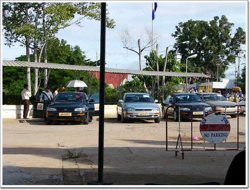

\- 이제 국경을 넘기 위해 국경쪽으로 걸어간다.

\- 룸비니 공원에서 부터 같이 온 남자와 여자. 사진을 전공하여 카메라는 캐논 20D를 가지고 있었다.

\- 국경 마을이라 그런지, 확실히 분위기 좀 달랐다.

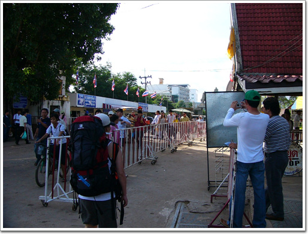

\- 버스에서 내려 한 3분 걸어나니 출국심사관이 나왔다.

\- 출국심사장. 아침이라 사람이 없었다. 낮이나 성수기에는 사람이 무지 많다고 한다.

\- 출국심사를 마치고, 이제 캄보디아로 걸어가는 중.

캄보디아 비자는 1000바트를 내고 받는 거였다.

비자는 여권과 신청서를 제출하고 한 10여분 기다니 나왔다.

이제 캄보이아 입국.

\- 캄보디아 입국 서류를 작성하는 두 남녀

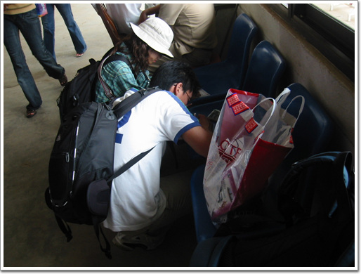

\- 그리고 다른 대학생 커플

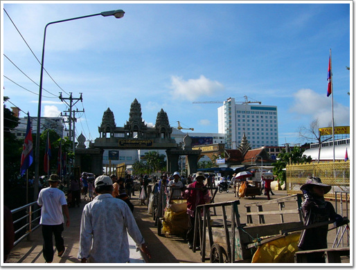

\- 이제 캄보디아 땅이다.

다리 하나를 두고 완전히 달라진다.

저 앞에 있는 흰 건물이 카지노 건물이다.

원래 카지노 버스를 타게 되면 breakfast coupon을 주게 되는데, 그 쿠폰으로 아침 부페를 먹을 수 있는 거였다.

버스를 무슨 티켓을 주길래, 그게 아침식사쿠폰이겠거니 했는데, 그 쿠폰을 들고, 이 카지노, 저 카지노 돌아가며 물어봐도, 아니랜다.

나중에 알고 보니, 이 카지노 버스를 배낭 여행자들을 많이 이용하게 되면서, 카지노에 갈 사람처럼 안 보이는 사람에게는 아침 쿠폰을 안준다는 거더군.

캄보디아의 국경마을 포이펫에서 앙코르와트가 있는 시엠립까지는 택시로 가기로 했다.

택시비는 1000바트. 우리돈 33,000원 정도되는군.

나는 대학생 커플과 같은 택시를 탔다.

나누기 3해서는 난 300바트를 냈다.

\- 캄보디아의 국경마을 포이펫. 아스팔트도 안 깔려 있다.

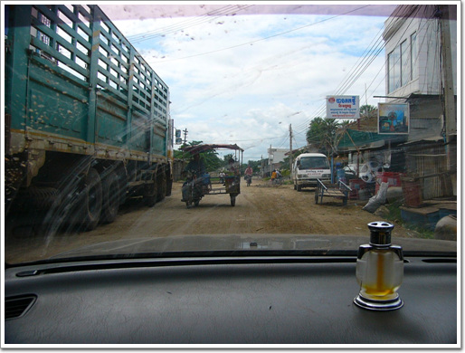

\- 지나다니는 차들도 태국과는 너무 큰 차이를 보인다.

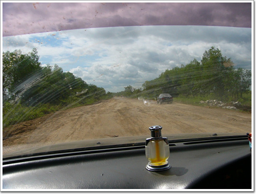

\- 포이펫 읍내를 벗어나니 본격적인 고속도로가 나온다. 이것도 고속도로라고 고속도로 통행료도 받는 것 같더군.

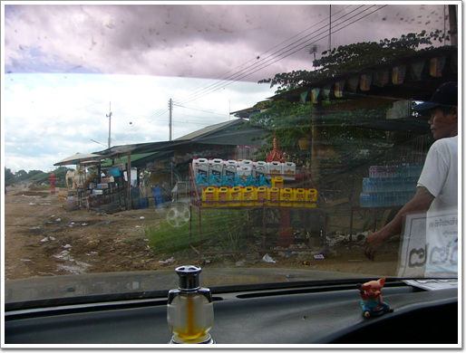

\- 한 1시간 정도를 달리다 기름을 넣으면 잠시 멈춘 곳. 여기가 주유소다.

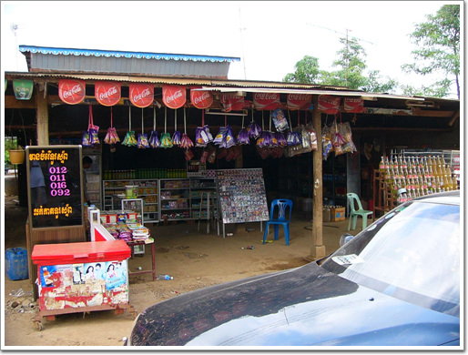

\- 저 오른쪽의 병들에 석유가 담겨져 있다.

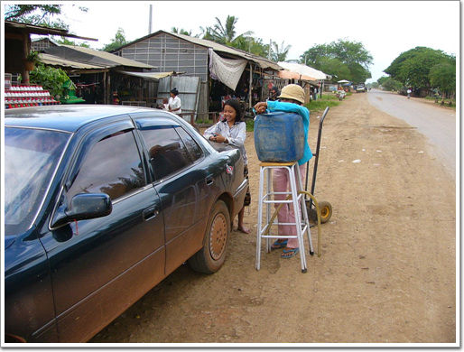

\- 기름도 이런 장비로 넣는다.

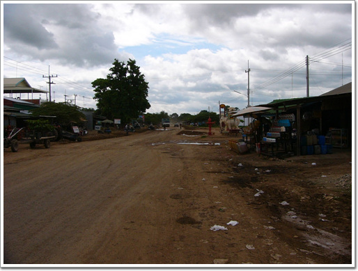

\- 그다나 많은 왕래가 있는 마을이라서 그런가 아스팔트 깔려 있는 흔적이 있다.

\- 현지인들은 저런 형태로 이동을 하나 보다. 픽업트럭이 20여명까지 타고 다니더군.

\- 교량도 거의 임시 다리 수준이다.

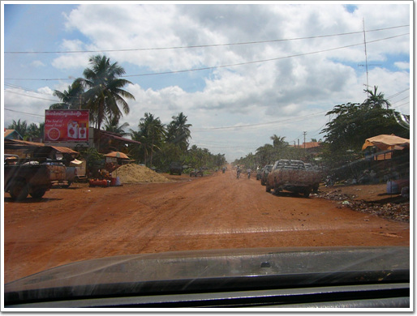

\- 그 다음 마을은 마을 안쪽 길도 그냥 황토길이다.

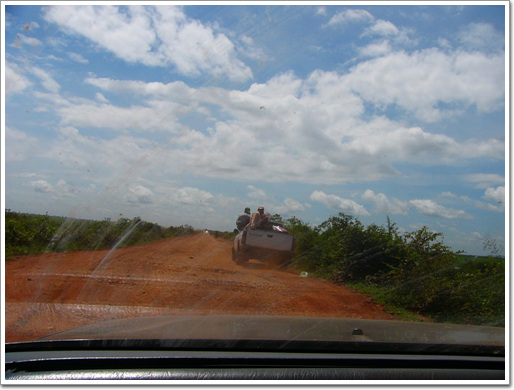

\- 에어콘나오는 택시안임에도 불구하고, 강렬한 햇볕에 좀 더운데, 저 트럭에 올라탄 사람은 얼마나 더 더울까?

\- 길이 환상적이다.

웅덩이 푹푹 파여있어, 차는 웅덩이를 피해 이쪽 저쪽을 다닌다. 그럼에도 속도는 80~90 km 를 유지한다.

내가 좋아하는 광란의 질주, 죽음의 랠리를 하는 거다.

\- 앞에 차라도 있을라 치면, 흙먼지로 앞도 뽀얗고, 정말 좋은 랠리 코스다.

\- 택시로 두시간 정도를 달려 멈춘 휴게소.

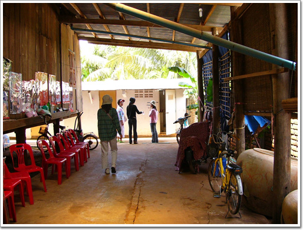

\- 화장실도 유료. 5바트혹은 500리엘. 여기서 물건 산 사람은 공짜.

\- 한국인 관광객이 많은 탓인지, 한글도 있군. 그런데 너무 비싸다. 우리나라보다도 더 비씨군.

\- 택시를 물청소는 어린애. 택시운전수가 여기 멈추면 휴게소에서는 이와 같은 서비스와 함께 커미션을 주나 보다.

\- 화장실 가면서 산 망고스틴. 한 500g 정도 되는 것 같은데 1달러다. 상태는 별로 안좋다.

\- 또다시 달린다. 포장된 도로가 나타난 걸로 봐서, 이제 앙코르와트가 얼마 안 남았군.

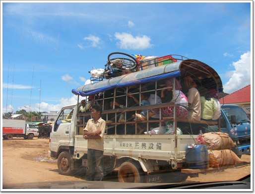

\- 거의 닭장수준의 차. 저렇게 타고 가면 얼마나 더울까

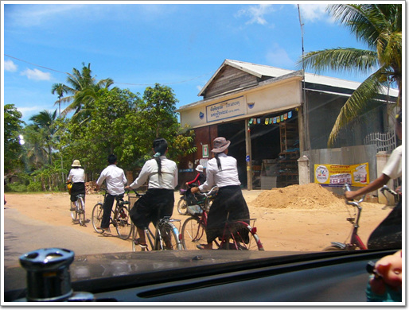

\- 교복을 입은 학생들도 보이는군.

\- 12:30 목적지 시엠립에 왔다. 시엠립의 기준점이 되는 스타마트. 대부분의 게스트하우들이 이 뒷쪽에 있다.

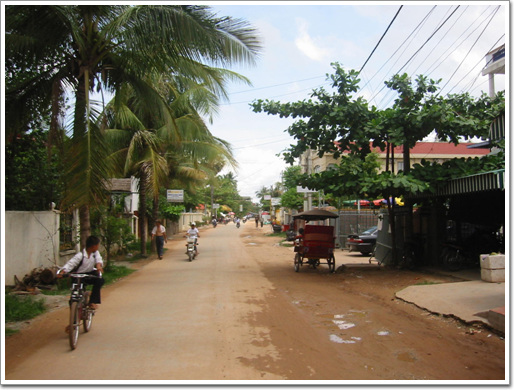

\- 스타마트를 끼고 오른쪽으로 돌면 게스트 하우스가 밀집해 있는 골목이 나온다.

\- 내가 묵을 게스트 하우스. 롱라이스게스트 하우스.

태사랑에서 제일 평이 좋았던 게스트하우스다. 하루에 10$하는 에어콘 방을 택했다.

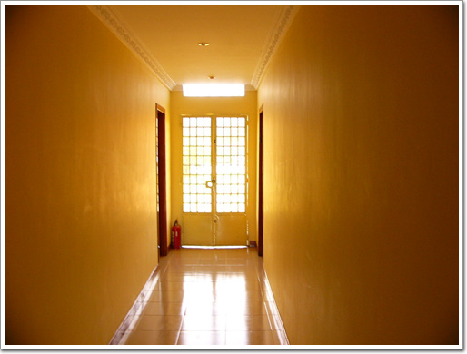

\- 제법 깨끗한 복도.

\- 그리고 깨끗한 방.

사실 깨끗하는 것은 이 때는 못 느끼다가 태국에서 하루 130바트 하는 방에서 묵은 후에야 느꼈다.

그 전까지는 항상 출장으로 고급 호텔에서만 묵었던 터라. 호텔 수준을 생각하다 게스트 하우스 방문을 열었을 때는 '좀 후진 걸'라고 생각했었으니..

15:00 아직 점심을 안 먹은 터라, 점심을 먹으로 갔다.

점심을 먹으로 간 곳은 북한식당 평양랭면. 숙소에서 평양랭면까지 3000리엘(700원정도) 주고 툭툭을 타고 갔다.

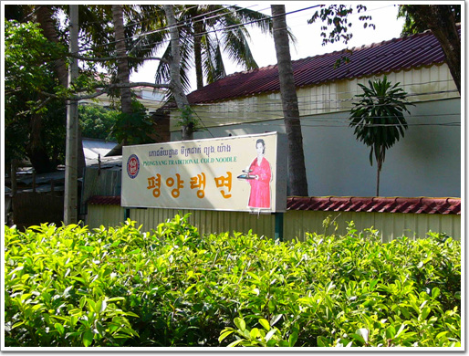

\- 중국출장에서도 많이 가 본 북한식당이지만, 그래도..

\- 이곳의 추천메뉴 '김치된장지지게'. 좀 매운맛인데, 무지 맛있다. 가격은 4$

\- 남녀와 북녀.

북녀는 복무원 전새별. 정말 친절한 복무원이었다.

손님이 없었던 탓도 있지만, 식사하는 내내 옆에 서서 이야기를 해 주었다.

전문대를 마치고, 이곳에서 2년 반동안 일했다고 한다.

그리고 6개월 후에, 북한으로 복귀하여, 대학교로 들어갈 예정이라고 하였다.

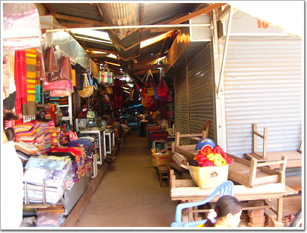

\- 16:00 점심을 먹은 후, 간 올드마켓. 시엠립에서 제일 큰 시장이다.

\- 나는 과일가게에 눈이 가더군.

\- 망고스틴과 람부탄을 각각 1Kg씩 샀다. 각각 1$와 2500리엘.

도착한 첫날은 그냥 숙소에서 먹고 자고 휴식만 취하기로 했다.

저녁은 캄보디아의 전통춤은 압살라댄스를 하는 디너쇼를 보기로 했다.

게스트하우스로 10$주고 바우처를 끊었다.

시간은 19:00 ~ 20:30.

19:00 디너쇼를 하는 쿨릉으로 갔다.

\- 메뉴는 그냥 부페.

\- 저게 무대다.

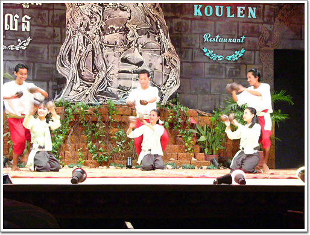

\- 공연 시작. 솔직히 춤은 무슨 의미인지는 모르겠다.

\- 대여섯명의 남녀가 나와서 뭔가 추는데, 무엇을 의미하는 걸까.

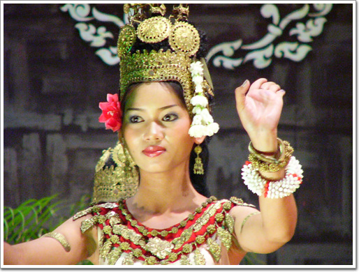

\- 저건 천사라고 하는 압살라 복장같은데,.

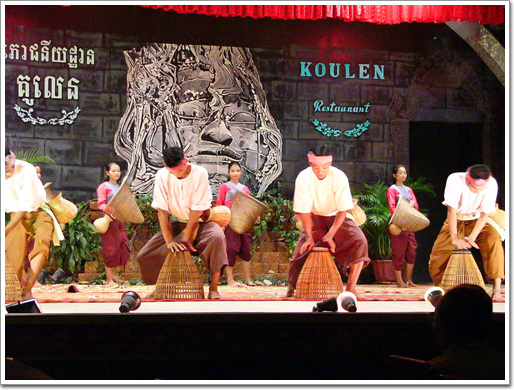

\- 이것은 농사짓는 것인가?

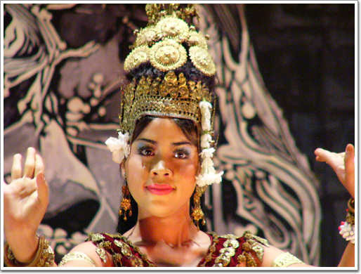

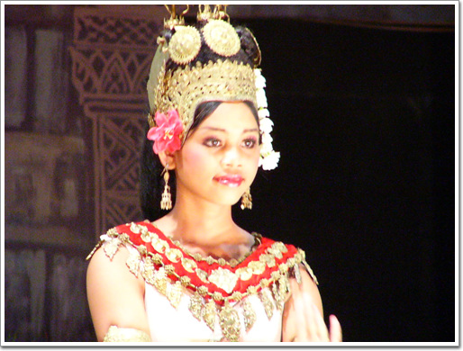

\- 복장이 압살라인걸로 보아 이게 압살라 춤인가 보다.

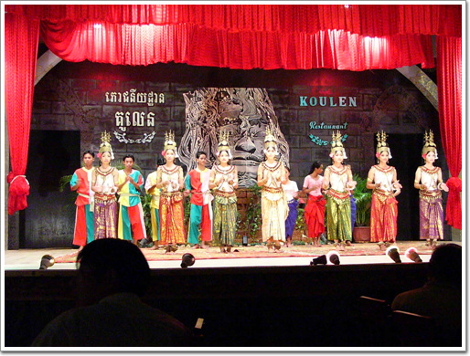

\- 20:30 공연은 끝난다.

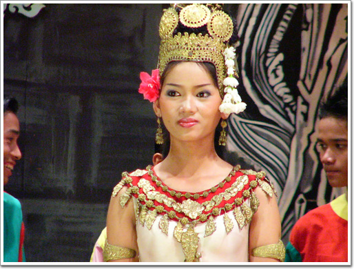

\- 무희들 중에서 제일 이쁜 사람를 12배줌으로 땅겨봤다.

첫날 일정과 쓴 돈은 다음과 같다.

- #### 6/19(일) - 348,700원

- 비행기표 337,200 - 타이항공 30만원짜리에 공항세, 전쟁보험료보함. 탑항공통해 구매
- 17:30 ~ 18:50 청량리->인천공항(청량리에서 공항버스 탑승 7,000)
- 19:00 L과 K 사이에서 탑항공 직원으로부터 항공권 인계
- 19:00 ~ 19:20 티케팅과 환전(지하 외환은행에서 40만원 환전-300달러와 바트)
- 19:20 ~ 19:50 커피 4,500
- 19:50 ~ 20:00 보안검색 및 출국심사대 통과
- 20:00 ~ 20:30 SK라운지에서 블로그 쓰며 시간 보냄
- 20:40 항공기 탑승
- 21:00 인천->돈무앙 이륙

#### 6/20(월) - 84,128원

- 00:35 태국 돈무앙 공항 도착
- 00:35 ~ 01:30 태국 입국
- 01:30 ~ 03:30 공항에서 죽치고 있음
- 03:30 ~ 03:50 공항->룸비니 공원 ( 택시비 176바트+공항요금 50바트+고속도로 통행료 20바트 = 246바트 )
- 03:50 ~ 05:00 카지노 버스 기다림 ( 기다리는 도중 두 커플 만남 )
- 05:00 ~ 08:30 방콕->아란 ( 100B )
- 08:30 ~ 09:00 태국 아란->캄보디아 포이펫 ( 캄보디아 비자 1,000B )
- 09:00 ~ 12:30 포이펫 -> 시엠립 ( 택시 1000B/3 = 300B, 대학생 커플과 같이 탐 )
- 11:00 휴게소에서 망고스틴 1$
- 12:30 ~ 14:00 게스트하우스 알아봄, 롱라이브 게스트하우스로 정함
- 14:00 ~ 14:10 스타마트에서 물과 사과주스 구매 2.5$
- 14:10 ~ 15:00 개인정비 - 샤워
- 15:00 ~ 15:10 게스트하우스->평양랭면 툭툭 3,000R
- 15:10 ~ 16:00 평양랭면에서 김치된장지지게 4$ - 복무원 전새별과 장시간 대화를 함
- 16:00 ~ 16:30 올드마켓으로 가서 쇼핑 - 와트 모형 3.5$, 망고스틴 1Kg 1$, 람부탄 1Kg 2,500R
- 16:30 ~ 16:40 올드마켓->숙소 - 3,000R
- 16:40 압살라댄스 디너쇼 예약 10$ ( 게스트하우스에서 픽업함 )
- 19:00 ~ 20:30 압살라디너쇼 관람, 맥주 3$
- 23:00 빨래후 취침

