# 제주도 3박4일 여행

제주도는 아직 한번도 가 보질 못했다.

많은 사람들이 신혼여행을 국내로 간다하면 다들 제주도로 가지만, 나는 북한 금강산으로 갔었기에 더더욱 제주도는 갈 생각을 안했었다.

그러다 가게 된 이유가, 마일리지 예약을 연기한 적이 있는데, 그것은 6개월 이내 사용해야지만 되는 거라서, 성수기를 막 앞둔 이 시기에 제주도를 갔다.

항상 가격대 성능비를 따지는터라, 인터넷을 뒤져 숙박비와 렌트카 통합된 것 중 2인일 때 222,000 이 제일 저렴하다고 여겨 그것으로 예약했다. 혹시나 몰라, 렌트카는 자차보험을 2만원 추가로 들어 242,000원인 셈이다.

마일리지 탑승은 평일도 오전에 다 예약이 차 있어, 오후 4시 25분 비행기를 탔다.

국내이기 때문에, 제주면은 상당히 가까울 줄 알았다. 그냥 비행기 뜨자 마자 착륙할 줄 알았다. 그런데 꽤나 지겨웠다. 아마도 기내식이 없어 심심해서 그런가 보다.

제주에 도착한 시각 5시 반. 6시에 렌트카를 인수하고 숙소로 향했다.

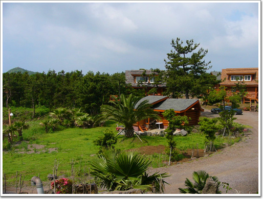

\- 내가 묵은 숙소 로그빌리지. 가격에 비해 경관이 꽤 좋았다.

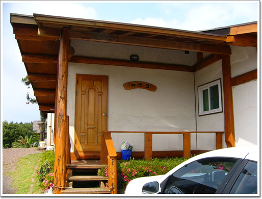

\- 내가 묵은 방 "캐빈3", 8평짜리다.

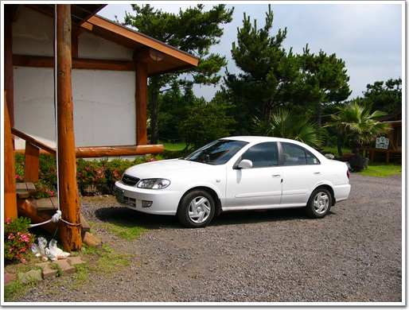

\- 3박 4일간 타고 다닌 렌트카 SM3. 명차 록스타만 타다가 SM3를 탈려니, 꽤나 피곤하더군.

처음 제주에 도착했을때만 해도, 제주 그까짓껏 조그맣고, 조금만 돌아다니면 되겠지 했는데, 전혀 모르던 길이라 꽤나 햇갈렸다. 게다가 차에 장착된 네비게이터도 어찌나 멍청하던지, 네비케이터때문에도 좀 고생을 했다.

계획을 둘째날 해안도로 따라 돌고, 세째날 우도, 그리고 네째날 한라산 등반으로 계획하였다.

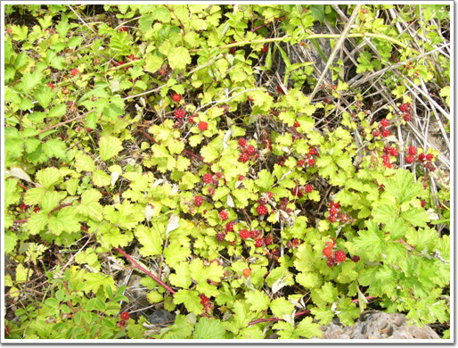

\- 해안가에서 발견한 산딸기. 산딸기인데 바다에서 보다니, 신기하군.

\- 제법 많이 따서 먹었다. 역시 자연산이 맛있다.

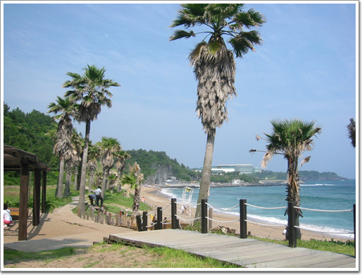

\- 중문해수욕장에도 갔다. 수영복을 챙겨오긴 했지만, 해수욕하는 사람도 없고 하여, 그냥 구경만 했다.

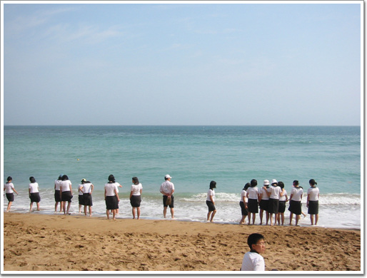

\- 수학여행을 왔는데, 모래사장은 학생들이 점검했다.

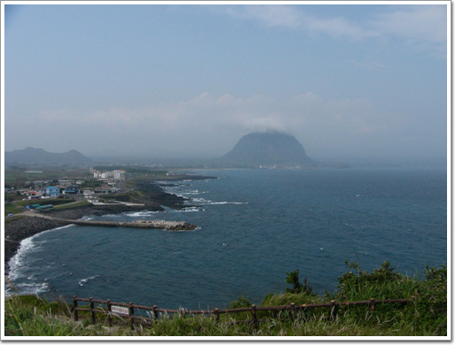

\- 저게 성산봉 일출봉이었던가?

둘째날은 우도를 가기 위해 동쪽길을 따라 갔다.

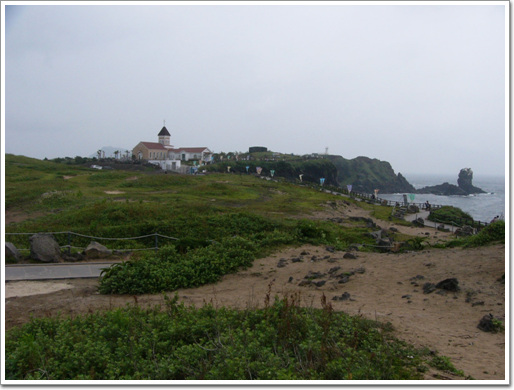

\- 우도가는 길에 들른 섭지꼬지. 저 건물이 드라마 "올인"의 세트장이란다. 입장료 3천원인데, 내가 올인을 본 적이 없었기에, 별 흥미를 자극하진 못했다.

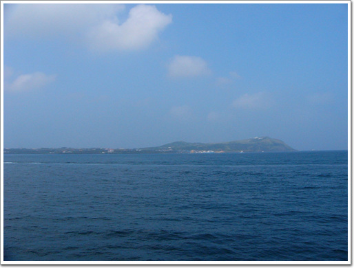

\- 우도가는 배는 성산항에서 탔다. 바로 앞에 보이는 섬이 우도다.

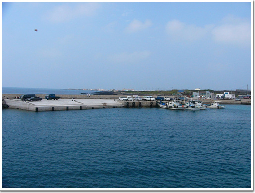

\- 우도 도착. 생각보다 섬이 컸다.

도착하니, 5천원에 일주하는 관광버스가 있어 그것을 탔다.

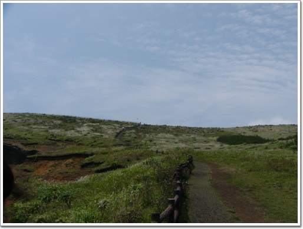

\- 관광버스의 첫 도착지 등대박물관 올라가는 길.

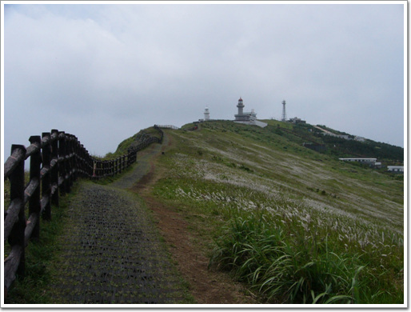

\- 제법 이국적인 모습이었다.

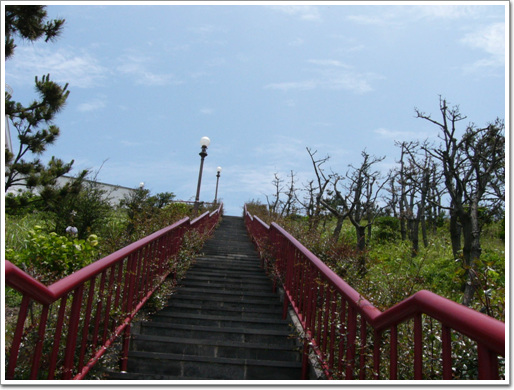

\- 원래 비오기로 한 날인데, 하늘도 맑고 무지 더운 날이다.

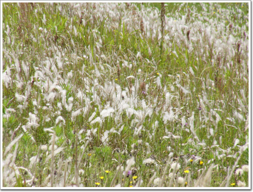

\- 풀밭에 펼쳐져있는 삐삐. 어렸을 적 저것을 많이 먹었던 기억이 난다.

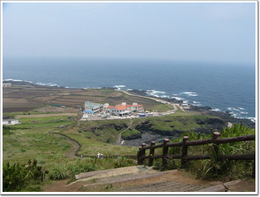

\- 등대 박물관에서 내려와, 다음 목적지로 향한다.

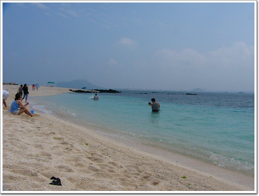

\- 여기는 산호해수욕장. 정말 마음에 드는 곳이다. 예전 괌에 갔을 때 보았던 그 에메랄드및 바다다.

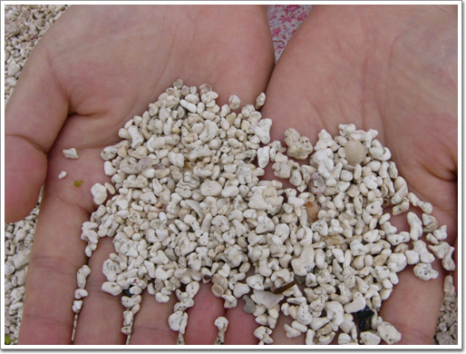

\- 모래도 일반 모래가 산호, 조개 모래라, 밟는 느낌도 다르다.

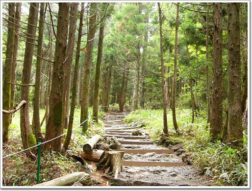

\- 셋째날 오르고 있는 한라산. 코스는 성판악에서 출발했다. 길 자체는 산길이라고 생각되지 않을 만큼 평탄하여, 산책길 같았다.

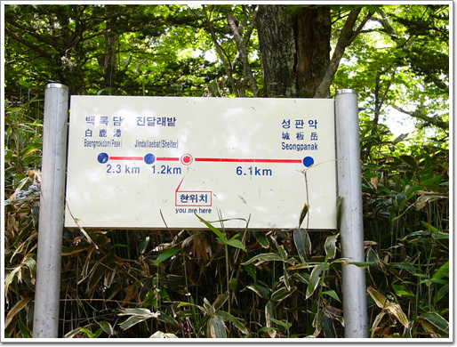

\- 6KM 걸었는는데, 아직 멀었다. 진달래밭까지 1시전에 도착해야 정상에 올라갈 수 있다.

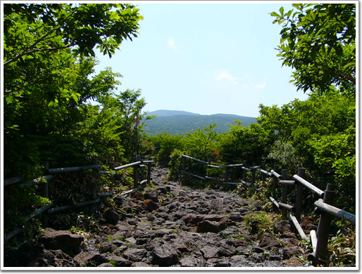

\- 진달래밭대피소 바로전. 이미 1시는 넘었다.

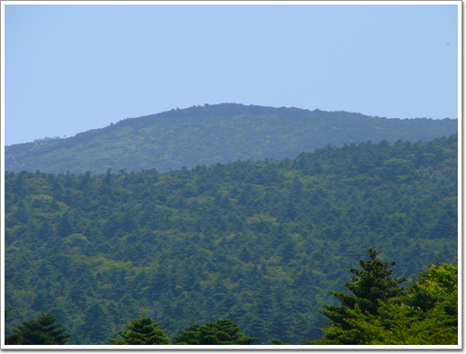

\- 바로 앞에 한라산 정상이 보이는데,..

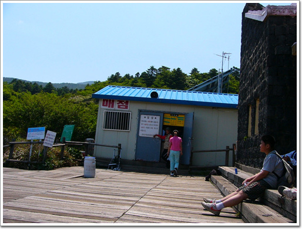

\- 대피소에는 간단한 매점은 있지만, 물 마시는 곳은 없었다.

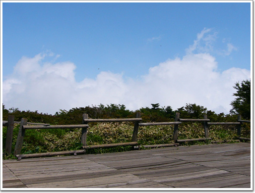

\- 한라산이 높긴 하다. 아직 정상이 아닌데도 구름이 밑에 있군.

3박 4일 제주도 여행의 총 경비 40만원.

[null](../6166740.html#6166740_1)

