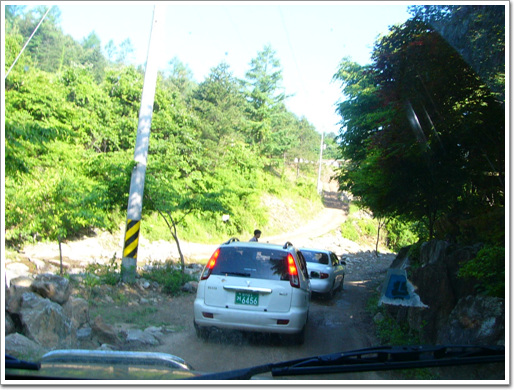

# 경반 계곡

이번엔 경반 계곡이다.

위치는 가평군에 있고, 용추계곡 근처에 있다. 좋은 점은 용추계곡만큼 알려지지 않아, 그리 사람이 많지 않다는 점이다.

\- 경반계곡의 입구 부근. 보통 승용차가 이 지점까지 오더군.

\- 중간 중간 물구덩이가 있어, 재미를 배가시켜준다.

경반계곡은 그리 길이 험한 편은 아니어서, 경반사까지 승용차가 가기도 한다. 제일 좋은 점은 사람이 별로 없어, 길이 한적하다는 점이다. 나무도 꽤 울창히 자라있어, 운전하는 재미가 있다.

\- 경반사에서 우선 목을 축이고

\- 올라온 길을 내려다 본다.

\- 경반사에서 조금 더 올라가면 수락폭포가 있는데, 지금은 그 길을 입산통제라고 막아놨다.

\- 내려가는 길에 다시 안 가본 길이 있어 또 올라갔다.

\- 임도인데, 길은 상당히 평탄했다.

\- 다람쥐도 보이고,

\- 올라온 길이 제법 높았던지, 아까 지나갔던 길이 한 눈에 보이는군.

\- 다시 하산.

좀 미적지근한 점이 있는 상태로 내려가다가 눈에 보인데, 짓다만 펜션.

그래서 그 펜션이 있는 곳으로 올라갔다. 펜션 뒤에는 공사하다만 길이 보였다.

풀도 제법 자라있어, 꽤 재미있는 길 같았다. 그래서 올라갔다.

이게 1시간반 고생의 시작이었다.

경사가 제법 되는 곳인데다가, 미끄러운 수풀이 있어, 바퀴가 헛돌았다. 후진한다는게 밑둥만 남은 나무를 못보고 그걸 연료통이 올라타기까지 하였다.

\- 빠진 차.

1시 반 동안, 땅을 파고, 뒤바퀴 들어올려 돌로 괴고하는 중노동을 하였다.

\- 야삽하나로 이렇게 엄청나게 땅을 판 후에 탈출할 수 있었다.

\- 아둥바둥 했던 흔적

\- 열심히 땅 판 상민.

[null](../6166745.html#6166745_1)

