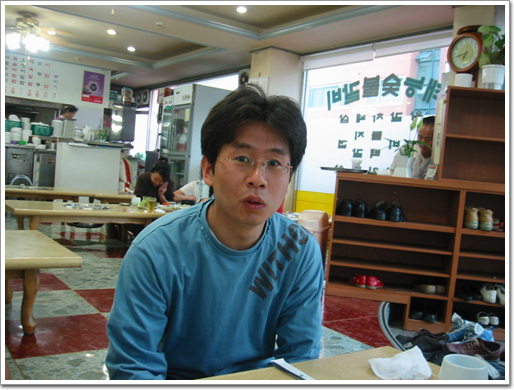
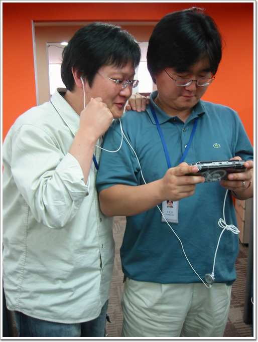
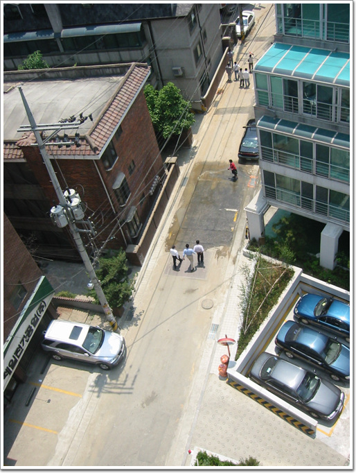
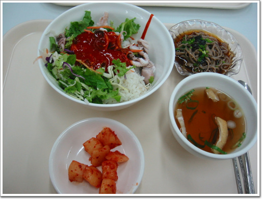
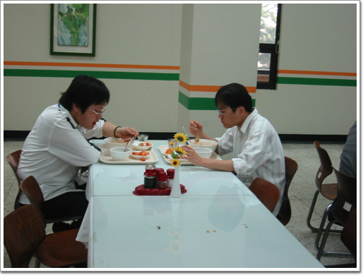
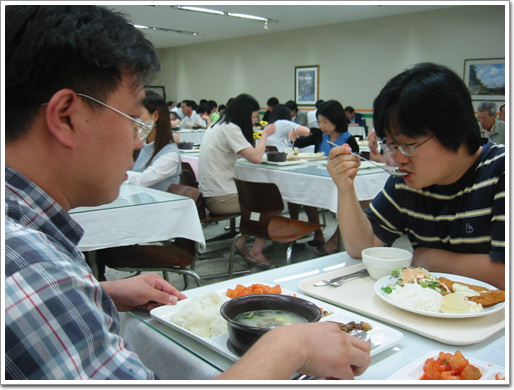

# 밥 먹을 때만 도서관

중학교때부터 도서관을 자주 갖었다.

뭐 공부한다라는 것 보다는 나에게는 놀이터였다.

많은 책들 있었기에.. 그렇다가 수준 높은 책을 읽는 것도 아니었지만..

학생 시절 주로 다는 도서관은 정독도서관.

그러다가 백수시절부터는 국립중앙도서관에는 다녔다.

이곳의 좋은 점이 열람실이 없고, 성인만 들어갈 수 있었기는 수질이 흐려지지 않는다는 점이다.

회사가 서래마을쪽으로 이전하면서부터 도서관에 꽤 가까워졌다.

그래서 매일 점심은 도서관.

\- 처음에는 도서관에 잘 따라오다가 어느 순간부터 거부한 최영태군. 좋은 하는 음식은 삼겹살.

밥때. 점심시간이 12시가 되면 슬슬 사무실은 어수선해진다. 거의 대부분 엉덩이 무거운 사람들 때문에 제 시간에 나가지는 못하는 경우가 많기는 하다.

\- PSP를 만지작거리는 포레스트와 어깨넘어로 보는 승우씨.

\- 제법 지름신이 들 것 같은 표정이긴 한데,..

\- 엘리베이터를 기다리면서 밖을 쳐다본다.

\- 뭐 별 건 없고, 밥 먹으로 가는 사람들이로군..

도서관의 밥값은 2,400, 2,900, 3,200 이렇게 세 종류다. 내가 주로 먹는 것은 2,400원짜리 일품요리다.

\- 오늘의 일품요리는 제법 잘 나왔다. 쭈구미비빔밥이다. 반찬으로 냉모밀도 나오는군.

\- 다른 테이블에 밥 먹고 있는 상민군과 승우씨.

\- 다음 날의 메뉴는 설렁탕과 돈까스. 돈까스는 도서관 식당의 단골 메뉴다. 일주일에 두세번은 나온다.

[null](../6166750.html#6166750_1)

