# 바다 낚시

섬에서 자랐다.

그래서 어릴적에 낚시를 해 보았다. 친구들 따라 5원 짜리 낚시바늘과 10원짜리 추를 대나무 낚시대에 매달고, 갯펄에서 갯지렁이 잡아 매달고, 정박해있는 배에 배를 깔고 엎드려 낚시질을 했었다.

그때 당시에도 낚시는 내게 별로 재미없는 것이었다. 나랑 노는 친구들 대부분이 낚시가러할 때에만 그냥 따라가고 있는 수준이었다.

그 후 다시 낚시한 것이 이전 직장 민이사님과 효성차장과 바다 낚시 다니면서였다. 배를 타고 이곳 저곳 다니는 것이 재미었었다.

1년 반만에 다시 바다 낚시를 가기로 했다. 인원은 민이사, 효성차장, 나, 아내 이렇고 총 4명.

토요일 아침 5시에 낚시배가 출항하기에, 1시에 일어나 채비를 하고, 상계동에 사는 효성차장을 태우고, 3시에 잠실에 있는 민이사 집으로 갔다. 그곳에서 민이사 차로 갈아탄 우리, 인천까지 1시간 주파를 하여 4시에 도착했다.

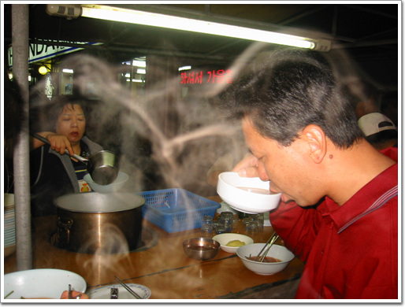

\- 4시 반. 우선 간단히 요기를 한다.

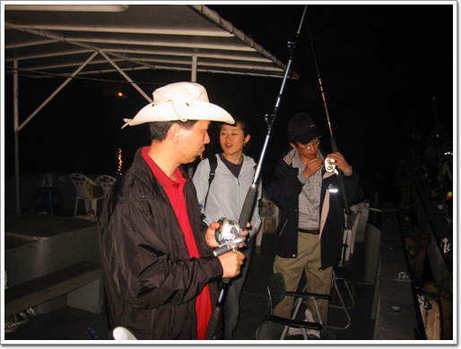

\- 간만에 만난 역전의 용사들. 배 출항하기를 기다리며 벌써부터 채비를 한다.

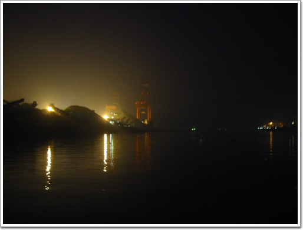

\- 4시 50분. 아직 어둡다.

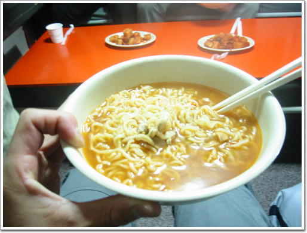

\- 5시 배가 출항하자, 곧 나온 아침 식사 라면.

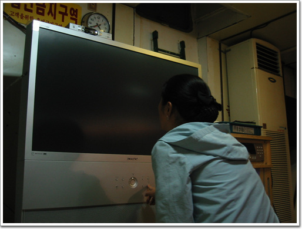

\- 큰 배라 그런지 선실에 대형 TV가 있더군. TV를 보자마다 켜려고 하는 아내.

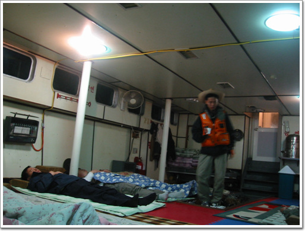

\- 목적지까지는 두시간정도. 그 때까지 잠을 잔다.

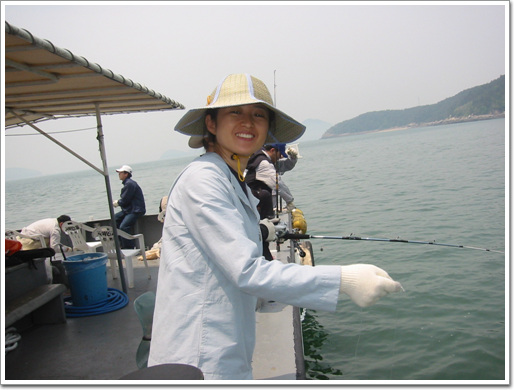

\- 고기 잡겠다고 낚시줄을 드리운 아내.

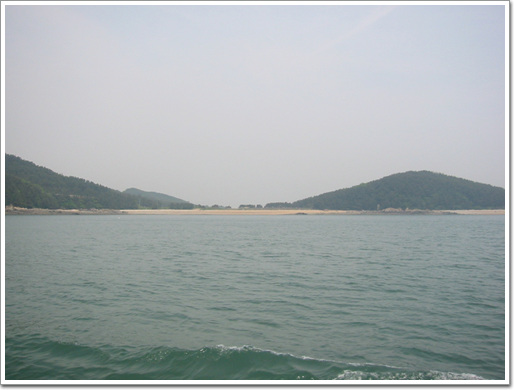

\- 낚시는 수심 30~100미터 에서 하기 때문에서, 섬 근처에 보통 한다.

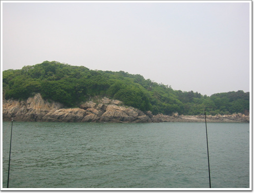

\- 우리나라가 꽤 많은 섬이 있군.

\- 바다 낚시는 한 곳에서만 하는 것이 아니라 이곳 저곳을 다니기 때문에, 배가 이동하는 시간이 곧 휴식시간이다.

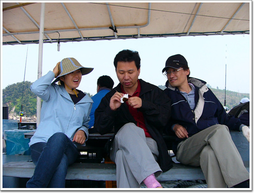

\- 간만에 만난 거라, 기념사진 찍는데, 다들 딴짓에 정신이 팔렸군.

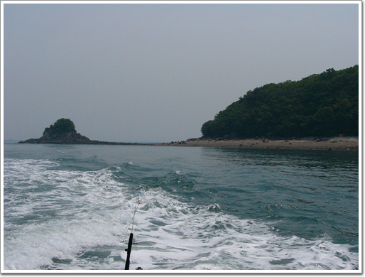

\- 이번 낚시할 곳은 이 섬의 서쪽 부근인가 보다.

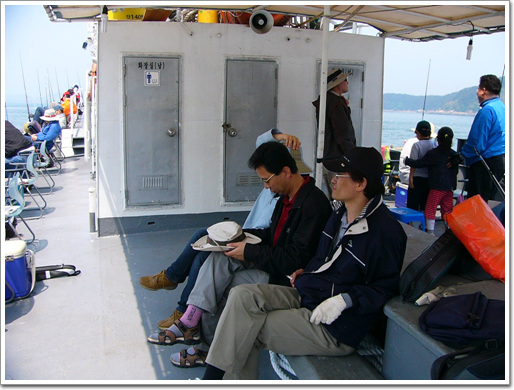

\- 제법 큰 배라 남녀 화장실에 따로 있다. 물론 청결하고는 거리가 있다.

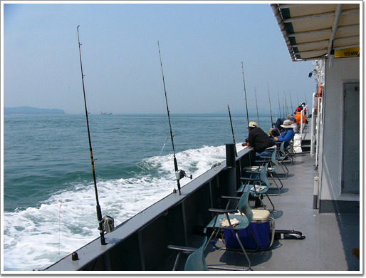

\- 배에서 바라보는 바다로 제법 볼 만 한다.

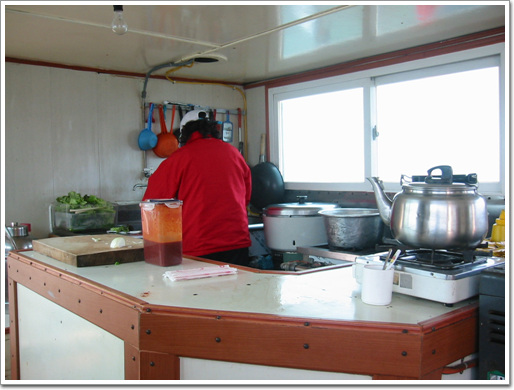

\- 배에는 주방이 있고, 음식을 해 주는 아줌마가 위치해 있다. 아침과 점심을 해 주고, 사람들이 잡은 고기를 회 떠주는 일도 해 준다.

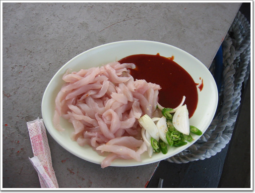

\- 놀래미 6마리가 회 한접시가 되어 돌아왔다. 평소 회를 먹으면 거의 대부분 배탈이 나지만, 배에서 직접 잡은 고기로 만든 회는 아무 탈도 없을 뿐더러, 아주 맛있다.

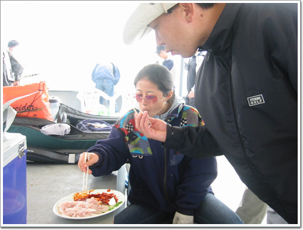

\- 두툼하게 썰은 회라 4명이서 먹는데로 제법 되었다.

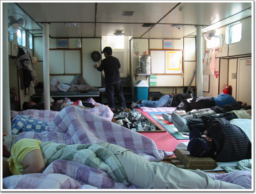

\- 오후 5시. 낚시를 접고, 다시 남동부두로 향하는 시간. 다들 하루의 피로를 선실에서 누워 푼다.

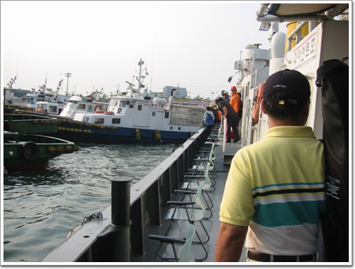

\- 항구에 도착했다.

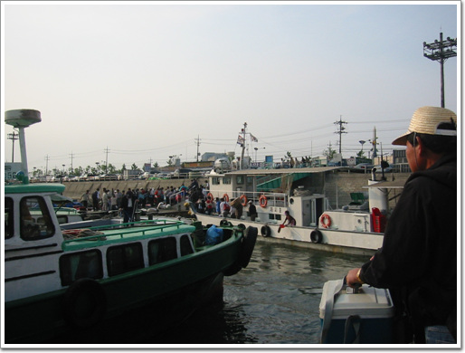

\- 우리뿐만 아니라, 이 시간대에는 다른 배들도 다 돌아오나 보다.

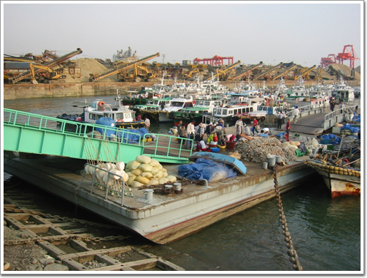

\- 배에 내리는 사람들을 상대로 활어를 파는 상인들. 고기를 못 잡은 사람들이 주로 저기서 활어를 사나 보다.

[null](../6166758.html#6166758_1)

