# 마추피추!  이제 몇만km 안남았다!

멕시코 출장이다.

내가 가고 싶은 남미는 아니지만, 그래도 남미에 제일 근접한 곳이다.

지도를 보니, 마추피추가 있는 페루랑도 몇만km 안 떨어져 있더군.

일요일 오후 3시 비행기를 타고 가서, 미국 LA에 일요일 아침 10시에 도착하여, 거기서 3시간 머문 후, 오후 1시 반 비행기를 타고 멕시코시티로 들어가는 여정이다.

출장준비. 언제나 출장준비가 제일 신경쓰이는 부분이다. 뭐 하나 깜빡하고 빠뜨렸다가는 비행기값 낭비하는 사태가 발생할 수 있기 때문이다. 준비물 목록을 프린트하고, 하나하나 대조하며, 집어 넣고 하는데 꽤 많은 시간이 걸렸다.

집에서 11시반에 나와 삼성동 도심공항터미널로 향했다.

12시에 도착하여, 티케팅과 짐을 부치고, 환전했다. 멕시코돈은 직접 환전이 안되기 때문에, 달러로 12만원어치. 환율이 1058.98원. 도심공항터미널의 환율이 그다지 안 좋은 것 같다.

\- 이번에 같이 가게 된, 하드웨어팀 배상우씨.

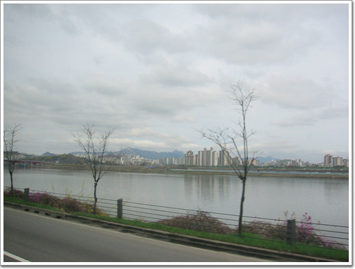

\- 전날 내린 비로, 뿌옇던 서울의 공기가 맑아졌다.

\- 비행기를 기다리는 중. LA까지 가는 비행기는 대한항공.

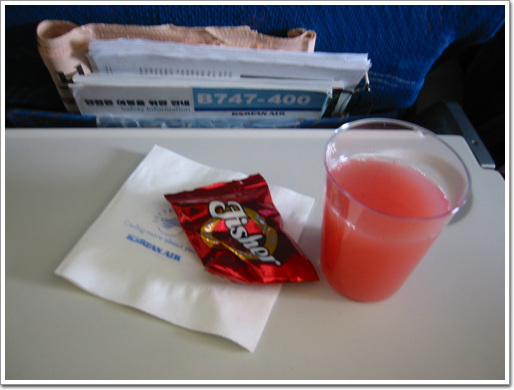

\- 비행기를 타니, 밥 부터 줄거라 여겼는데, 땅콩부터 주는군.. 배고픈데..

\- 내가 좋아하는 스카이라운지 식사 시간. 메뉴는 비빔밥.

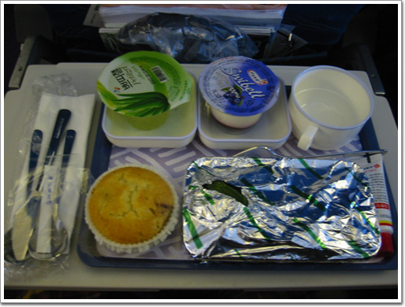

\- 그 다음 아침 식사는 LA 도착 2시간에 오믈렛이다.

\- LA 공항에 도착하였다.

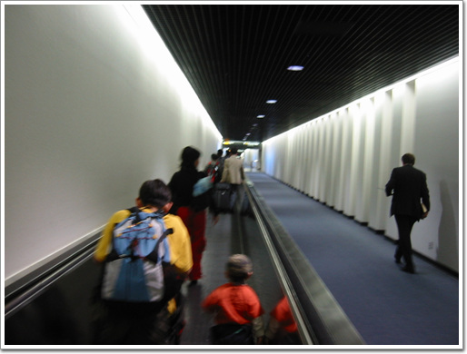

\- 악의 축 미국 답게, 분위기부터 칙칙하다.

역시나 미국의 입국 심사는 까다롭더군. 1인당 5분 정도 걸리고. 지문 날인에, 사진 촬영까지..

경유하는데도 입국을 하고, 다시 출국을 하는 시스템이다. 뭐 이렇게 번거롭게 했나 모르겠다.

다른 데와는 다르게, 여기는 수화물을 미국에서 도중에 찾아서, 다시 붙이기 까지 해야 했다.

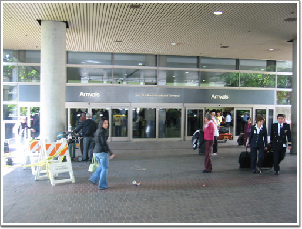

\- 악의 기운이 숨쉬는 미국땅이다. 별로 나오고 싶은 생각은 없었지만, 같이 간 사람들의 스모킹 타임으로 같이 따라나왔다.

LA. 예전에 TV의 퀴즈쇼를 보니, '나성에 가면 편지를 띄우세요'라는 노래의 그 나성이 이 LA라는 군.

\- 다시 멕시코로 가기 위해 멕시카나 항공 티켓 부스로 가서 표를 끊었다.

\- 수화물 붙이는데도 꽤나 번거롭다. 각자 수화물 검사대로 가서 검사받아야 했다. 10시에 도착했는데, 11시 15분. 짐 검사하는데 줄 서는데까지 벌써 1시 15분이나 걸린 거다.

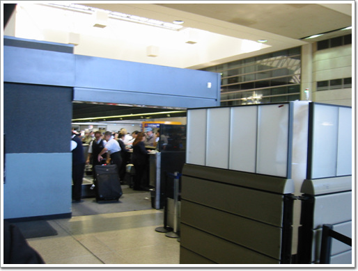

\- 검사대를 통과하여 비행기에 실리는 것을 확인.

그리고 또 미국의 보안검사대에서는 컴퓨터를 짐에서 따로 빼서 검사를 하더군. 그런데 출국심사같은 것은 안 보인다. 그냥 보안검사대 통과하니, 곧장 비행기 타는 곳이 나오네..

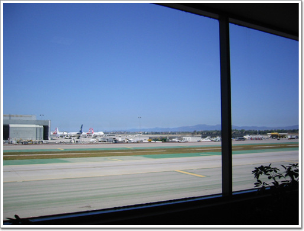

\- 출국장에 들어왔다. 활주로가 크긴 크다.

\- 내가 타고 갈 멕시카나 비행기.

\- 탑승 시작.

\- 기내식으로 나온 멕시카나 양념치킨. 맛 없다. 특히 저 푸석푸석한 밥은 그대로 남겼다.

\- 멕시코 도착.

\- 멕시코 공항은 입국장과 출국장을 같이 쓰나 보다.

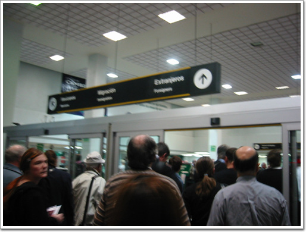

\- 입국 심사장. 여기 줄이 장난아니게 길더군. 저 줄에서 기다리는데만 40여분 걸렸다.

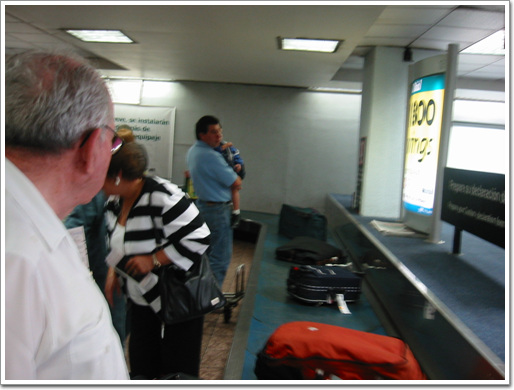

\- 짐을 찾고..

\- 출국장으로 빠져나오는데도 줄을 선다.

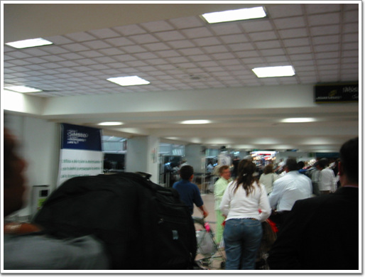

\- 이제 세관검사만 남았다. 이곳 세관 검사도 조금 특이하다. 각 개인이 세관검사대 앞에서 버튼을 누른다. 그러면 빨간불하고 파란불 둘 중의 하나가 랜덤하게 켜지는데, 빨간불이면 검사하는 것이다. 아마도 세관원의 부정을 방지하기 위해 만든 시스템인가 보다.

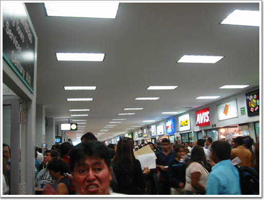

\- 출국장을 나왔다. 뭔놈의 사람이 이리도 많은지..

비행기에 멕시코에 내린 시각은 저녁 6시쯤 되었는데, 출국장에 최종적으로 나온 시각은 8시쯤 되었다.

공항에는 이곳 Zonda 회사의 부사장이 직접 마중을 나왔었다. 처음에는 젊은 외모를 보고, 뭐 말단 직원 정도 되었나 생각했었는데, 나이보다 어려보이는 것이었다.

Zonda 부사장이 우리를 저녁식사에 초대한 곳은, 멕시칸 레스토랑.

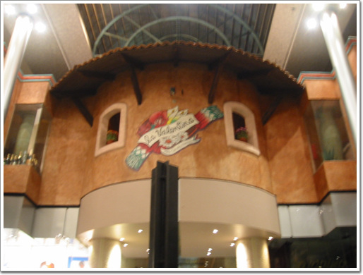

\- 시내 중심부의 건물안에 있는 고급 식당이다.

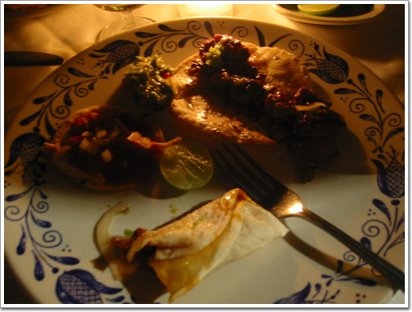

\- 이름은 생소하여 기억이 안 나지만, 이렇게 생긴 것이다. 살사 소스에 익숙해져인지 거부감 없이 맛있다.

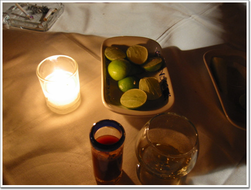

\- 데낄라. 데낄라 먹는 방법은 부사장이 직접 가르켜 주더군. 오른쪽의 데낄라는 한모금 마신 후, 바로 왼쪽의 토마토즙을 조금 마셔, 입술에서 데낄라의 맛을 중화시킨 후, 위쪽의 오렌지를 먹는 것이란다. 내가 술맛을 제대로 알지는 못하지만, 한국에서 먹었던 데낄라와는 맛이 틀리더군. 이게 더 부드러운게 비싼 티가 난다.

\- 테이블 주위로, 4명의 아저씨들이 생음악을 연주해 주었다. 꽤 좋았다. 이제서야 내가 멕시코에 왔다는 생각이 든다.

\- 특히 이 아저씨의 감미로운 목소리가 죽이더군.

\- 제일 멕시코인처럼 생긴 아저씨. 제일 큰 기타 들고, 가끔 추임새만 넣는다.

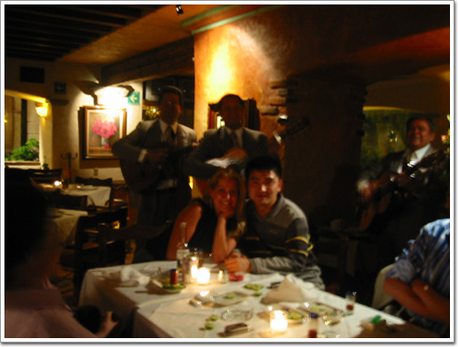

\- 내가 디카로 여기저기 찍는 것을 본 부사장이, 멕시코 온 기념 사진 찍으라고 직접 찍어준 사진. 왼편의 아낙네가 부사장의 애인다. 멕시코에 왔으니 멕시칸 걸과 같이 찍으라고 한 것인데, 아무래도 멕시칸 걸이 아니라, 멕시칸 아줌마다.

\- 부사장차다. 저 뒷 좌석에 4명이 같이 낑겨 탔었다.

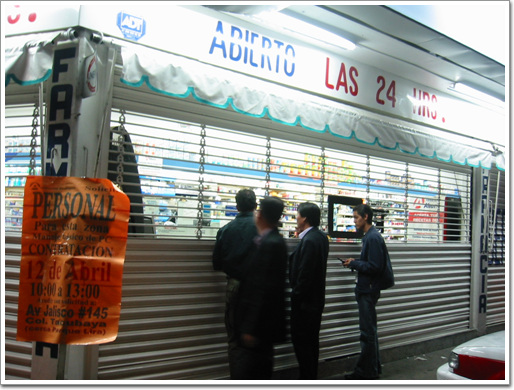

\- 칫솔을 사려고 24시간 편의점에 들렀다. 그런데 밤에는 셔터 내리고 저 구멍을 통해서만 물품을 주고 받는다. 그런데 저 안의 점원의 복장이 좀 이상하여 자세히 보니, 방탄조끼를 입고 있는 게 아닌가.. 여기서 쫄았다. 말로만 듣던 멕시코의 치안이 이 정도구나 하는 게 여실히 느낄 수 있었다.

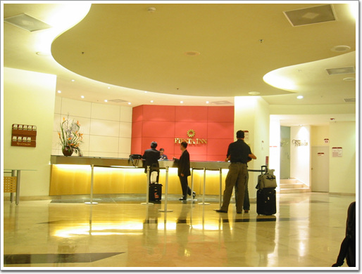

\- 드디어 호텔 도착. 호텔은 피에스타 인. 하루숙박비는 120불정도 한다. 아침도 포함안되어 있는 것이.. 그리고 방에서 랜을 사용할때의 가격또한 하루에 11불.

\- 내 방 701호.

\- 창문으로 본 멕시코의 야경.

[null](../6166799.html#6166799_1)

