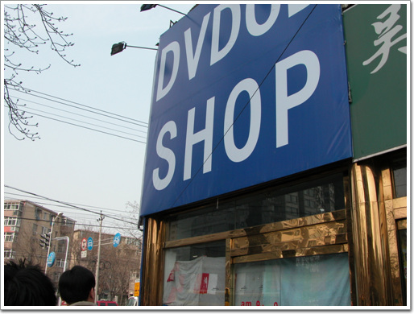
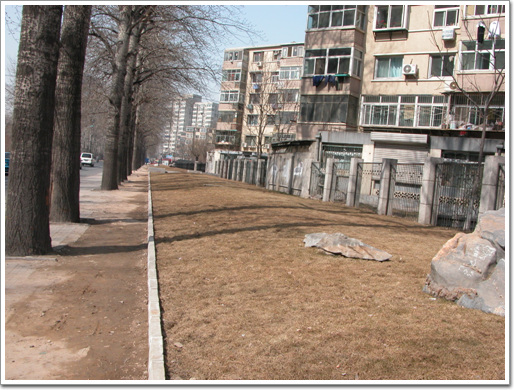
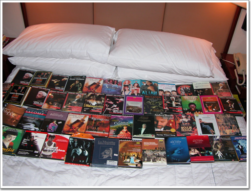

# 중국의 불법복제 DVD

중국 출장의 백미는 바로 DVD 쇼핑.

지적재산권이라는 개념자체가 없는 나라이기 때문에, DVD는 오로지 그 매체의 물리적인 가격만으로 판다. DVD-5는 10원(우리돈 1,300원). DVD-9은 20원(우리돈 2,600원)이다.

그래서 이번 출장에도 DVD를 많이 사기 위해, 옷도 거의 안 가져갔다.

\- 주로가는 DVD shop중의 하나. 수미정 바로 옆에 있는데, 이번에는 왠일인지, 낮에는 안 열고, 저녁때에만 열더군.

\- 신호등을 건너 리도호텔쪽으로 가는 길. 쭉이어져 있는 짝퉁시장이 다 사라져버렸다. 어디를 갔다 했더니, 맞은 편에 새로 양광금거리라는 건물로 다 들어갔더군.

\- 리도호텔앞쪽에 있는 DVD shop. 이 Jewelry shop에는 그다지 많이 있지는 않고, 조금 더 간 곳의 DVD shop이 종류가 많아, 주로 거기서 샀다.

\- 이번 출장 때 내가 산 DVD들. 이중 반이 내 꺼고, 동함이꺼나 한 300원(3만5천원정도)어치 정도.. 그리고 아내 친구들꺼가 조금 나머지들.

이 상태로는 내 가방에 전혀 들어갈 수 없는 상태지만, 동함이꺼는 껍데기를 다 제거하여, 부피를 왕창 줄일 수 있었고, 그리고 한 20여장은 상민이가 자기 가방에 넣어 준 덕분에 무사히 이것들을 다 가지고 들어올 수 있다.

[null](../6166817.html#6166817_1)

