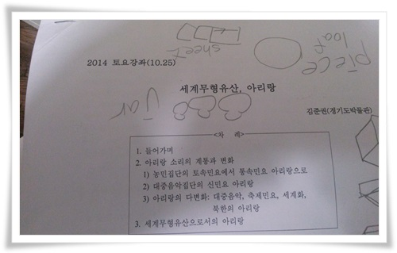
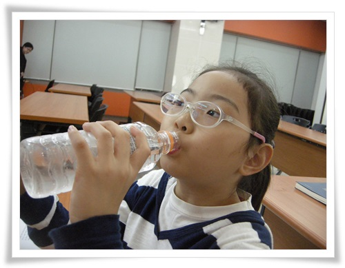
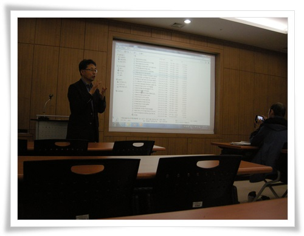
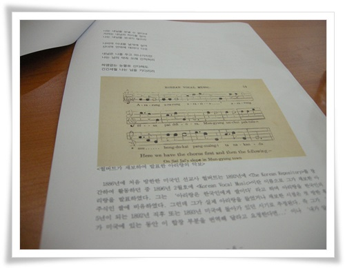
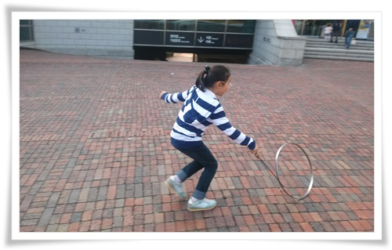

# 경기도박물관 아리랑 토요강좌

모처럼 토요일 여유가 있었다.

때마침 경기도 박물관 토요강좌가 있었고, 주제도 '아리랑'이었다.

성인대상 강좌이긴 해도 아리랑이면 딸내미도 조금을 이해할 만 내용이라 생각하여 딸내미 데리고 갔다.

\- 이번 토요강좌 주제.  '세계문화유산,아랑'.  강의는 김준권선생님이 해주셨다.

\- 내 옆에 앉은 딸내미.

\- 차분하면서도 재미있게 강의해 주신 김준권선생님.

이날 강좌를 들은 사람 한 7명 정도.

아마 단풍놀이가 절정인 시기라 다들 놀러가 수강생이 적은 듯 하다.

\- 1886년 미국인 선교사 헐버트가 채보한 아리랑 악보.

이 날 헐버트 아리랑에 대해 처음 알았다.

뭐 아리랑의 역사에 대해 여지껏 무지했다고 봐야겠다.

아리랑의 역사가 그리 길지 않았더군.

꽤나 오랜 역사가 있었을 줄 알았는데, 19세기 후반에 시작하여 20세기 전후에 유행한 노래였다.

원래 강원도 노동요로 불리던 아라리계통 노래가, 19세기 경복궁 중수 공사에 동원된 강원도 장정들을 통해 서울에 알려졌고, 서울 소리꾼들에 의해 통속적인 민요 아리랑으로 바뀌어 불리고 되었다고 한다.

그 때 유행한 아리랑을 채보한 사람이 헐버트이고, 그래서 헐버트 아리랑이 지금 아리랑의 원류라고 한다.

이후 나운규의 영화 '아리랑'에서 영화음악으로 편곡한 노래가 지금 우리가 널리 알고 있는 아리랑으로 본조 아리랑이라 했다.

\- 여러 버전으로 아리랑을 들어보며 설명을 들었다.

북한의 아리랑은 특이했다.

우리가 흔히 북한 음악으로 듣는 뭔가 높은 음의 간지러지는 음색의 아리랑이었다.

왜 그렇게 되었는지 설명을 들었다.

북한의 창법은 '민성'이라 하여, 가사를 명확히 알아들을 수 있는 강조하여 그렇게 발성하게 된 것이라 했다.

그걸 듣고 나니, 왜 서양음악이나 우리나라 노래는 가사를 잘 알아들을 수 없는데, 북한 노래는 적어도 가사는 쏙쏙 알아들을 수 있는지 이해가 되었다.

\- 토요강좌 끝나고 나서 굴렁쇠 굴리는 딸내미.

경기도 박물관에는 굴렁쇠와 투호가 있어 애들 놀기에도 좋다.

