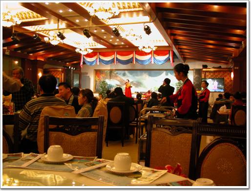
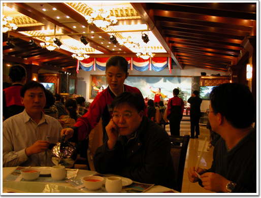
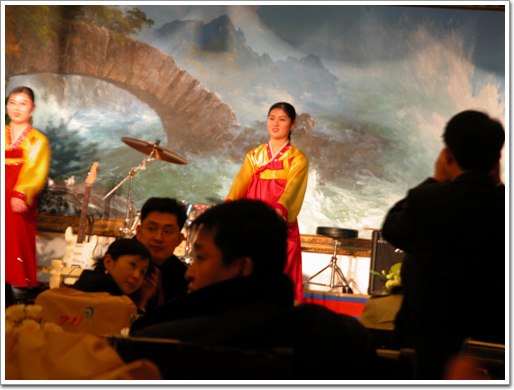
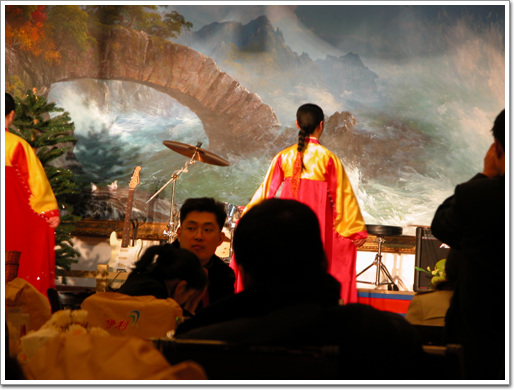
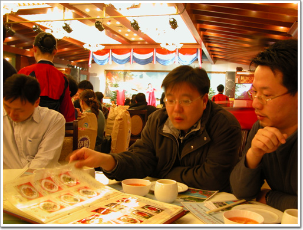
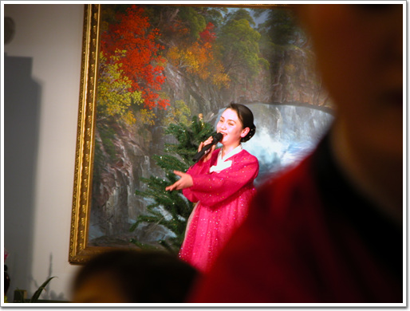
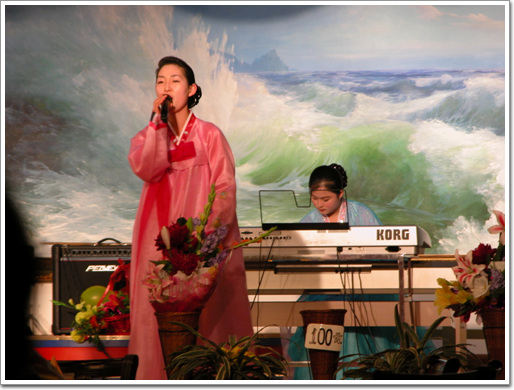
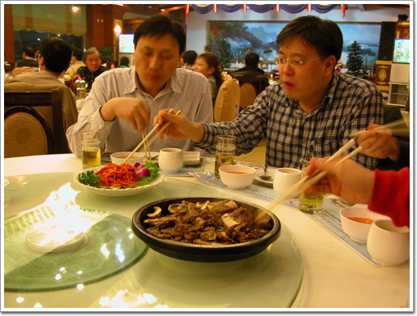
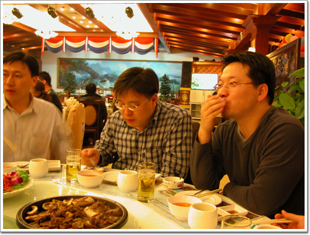
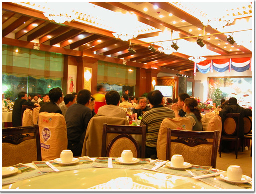

# 북경옥류관 - 평양 옥류관 제1분점

북한 음식점을 가보기로 하였다.

북한, 북한사람. 금기시되던 거여서 그런가 중국 출장을 오게 되면 한두번은 가게되는 곳이다.

해당화는 이미 두번이나 가 보았기 때문에, 이번에 옥류관을 가보기로 하였다.

평양옥류관의 북경 제 1분점이 회사가 있는 시빠지안팡에서 가까운 왕징에 있다는 것을 북경유학생모임카페에서 찾아냈다.

북경에 있는 북한 음식점 중에서 제일 규모가 큰 곳이라고 하더군. 그리고 점심시간과 저녁 시간때에 공연도 한다더군.

전화번호도 나와있길래, 전화를 걸어보았다. 6473-2806번.

북한말투의 여성복무원이 받더군. 어떻게 가면 되냐고 물어보니, 왕징 호광중로 8가에서 왕징신청쪽으로 오면 된다고 하더군. 그쪽 지리를 모르므로 대충 알았다고 하고만 하고 전화를 끊었다.

대충 이 근처겠거니 하고 지도만 본 후, 못 미더워한 사람들을 끌고 택시를 탔다.

택시기사한테 호광중로 8가로 가자고 하여, 8가로 갔다.

가는 길에 옥류관이라고 하는 큰 간판이 보일 줄 알았는데, 안 보였다.

답답한 택시 운전사, 옥류관에서 전화를 하는데, 통화중. 그냥 그 길가를 살펴보며 가는데, 심상민이 옥류관을 발견, 우회전중인 차는 갑자기 차선을 타꿔 유턴으로 돌아, 옥류관에 도착하였다.

\- 옥류관 건물. 호광중로 8가 대로변에 있다.

규모는 일단 해당화보다 컸다. 들어가니 흥겨운 노랫소리를 들려온다. 헌데, 너무 스피커 볼륨을 키워놔서인가, 시끄러워 대화조차 힘들겠더군.

\- 공연시간은 저녁 7시반부터 1시간 반을 한다고 한다. 우리가 도착한 시각이 8시 반정도. 한창 무대에서 노래를 부르고 있었다.

\- 줌을 확 땡겨봤다. 나의 12배줌이 아닌, 김문호씨의 8배줌이라 얼마 못 땡기는군. 손떨림방지기능도 없어, 선명치 못하군.

\- 테이블에 앉자, 복무원이 차를 따라준다.

\- 노래뿐만 아니라 깜찍이 춤도 추는군.

\- 아직까지 메뉴 고르고 있는 중.

\- 노래하는 여성동무들. 그런데 노래톤은 내가 기대한 것에 못 미쳤다. TV에서 가끔 나오는 북한 방송에 나오는 그런 애간장을 녹이는 목소리가 아니라, 남한과 많이 비슷한 목소리톤이었다.

그리고 무대앞에 100원이라 붙어있는 게, 꽃다발 가격이다. 복무원들에게 저 꽂사서 선물하라는 것인데, 뭐 그다지 괜찮은 생각처럼 보이지는 않는다.

\- 소갈비와 도라지무침.

\- 맛은 해당화와 비슷하다. 맛있다.

\- 테이블 중앙에 있는 중국인(혹시 조선족인지도 모르겠다).

이 놈들로 인해 그다지 유쾌하지는 못했다.

어찌나 시끄럽게 떠들어대고, 서빙하는 북조선 동무를 어찌나 추근덕거리던지... 고 놈 다리몽뎅이 확 분지르고 싶더군.

[null](../6166818.html#6166818_1)

