# 중국에선 뭘 먹고 사나

중국.

먹을 것 하나는 걱정안해도 되서 좋다.

싼 가격에 좋을 요리를 마음껏 먹을 수 있으니 말이다.

이번 중국 출장에서 맛있는 중국 요리를 마음껏 먹을 수 있겠다 싶었는데, 결론은 그렇지 못하였다. 특히 폴팀과 같이 밥 을 같이 먹으러 다녔던 것이 문제였다. 이팀의 평균 연령이 높다보니, 입맛이 고리타분한 스타일이었다.

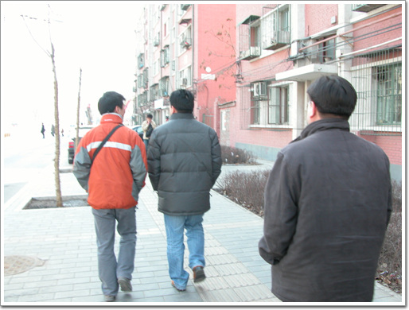

\- 밥 먹으러 가는 길. 폴 팀이 별 다른 개척을 해 놓은 게 아니어서, 가는 곳이 뻔했다.

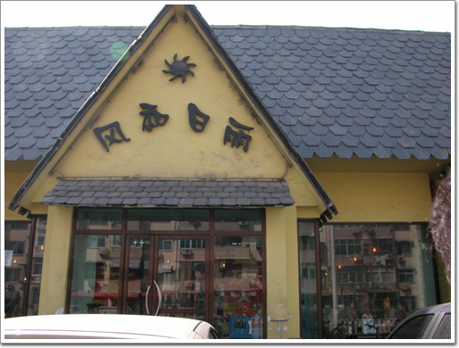

\- 가끔식 가는 중국집. 회사 바로 옆의 식당이다.

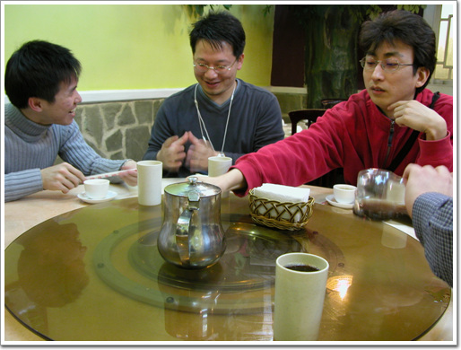

\- 중국식 테이블. 그리고 맨 윈쪽이 홍콩 쪼란에서 지원나온 중국사람이다.

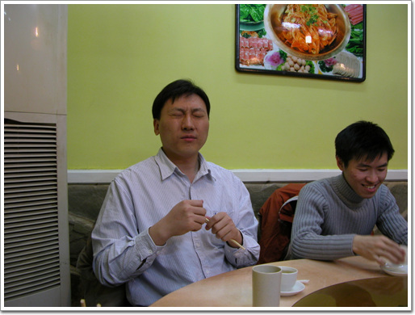

\- 임영준씨는 저렇게 깜찍한 표정 짓는게 버릇인가 보다.

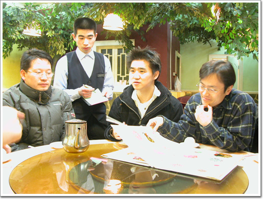

\- 우선 메뉴판부터 구경하는 상민.

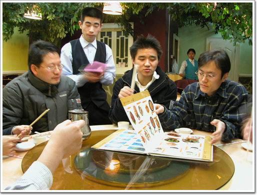

\- 글자를 읽는 게 아니라, 그림을 보면서, 이런이런 요리가 있군 하는 듯 하군.

주문은 폴팀이 알아서 시킨다. 몇번의 시행착오 끝에 자기들 입맛에 맞는 음식의 종류를 외운 것이다.

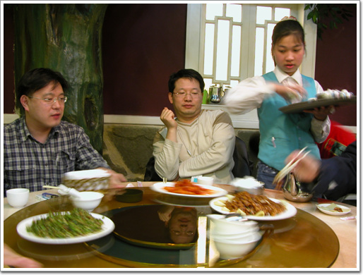

\- 요리가 놓여지면서부터 판이 돌아간다.

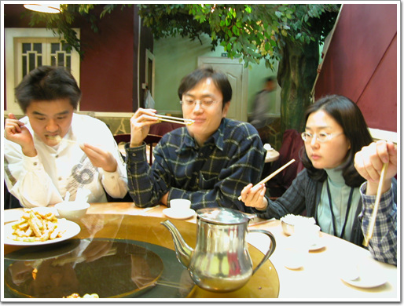

\- 뭐 제법 맛있게들 먹는다.

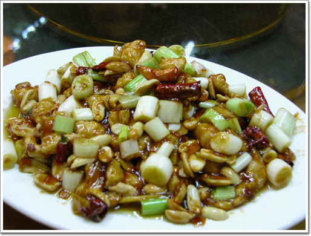

\- 땅콩 조림

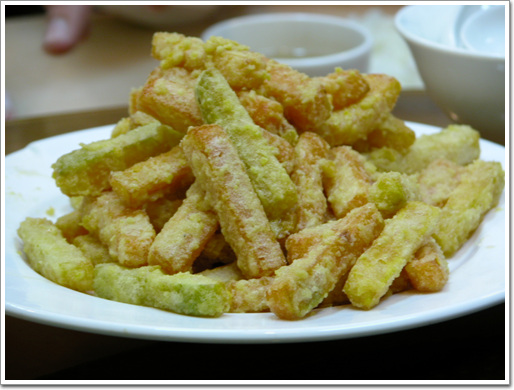

\- 단호박 튀김

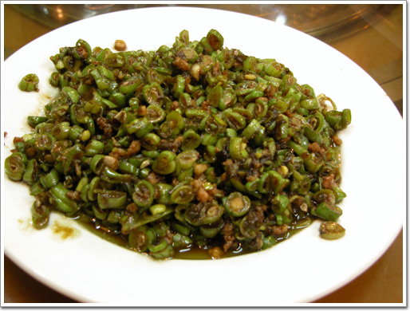

\- 콩 요리

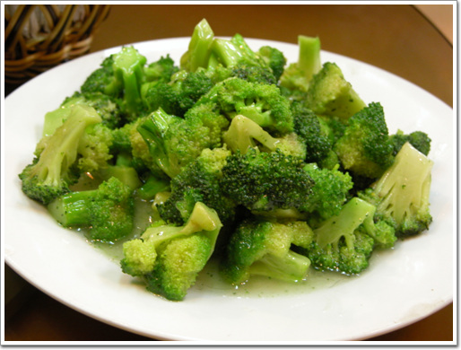

\- 브로콜리

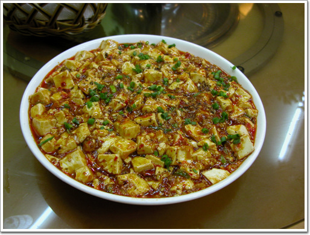

\- 마파두부

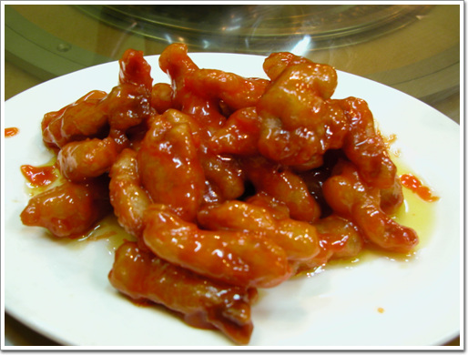

\- 탕수육

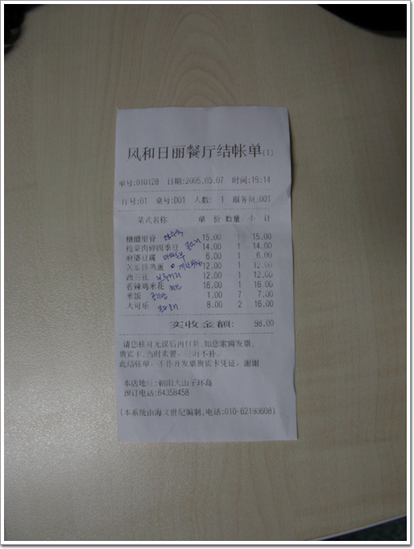

\- 검증된 메뉴의 계산서다. 저 옆의 글씨는 나중에 저대로 시켜먹을려고 정성두씨가 적어 놓은 거다. 합계 98원. 일인당 13원 정도씩이다. 우리돈 2000원정도겠군.

위의 중국식당을 별로 안갔다. 제일 많이 간 곳이 수미정숮불갈비다. 조선족이 운영하는 곳으로, 한국음식을 하는 집 중에서 제일 가격대성능비가 나오는 곳이다.

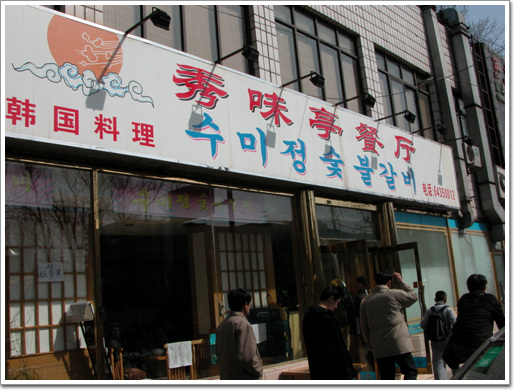

\- 회사에서 걸어서 10분 거리에 있는 조선족식당 수미정.

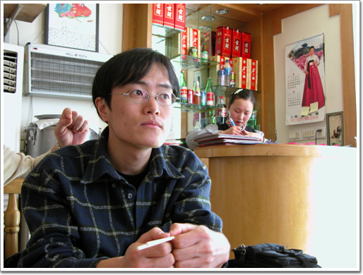

\- 중국에 와서 맛있는 중국요리 못 먹고, 한국요리 먹는것에 맥이 빠진 상민. 저 뒤에 여자종업원이 이 식당에서 유일하게 한국말을 한다. 깻잎머리가 상당히 인상적이다.

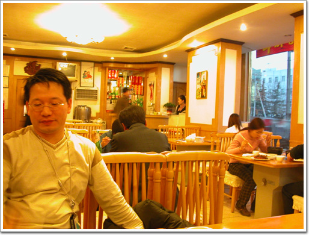

\- 한국음식점이지만, 중국인들이 많다. 그래서 음식맛도 중국입맛에 변형을 했나 보다.

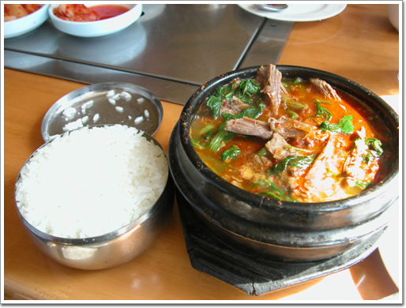

\- 맨 처음 내가 먹은 음식 보신탕. 가장 가격대성능비가 높은 음식이다. 20원. 우리돈 2,600원. 우리나라라면 거의 1,5000원 정도 해야 저 정도 먹을 수 있지 않을까 싶다. 저거 한 번 먹으니, 역시 온 몸에 기가 흐르는 것 같더군.

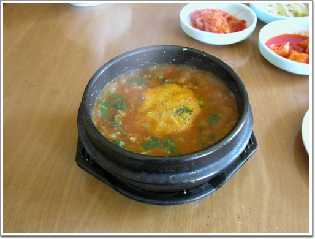

\- 추어탕. 역시 20원. 우리돈으로 2,600원. 이건 실패작. 너무 기름지고 느끼하다.

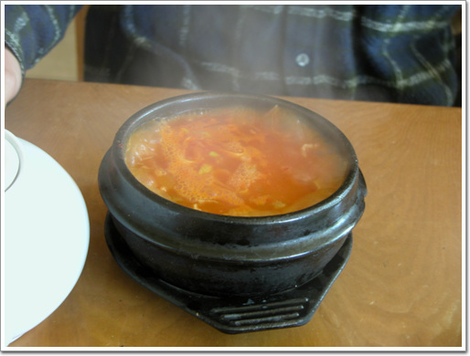

\- 참치 김치찌게. 우리나라 참치김치찌게와 동일한 맛이다.

[null](../6166819.html#6166819_1)

