# NGT China

북경 생활의 주무대는 NGT China.

아침에 이곳으로 출근하여, 퇴근하면 곧장 호텔로 온다.

아침 9시부터 밤 12시까지가 회사에서의 체류 시간.

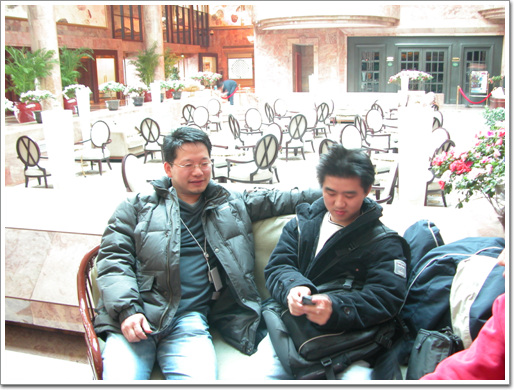

\- 아침 식사후 8시 50분에 호텔 로비에서 모여 회사로 출발한다.

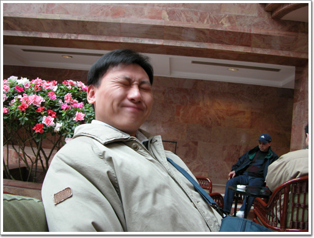

\- 아침을 잘 먹었는지, 덩치에 맞지 않게 깜찍한 표정을 짓고 있는 임영준씨.

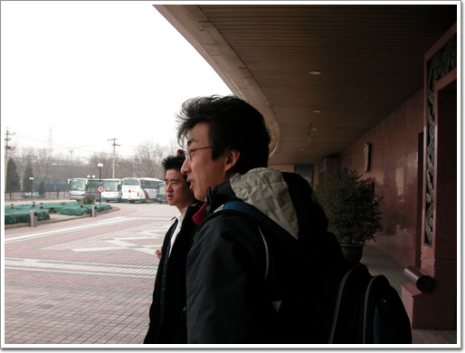

\- 호텔에서 회사까지의 거리 약 4km. 걸어봤다 20분도 안걸리는 거리지만 택시를 탄다. 호텔앞에서 택시를 기다리는 중이다.

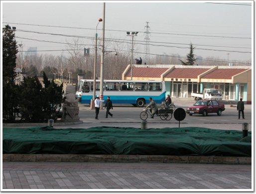

\- 대기하는 택시가 없어서, 벨보이가 직접 길가는 택시가 불러 들였다.

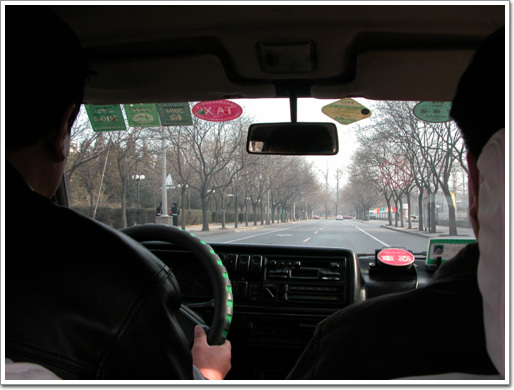

\- 회사로 가는중. 회사의 위치는 시빠지안팡의 이엔똥따샤. 뭐 이말을 알아 듣고 곧장 가는 택시 기사는 없다. 뭐 우리라도 마찬가지겠지. 회사 명함주고 이리로 가주세요 해 봤자 제대로 갈 수 없는 것 처럼.. 앞으로, 왼쪽으로, 오른쪽으로에 해당하는 중국어를 사용하며 회사까지 찾아간다.

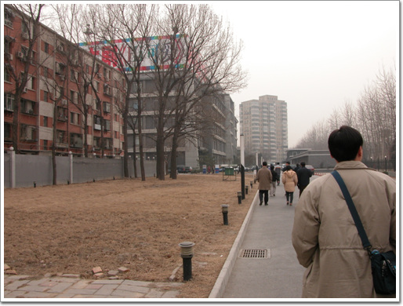

\- 목적지 이엔똥따샤

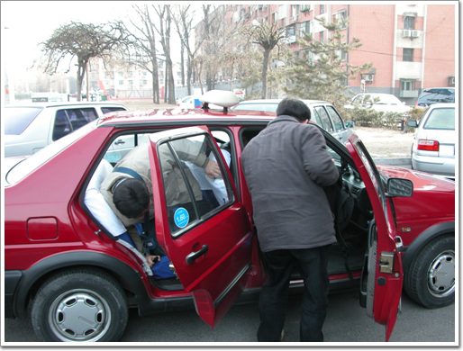

\- 건물 문 앞까지가서 내린다.

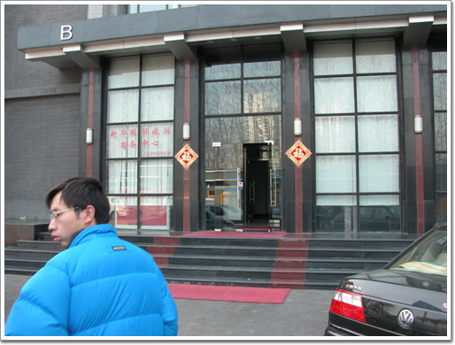

\- 출근이다.

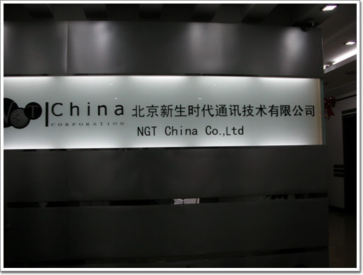

\- NGT China. 한문으로 북경신생시대통신기술유한공사라고 되어 있군.

\- 회사에 도착해서도 여전히 깜찍한 미소를 잃지 않는 임영준씨.

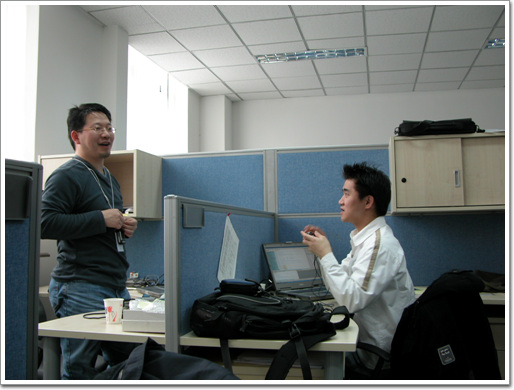

\- 이 팀은 좀 시끄럽다.

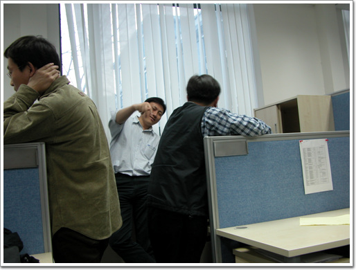

\- 뭔가 일이 잘 되는 모양이다.

점심을 먹고, 오후가 되면서부터는 사람들 표정엔 피곤함이 깃들기 시작한다.

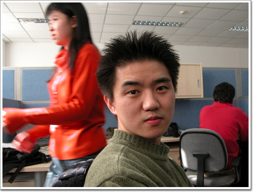

\- 그리고 출장2주째에 접어들어 슬슬 맛이 가기 시작하는 재호씨.

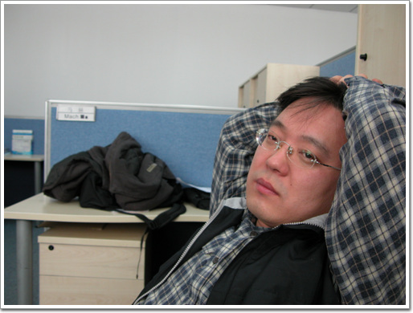

\- 폐인의 자태를 뽐내고 있는 정성두씨.

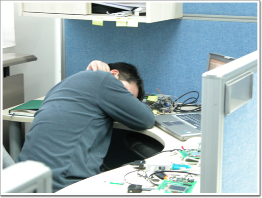

\- 밤 11시. 넉다운된 폴.

[null](../6166821.html#6166821_1)

