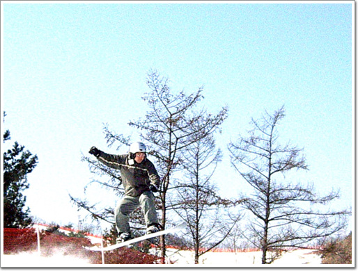

# 보딩

이제 지나가 버린 겨울. 작년보다는 많이 탔지만, 생각보다는 많이 타지는 못한 듯 하다.

올겨울 스키장 방문 실적.

휘닉스 파크 1번.

강촌리조트 5번.

도합 6번.

별로 안 갔었군.

그다지 길지도 않고, 다양하지도 않은 강촌을 5번이나 간 이유는, 공짜 셔틀버스가 주요했다. 바로 집에서 출발하는 셔틀버스때문에 다른 데 갈 생각을 못 했었다. 슬로프상의 별다른 재미가 없었서 주로 했던 짓이 바로 이 짓. 내 나름대로의 점프. 옷이나 장비나 제일 싼 것으로만 했기에, 막상 사진으로 보니, 영 촌스럽군..

중급자 슬로프에서 절벽비슷하게 확 꺽어지는 부분이 있는데, 이곳을 속도내에 튕겨오르는 재미가 솔솔하다..

[null](../6166823.html#6166823_1)

