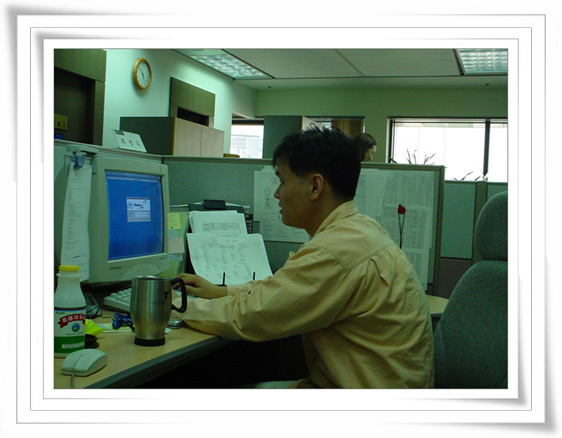
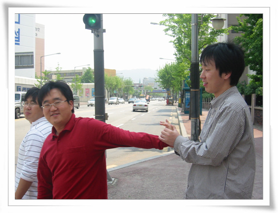
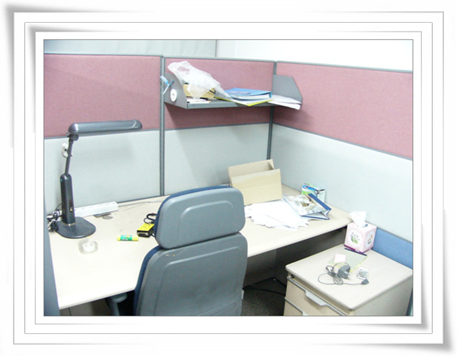

# 회자정리

2005년 1월. 새해 첫 달, 나와 오랫동안 같은 회사를 다니던 두 명이 나갔다.

병두씨와 동함.

병두씨랑 2001년 8월부터 같은 팀에서 일을 하여, 지금의 이 회사까지 같이 다녔다.

두 회사를 같이 3년 반을 같이 다닌 것이다.

동함은, 2002년 5월부터 지금까지. 2년 반을 같이 다녔군.

이제껏 인력이동이 빈번한 회사들을 다녔기에 누구 나가고 들어오고 하는것에 별 감흥은 없었었는데, 병두씨에 이어 제일 친했던 친구 마저 나가니 생각보다 훨씬 더 허전하다.

회사에서 일과 상관없이 놀 수 있는 친구여서 더 그런가 보다.

\- 2002년 봄 한창 젊었을 때의 병두씨

\- 2004년 여름. 포레스트와 동함.

\- 2005년 1월. 짐을 다 챙기고 나간 동함의 자리.

[null](../6166825.html#6166825_1)

