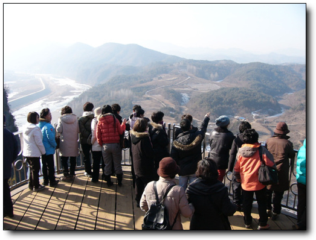
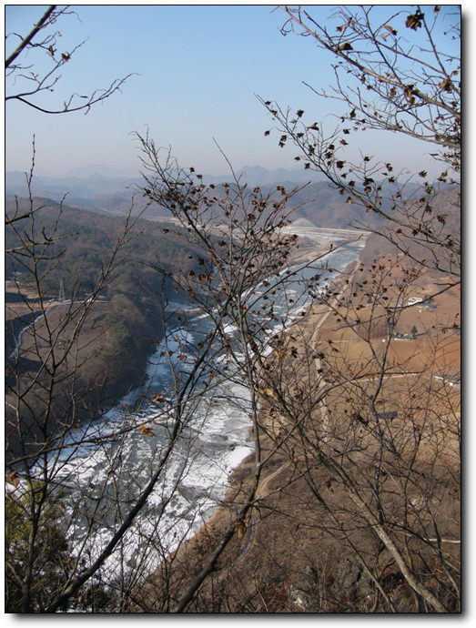
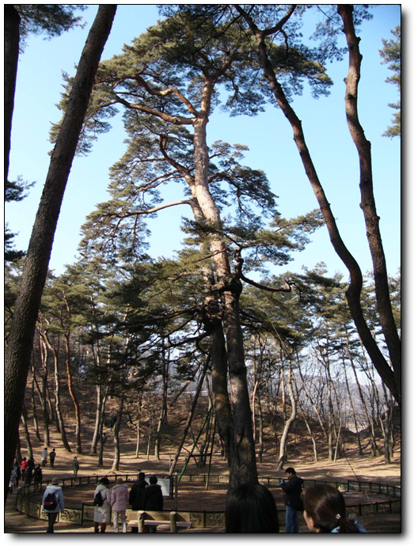
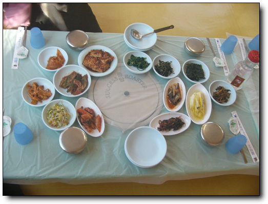
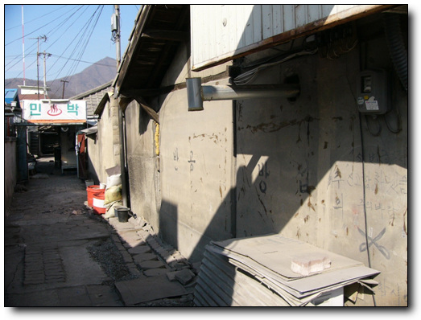
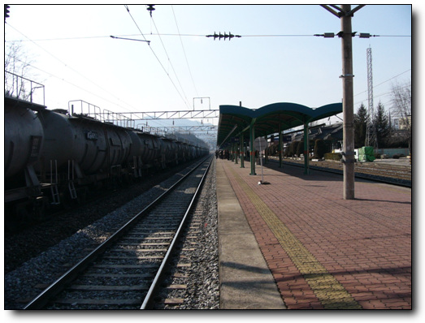
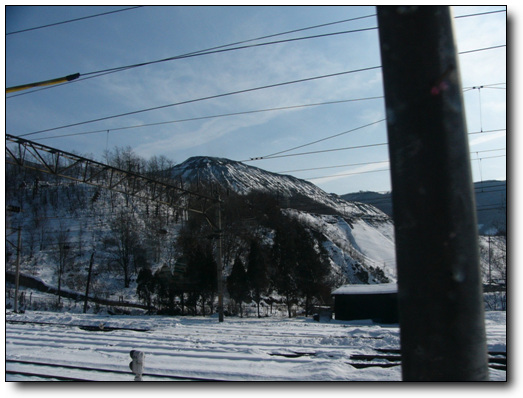
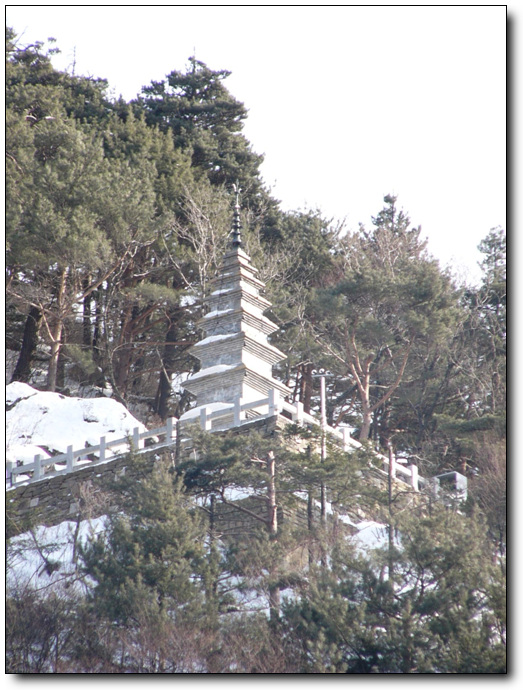

# 환상선 눈꽃 여행

올 겨울 별로 움직이질 않았다. 기름값이 오르고, 차 상태도 장거리 뛰기엔 좀 불안한 상태가 되기도 하여, 스키장만 다니고 있었다.

그러다 지난 주에 영동 지방에서 폭설이 내렸다는 뉴스를 보고, 생각난 게 눈꽃여행. 철도청에서 눈꽃기차여행 상품이 있다는 것을 얼핏 들었었다.

철도청 사이트가서 확인해 보니, 대택산 눈꽃열차라는 것이 있었다. 그런데 일정이 너무 단조로웠다. 청량리에서 기차타고 태백가서, 눈 보고, 박물관 보고, 눈썰매 타고 돌아오는 것. 가격도 그다지 싼 편이 아니고,.. 다른 사이트들을 뒤져보았다.

디씨인사이드에서 눈꽃여행을 공동구매하고 있더군. 3만7천원. 점심도 포함이다. 괜찮은 가격이다. 일정을 보니, 광화문에서 관광버스 타고 영월, 태백등을 돌고, 중간에 눈꽃열차여행의 하일라이트 구간만 기차도 타고 하는 것이라 재미있을 것 같았다.

예약과 입금을 하였다. 무슨 확인증이나 영수증 같은 것을 출력하여 가져갈 거라 예상했는데, 그냥 가면 된다고 한다. 토요일 아침 5시. 평일처럼 일어나, 아내를 깨워, 406번 버스를 타고 광화문으로 향했다. 집결장소는 동화면세점앞. 7시에 딱 맞춰 도착하였다. 버스가 10대 넘게 서 있더군. 여기서 각 여행상품별로 출발을 하는 것인가 보다.

내가 가는 눈꽃여행은 3대의 버스가 배정되어 있었다. 1대정도 될 거라 예상했는데, 제법 많은 사람들이 가더군. 내가 타는 차는 3호차. 가이드는 김은실.

7시 15분쯤되어 차는 출발하였고, 가이드의 간단한 일정 소개가 끝난 후, 버스는 실내등을 꺼 취침모드로 전환되었다.

8시 반쯤, 중부고속도로 치악산 휴게소에서 정차하였다. 다들 아침을 안 먹고 출발했을 것이기에 여기서 아침을 먹으라는 의미다. 휴게소에서 우동 한그릇씩을 먹었는데, 출발전 김밥을 먹어서인가, 배부르더군.

버스는 고속도로를 벗어나 영월의 국도를 달리기 시작하였고, 가이드의 설명이 본격적으로 시작되었다. 영월에서 우리가 보게 될 것은 선돌과, 청룡포. 이 두 지역과 함께, 영월이 단종의 역사가 있는 곳이라 단종에 대해서도 자세한 설명을 들을 수 있었다. 처음에는 그냥 대충 흘러 듣고 있다가, 너무 자세히 설명을 해 주길래, 혹시 책 보고 읽어주나 했는데, 그냥 라이브로 설명을 해 주는 것이다.

10시 반쯤 선돌에 도착하였다. 이름은 그냥 돌이 서있다고 해서 선돌이라고 한다.

\- 선돌이 있는 절벽이라 관광객들을 위한 전망대를 제법 잘 해 놓았다.

\- 이 두 돌이 선돌이다. 돌과 그 사이로 보이는 강줄기가 멋있다.

\- 선돌을 통과하는 이 강이 동강이더가?

다음으로 간 곳이 청룡포. 단종의 유배지였던 곳이다.

원래는 배를 타고 들어가는 곳인데, 요 며칠 추웠던 탓에, 강물이 얼어 있어, 얼음을 밟고 걸어 들어갈 수 있었다.

\- 이렇게 강을 건너니 1.4 후퇴 때 모습이 떠오르는군.

\- 청룡포안에는 단종이 유배되었던 집을 복원해 놓았다.

\- 600년을 살았다는 관음송.

이번 여행의 장점은 점심이 포함되어 있다는 점. 3만7천원이라는 여행비에서 점심이 포함되어 있으니, 얼마나 허접한 점심이 나올려나 내심 기대되었다. 요즘 뉴스거리를 장식하고 있는 부실도시락이던 건빵도시락이 나올려나 기대하고 있었다.

도시락은 아니었다. 청룡포 근처에 있는 전원가든이라는 식당에서 된장찌개백반이 오늘의 메뉴다.

나의 기억으로는 강원도 음식과 경상도 음식이 맛이 없었다. 그래서 오늘의 점심은 전혀 기대를 안 했었다. 그런데 전혀 기대밖이었다.

\- 네명이 같이 먹는 식탁.

\- 그리고 된장찌개.

그다지 배고픈 상황이 아니었음도 불구하고, 맛있었다. 반찬도 제법 많이 나왔다. 훌륭한 점심이었다.

\- 식당에 붙어있는 좌석배치표. 내가 탈 기차는 5호차 34번 좌석이다.

점심을 맛있게 먹은 후, 다음 일정 눈꽃기차를 타기 위해 영월역으로 갔다. 기차는 1시 15분 출발. 그런데 영월역에 도착한 시각은 12시 반. 한 40분가량을 기다려야 하는 것이다. 이것이 이 여행상품의 가장 허술한 점이라 여겨진다. 40분동안 할 것이 없는 거다. 다들 그냥 역 앞에서 사진좀 찍다고 대합실 안으로 가 TV를 보면서, 기차를 기다리고 있었다.

그냥 40분을 기다리기에는 몸이 근질거린다. 동네 탐사 시작.

\- 서울이라는 대도시에서 익숙해져서인가? 이 동네는 너무 황량해 보인다.

\- 간만에 보는 글. "반공방첩", 그리고 그 옆의 "소변금지". 씌여진지 한 20년은 되었겠군.

\- 기차 올 시간이 되어 플랫폼이 들어섰다.

\- 기차길에서 포즈를 취하고 있는 다른 관광객과, 사진 찍어주는 우리 3호차 가이드 김은실씨.

기차는 태백을 향해 출발했다. 내가 앉은 자리는 창이 남쪽으로 나 있는 자리다. 햇볕이 강하게 비추어 그리 좋은 여건이 아닌게 아쉽더군. 그리고 생각보다 눈이 별로 없었다.

\- 사북 근처를 지나고 있을 때의 차창밖 풍경.

\- 동으로 갈수록, 점점 눈은 많아졌다.

기차안에서 잠을 자지 말라는 가이드의 경고가 있었음에도 불구하여, 뜨듯한 햇볕과 안락한 의자에서 그냥 잠들어, 눈 떠보니, 태백이다. 눈꽃열차여행의 백미를 놓쳤다.

\- 태백역에는 벌써 버스가 기다리고 있었다.

다음 목적지는 정암사. 신라시대 창건된 1300년된 절로 마노석이라는 돌로 쌓은 수마노탑과 부처님 진신사리를 모셨던 적멸보궁이 있는 절이라 한다.

\- 정암사. 다른 유명한 절과 달리 고즈넉한 분위기를 풍기고 있다.

\- 정암사 위에 맨 위에는 탑이 수마노탑.

\- 수마노탑으로 올라가는 길. 제법 추웠나 보다. 물이 꽁꽁 얼었다.

\- 수마노탑에서 내려다본 산사.

\- 이 법당이 적멸보궁인가 보다.

정암사를 마지막으로 4시반쯤 서울로 향했다. 차가 안 막혀, 집에 들어오니 저녁 9시.

나름대로 만족스런 여행이었다. 여행 계획에 대한 별 고민없이 따라가면 되는 편안한 여행이었고, 점심도 괜찮았다. 그리고 항상 웃는 얼굴의 가이드가 더욱 여행을 재미있게 만들어주었다.

[null](../6166826.html#6166826_1)

