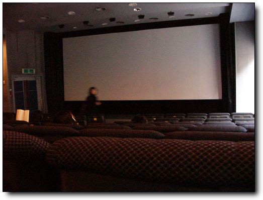
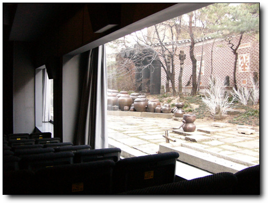
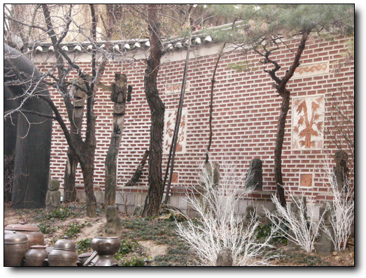

# 하이퍼텍 나다

하이퍼텍 나다를 갔다. 대학로에 있는 영화관. 주로 예술성 있는 독립영화 위주로 상영하는 극장이다. 아무래도 장사는 잘 안되겠지..

이 곳은 근 3년만에 온 듯 하다.

2001년 겨울 처음 이곳에 왔었다. 아직 사귀기전의 상태였었던 직장 동료, 지금의 아내 수경과 함께.

그 때 이틀 연속으로 왔었다. 이틀동안 연이어 6편의 영화를 봤었던 것 같다. 북경자전거와 귀신이 온다만이 기억이 남는군.

나의 영화 스타일이 이런 예술성 있는 영화 스타일이 아니어서, 그 후로 이런 영화관에 올 일은 없었다.

3년만에 다시 아내와 이곳에 왔다. 오늘의 영화 제목은 "아들". 프랑스 영화인 듯 하다.

\- 조그마한 영화관 내부.

이 영화관이 좋은 이유는, 이곳에 얽힌 사연때문이기도 하겠지만, 다른 극장과 달리 참 포근하다. 객석 오른편이 통 유리도 되어 있다. 그 유리너머로는 여기가 대학로, 서울의 그 번잡스런 곳이 맞나 하는 착각을 불러있으킬만만 풍경이 펼쳐져 있다.

2000년의 겨울엔 이 곳에 눈이 왔었다. 영화 한 편이 끝나고, 커튼이 열렸을 때, 소복히 쌓인 눈을 바라보았을 때의 느낌이란...

[null](../6166828.html#6166828_1)

