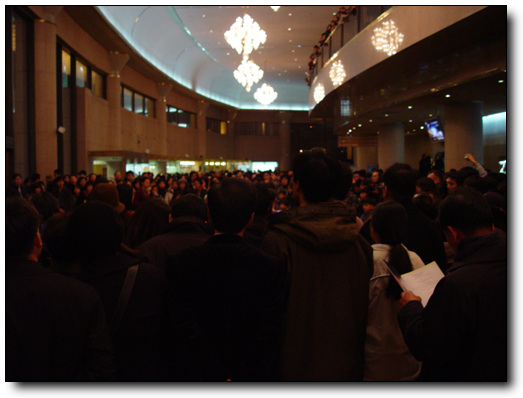
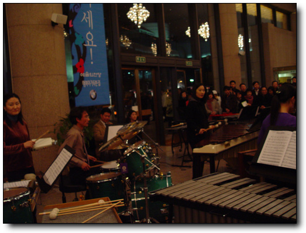
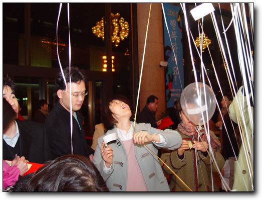
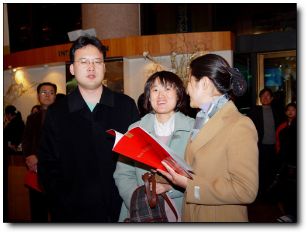
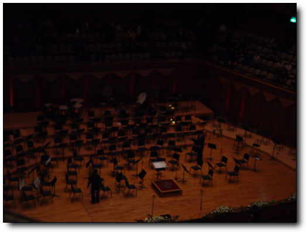
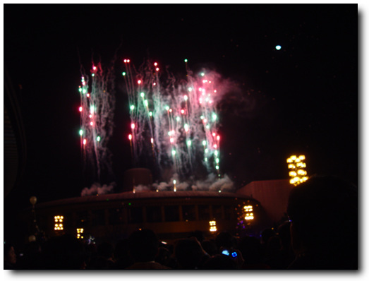
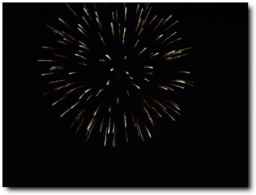
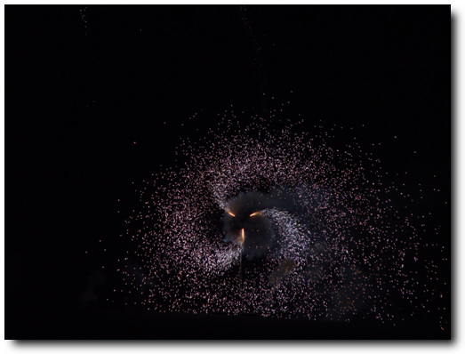

# 2004년 제야음악회

매년 마지하는 마지막 날.

직장인이 되기 전까지는 집에서 라디오나 들으면서 한해가 바뀌었구나 했었고, 직장인이 된 후부터는 보통은 술집에서 새해를 맞이하였다. 강남역 종로 등지에서 친구들과 술을 마시면서, TV를 통해 한 해가 바뀌었음을 통보받고, 집으로 향하고 했으니..

2004년은 결혼 후 처음 해가 바뀌는 거다.

다행히 올해는 어떻게 보낼까 별 고민안하도록, 오지은씨 부부가 스케줄을 만들어줬다.

다음커뮤니케이션에서 직장 생활을 같이 하면서, 재미있게, 허물없이 지내던 사이였다.

지난 시절을 생각해봤을 때 가장 재미있었던 때이기도 했었다. 참 재미있게 회사생활을 했었다. 회사 출근하는게, 참 즐거웠었으니.. 왕오빠라 불리던 유문석씨도 참 보고 싶군.

2004년 제야음악회. 장소는 예술의 전당, 시각은 밤 10시.

간만에 가보는 예술의 전당이다.

\- 예술의 전당 콘서트홀에 기다리는 사람들.

나름대로 격식을 차린 송년행사라, 분위기는 아무래도 달랐다. 로비에는 음악회 시작전부터 풍선등에 소망카드를 적을 수 있게 한 것도 있었고, 조그마한 음악도 연주하고 있었다.

\- 로비에서 연주중인 악단.

\- 풍선에 새해 소망을 적어 붙히고 있는 오지은 부부. 4월 출산을 앞두고 있는 예비 아빠 엄마다.

\- 오지은 부부와 내 아내 수경.

홀에 입장 했다. 프로그램을 보니, 연주단체는 강남심포니오케스트라. 구립오케스트라다. 뭐 구에서 문화예술에도 앞장서는 것 자체는 좋으나, 이름을 듣는 순간 드는 생각은 역시 재정자립도 1위의 구 답구나라는 생각.

연주는 스트라빈스키의 봄의 제전 부터 시작하여, 봄여름가을겨울이라는 주제로 연주하였다. 음악자체로만 본다는 만족스럽지 못한 수준. 너무 유명악단의 연주에 귀가 익숙해져 있었나 보다.

연주는 12시를 15분 남기고 끝났다. 콘서트홀 앞마당에서 새해를 맞이하는 행사가 준비되어 있었다. 밖으로 나가니, 2005년의 카운트다운이 시작되었고, 2005년이 시작하면서 시작된 불꽃놀이.

\- 오페라하우스 지붕에서 불꽃 발사.

새해맞이 불꽃놀이라 그런가 더 의미가 있는 것 같다. 사실 2000년이라는 새 천년이 시작되었을 때도, 불꽃놀이를 그냥 노래방의 화면에서만 보았었다.

2005년이다. 서른두살이다. 올해는 이제 어떤 재미있는 일이 있을까?

[null](../6166829.html#6166829_1)

