# 관악산 산책

이번주도 경률씨와 산에 올랐다.

이번주의 산은 관악산.

경로는 과천에서 올라, 서울로 내려오는 길로 택했다.

10시에 만나, 과천가는 버스를 탔다.

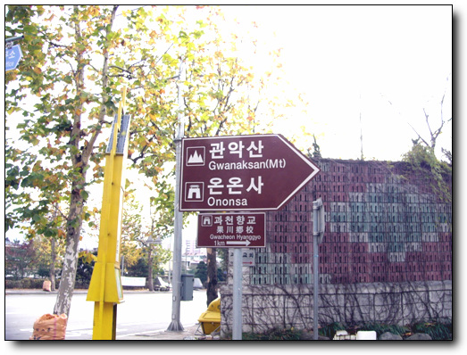

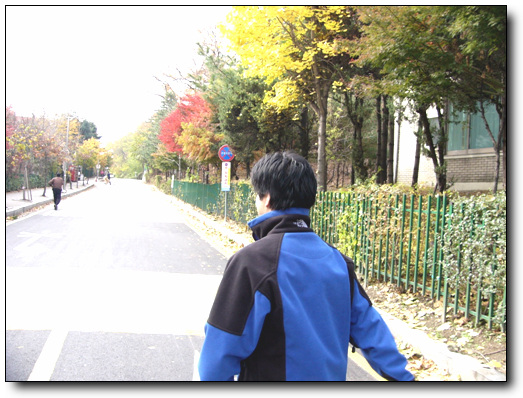

\- 올라가는 동네는 한적하다.

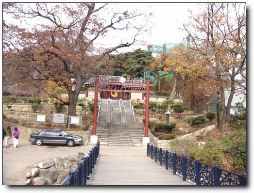

\- 입구에 있는 과천향교. 국사시간에 향교라고 배운 것 같기는 한데, 뭐하는 건지는 다 까먹었다.

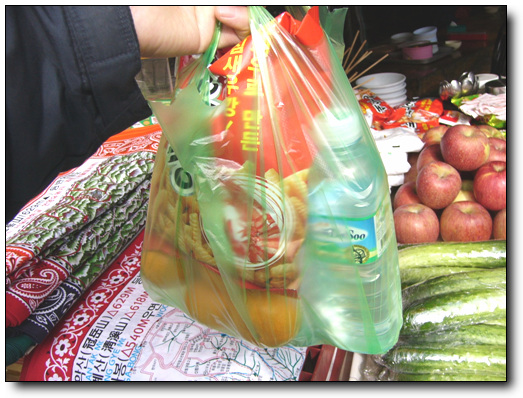

\- 입구에 매점이 있어, 먹을 것을 좀 사고,..

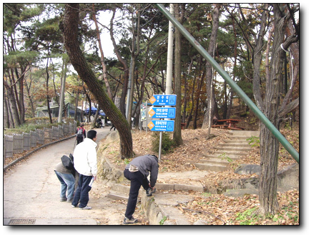

\- 자 이제 오른다.

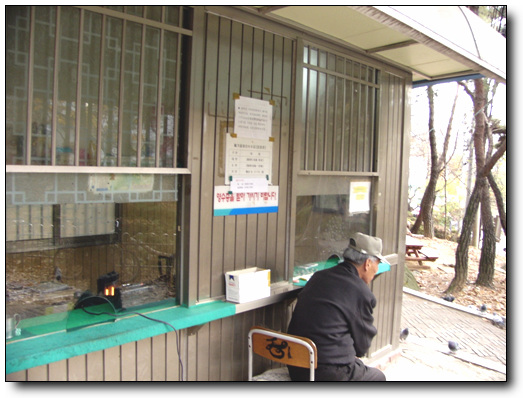

\- 입장료는 300원.

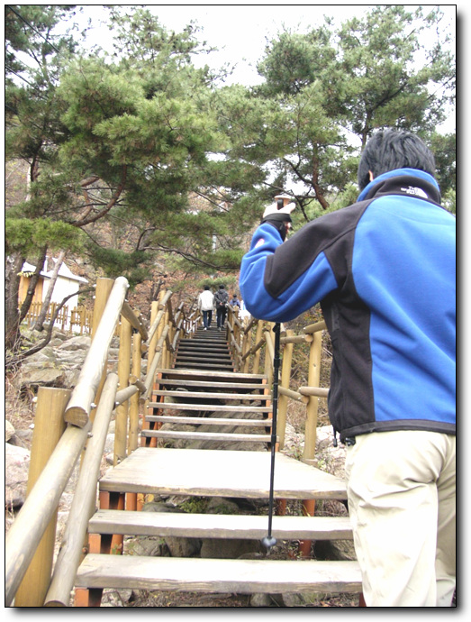

\- 나무로 계단도 만들어 놓고, 제법 돈을 썼군.

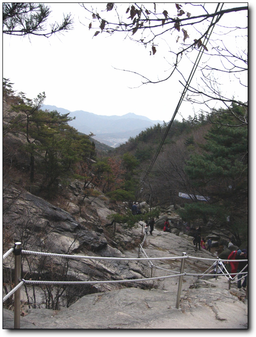

\- 한 20여분 올라온, 약수터에 바라보니, 아직 밑은 잘 보이는군..

\- 연주암까지 올라왔다.

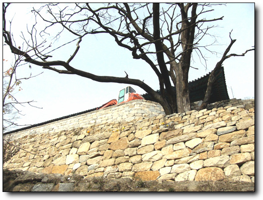

\- 근데 저 포크레인은 어떻게 올라왔을까?

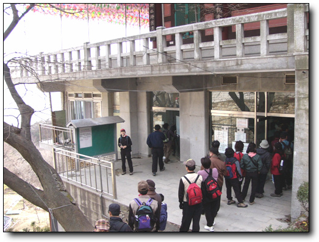

\- 올라온 시각은 12시 10분 전이라, 한번 절 밥 먹어보려 줄을 섰다.

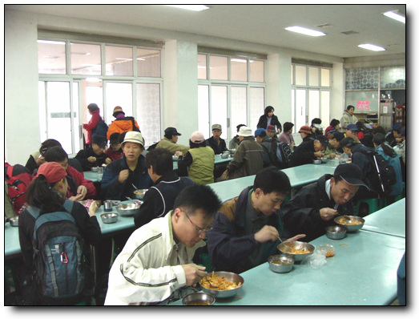

\- 그리 넓지는 않으나, 밥 먹는 시간이 짧아, 자리에는 앉아 먹을 수 있었다.

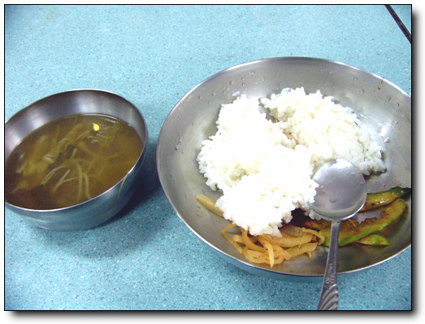

\- 오늘의 메뉴. 허기가 진 상태가 아니라, 그렇게까지 맛이 있지는 않더군.

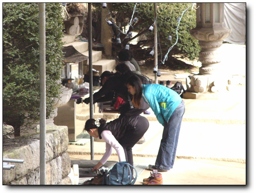

\- 수능을 얼마 남지 않은 때라, 많은 학부모들이 기도를 드리고 있다.

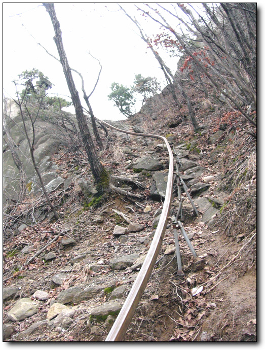

\- 모노레일 발견. 따라 올라갔다.

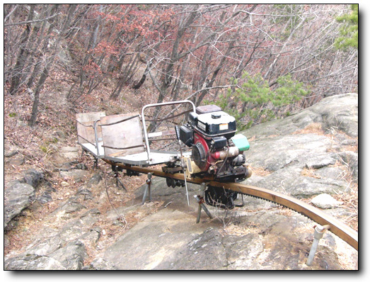

\- 무인 이동차다. 멋있군..

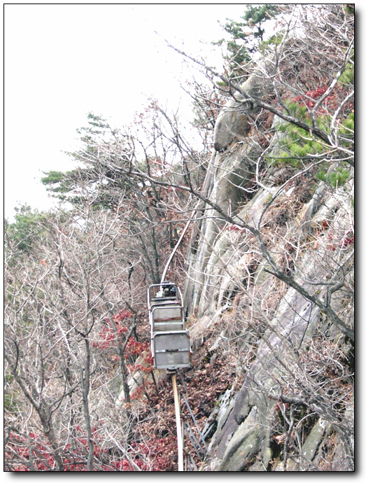

-험한 길도 잘 올라가는군.

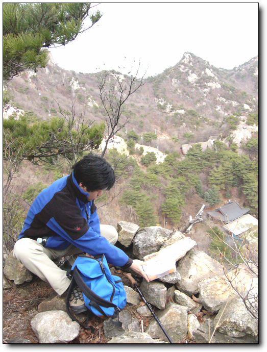

\- 연주암을 내려다보는 고지에서 먹을 것을 꺼내 먹는다.

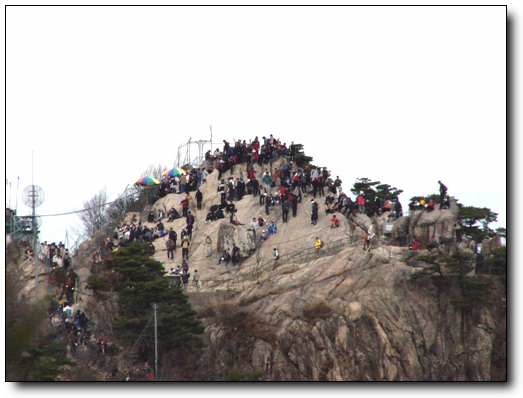

\- 정상에는 사람이 많군.

\- 연주대. 어떻게 저런 절벽에 저걸 지었을까?

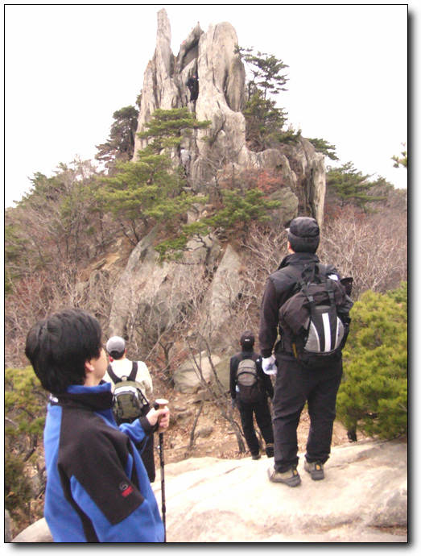

\- 저게 무슨 바위더라? 많은 사람들이 저 바위 오르려 애쓴다.

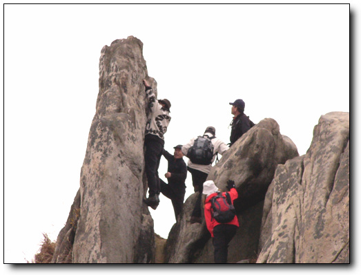

\- 잘못 미끄러지면 꽤 많이 아프겠군.

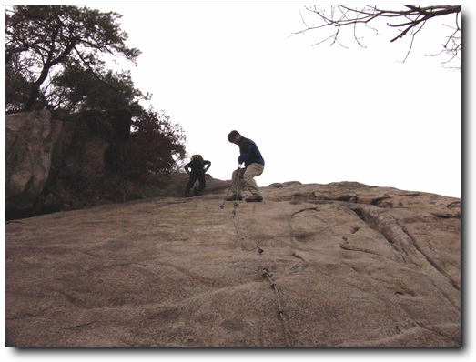

\- 유격장에서 하던 외줄타고 하강을 시범보이는 경률씨.

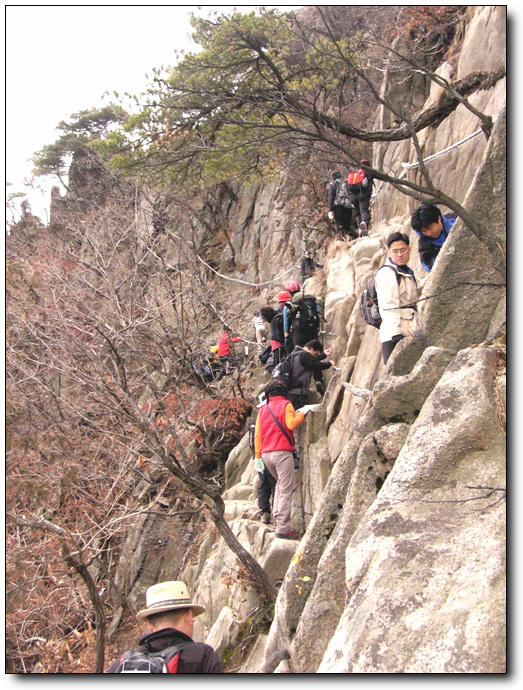

\- 또 다른 절벽에도 또 고군분투하는 경률씨.

10시반에 올라가서, 내려온 시각이 5시. 6시간 반을 산을 탔다.

제법 운동을 한 셈이다.

[null](../6166830.html#6166830_1)

