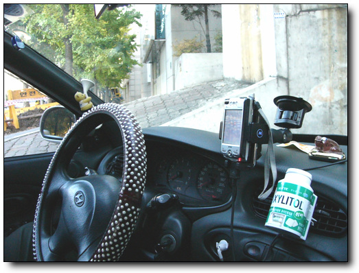
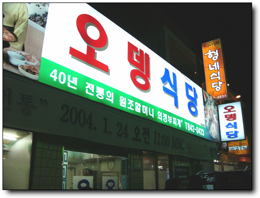
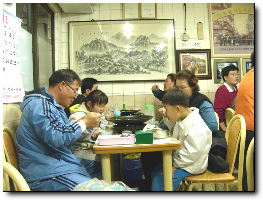
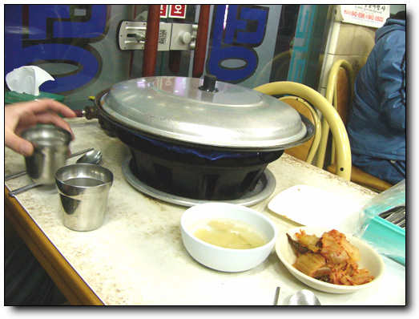
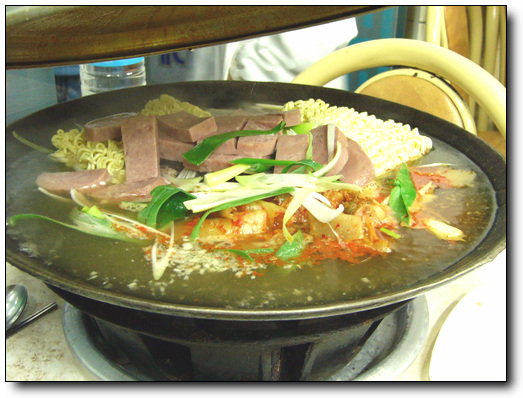
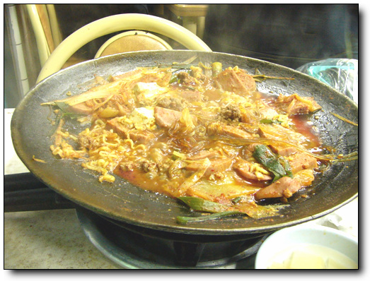
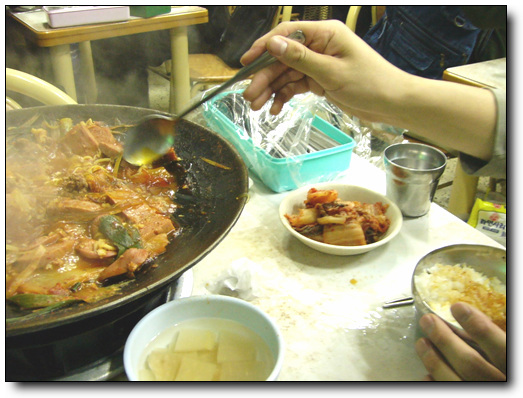

# 의정부 부대찌게

내가 좋아하는 음식중 한가지 부대찌게.

부대찌게의 원조가 의정부 맞나?

아마도 맞을 거다.

그 원조 의정부 부대찌게를 먹으러 의정부로 향했다.

\- 의정부까지 인도해줄, 동함의 차와 네비게이터. 하지만 안타깝게도, 네비케이터 프로그램이 엉켰는지, 작둥 불능. 하드리셋을 해야만 하는 거였다.

미리 지도에서 확인한 위치는 의정부역 근처에서 의정부경찰서쪽으로 가면, 부대찌게 골목이 나온다는 군.

토요일 오후. 꽤 정체가 되는 시간이다.

\- 이게 부대찌게의 원조란다. 이름은 오뎅식당. 처음에 오뎅장사하가 부대찌게를 개발해서 그런가? 식당은 자그마한데, 주차장을 별도로 가지고 있다.

원조라서 그런가, 한 10분 정도 줄을 기다린 후, 들어갔다.

\- 안에서 부대찌게 먹는 사람들. 주로 중년의 식구단위가 대부분이다.

\- 반찬은 허접하다. 맛있는 부대찌게의 맛을 더욱 만끽하기 위해서일꺼라 기대를 해 본다.

\- 부대찌게 2인분(6000x2)와 라면사리(1,000), 그리고 햄사리(5,000)을 시켰다.

특이사항. 여기는 김치가 들어간다.

\- 다 끓어, 먹는 중.

\- 맛? 기대에 못 미친다.

서울에서 먹는 부대찌게들은 김치가 안 들어간다. 김치가 큰 작용을 한 듯하다. 아마도 부대찌게도 진화를 하면서, 처음에 들어갔던 김치가 빠진 듯. 여기는 원조라서 그런가 처음의 그 스타일 그대로 하는 것 같은데, 그 어렵던 시절의 부대찌게를 먹어 본 적은 없고, 개량된 부대찌게에 길들여진 나에겐 아니다.

내가 제일 좋아하는 부대찌게는 송탄부대찌게. 예전 삼성동에서 회사 다닐 때 주로 갔었다. 이 부대찌게의 진수는 라면 사리 위로 올려놓인 치즈.

이번 의정부 부대찌게를 맛보고 난 후의 교훈.

원조라고 다 맛있는 것은 아니다.

원조가 생겼을 당시의 추억이 있지 않고서는 그냥 현대의 입맛에 맞게 진화한 맛을 즐겨라.

[null](../6166831.html#6166831_1)

