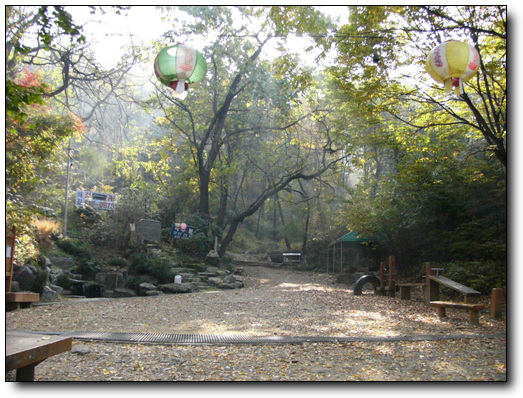
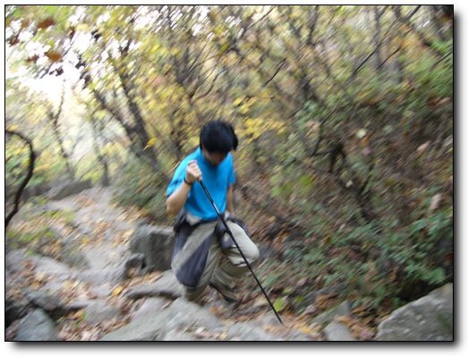
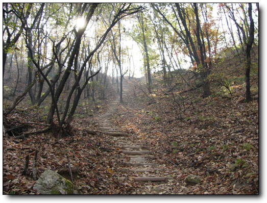
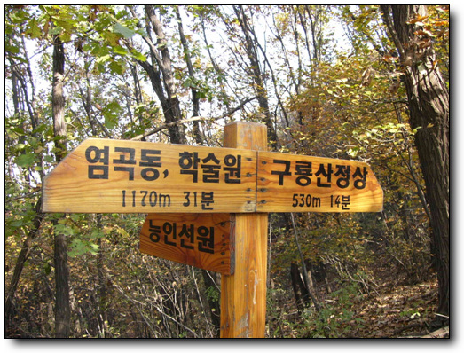
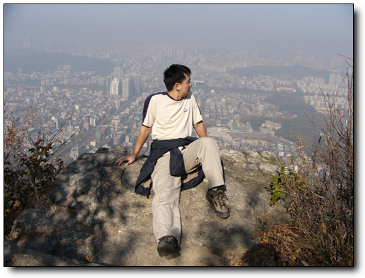
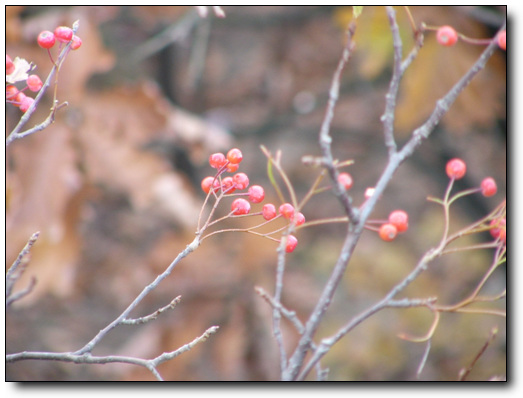
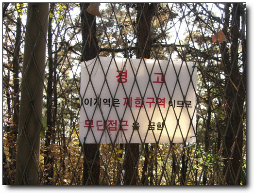
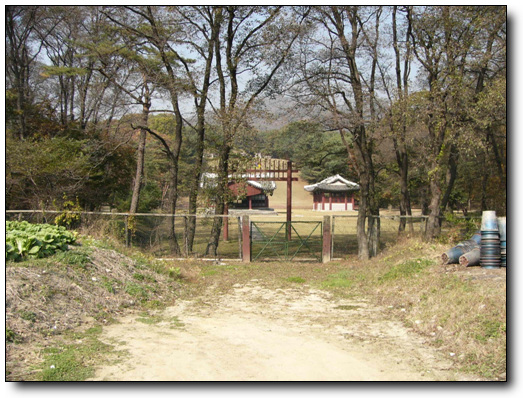
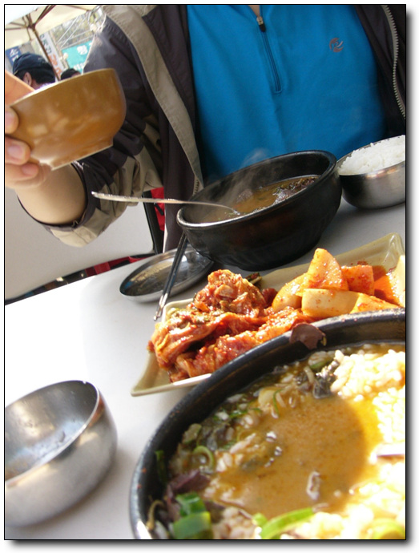

# 구룡산과 대모산

경률씨와 구룡산과 대모산을 가기로 했다.

이곳에 이사오면서, 간 곳은 매봉언덕과 양재천뿐.

지역탐사를 그다지 열심히 안 했다.

물론 핑계는 휴일아침의 게으름을 만끽하는 아내에게 대면서,..

시작은 강남사회복지원이던가 하는 곳에서 부터 올라왔다.

단풍 시즌이라 교외의 다른 산들은 인파로 넘쳐난다는데, 이곳은 자그마한 뒷산이라 그런가 한적하다.

\- 여기서부터 오르기 시작.

\- 언덕 오르는데, 지팡이까지 동원한 경률씨.

\- 낙엽과 서서히 들기 시작하는 단풍

\- 구룡산 정상 14분. 워밍업도 안되었는데, 얼마 안 어 정상이군.

\- 정상 근처의 바위에 앉아서 시내를 내려다 본다. 뿌옇다. 사진으로 보니 허벅지에 지방이 많이 축적되었군..

\- 이런 열매가 많이 있던데, 먹을 수 있는 건가?

\- 산의 남쪽 반은 국정원 땅으로 철조망으로 막혀 있다.

\- 구룡산 바로 밑에 있는 헌인릉. 여기를 오기 위해, 대모산으로 뺑 돌아 왔다.

\- 점심은 청계산 입구에서 해장국. 사진으로 다시 봐도 군침이 도는군..

[null](../6166834.html#6166834_1)

